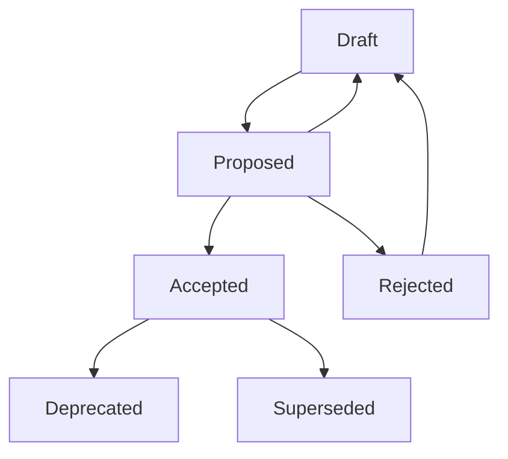

# Architectural Decision Records (ADRs)

Index of architectural decisions made for the WebGrip infrastructure repository.

## What are ADRs?

Architectural Decision Records (ADRs) document important architectural decisions along with their context and consequences. They help teams:

- **Track decision history** and understand why choices were made
- **Share context** with new team members and contributors
- **Revisit decisions** when circumstances change
- **Learn from past decisions** to improve future choices

## ADR Format

We use the [MADR (Markdown Architectural Decision Records)](https://adr.github.io/madr/) format for consistency and clarity.

### Template Structure

```markdown
# [short title of solved problem and solution]

* Status: [proposed | rejected | accepted | deprecated | superseded by [ADR-0005](0005-example.md)]
* Deciders: [list everyone involved in the decision]
* Date: [YYYY-MM-DD when the decision was last updated]

## Context and Problem Statement

[Describe the context and problem statement, e.g., in free form using two to three sentences. You may want to articulate the problem in form of a question.]

## Decision Drivers

* [driver 1, e.g., a force, facing concern, …]
* [driver 2, e.g., a force, facing concern, …]
* … <!-- numbers of drivers can vary -->

## Considered Options

* [option 1]
* [option 2]
* [option 3]
* … <!-- numbers of options can vary -->

## Decision Outcome

Chosen option: "[option 1]", because [justification. e.g., only option, which meets k.o. criterion decision driver | which resolves force force | … | comes out best (see below)].

### Positive Consequences

* [e.g., improvement of quality attribute satisfaction, follow-up decisions required, …]
* …

### Negative Consequences

* [e.g., compromising quality attribute, follow-up decisions required, …]
* …

## Links

* [Link type] [Link to ADR] <!-- example: Refines [ADR-0005](0005-example.md) -->
* … <!-- numbers of links can vary -->
```

## Current ADRs

### Infrastructure Architecture

| ADR | Title | Status | Date |
|-----|-------|---------|------|
| [ADR-0001](0001-docker-image-architecture.md) | Docker Image Architecture and Organization | Accepted | 2024-01-15 |
| [ADR-0002](0002-ci-cd-workflow-strategy.md) | CI/CD Workflow Strategy with Reusable Components | Accepted | 2024-01-20 |
| [ADR-0003](0003-documentation-platform.md) | Documentation Platform Selection (TechDocs) | Accepted | 2024-01-25 |

### Image Design Decisions

| ADR | Title | Status | Date |
|-----|-------|---------|------|
| [ADR-0004](0004-base-image-selection.md) | Base Image Selection Strategy | Accepted | 2024-02-01 |
| [ADR-0005](0005-multi-stage-builds.md) | Multi-stage Build Pattern Adoption | Accepted | 2024-02-05 |
| [ADR-0006](0006-security-hardening.md) | Container Security Hardening Standards | Accepted | 2024-02-10 |

### Operational Decisions

| ADR | Title | Status | Date |
|-----|-------|---------|------|
| [ADR-0007](0007-registry-strategy.md) | Docker Registry Strategy and Management | Accepted | 2024-02-15 |
| [ADR-0008](0008-testing-approach.md) | Testing Strategy for Infrastructure Images | Accepted | 2024-02-20 |
| [ADR-0009](0009-maintenance-automation.md) | Maintenance and Update Automation | Proposed | 2024-02-25 |

## Creating New ADRs

### When to Create an ADR

Create an ADR when making decisions that:

- **Affect system architecture** or overall design
- **Have long-term impact** on the project
- **Involve trade-offs** between different approaches
- **Change existing patterns** or standards
- **Require team consensus** to move forward

### Process

1. **Identify the Decision**: Recognize that an architectural decision needs to be made
2. **Research Options**: Investigate different approaches and their trade-offs
3. **Draft ADR**: Create a new ADR using the template
4. **Gather Input**: Share with team members and stakeholders for feedback
5. **Make Decision**: Finalize the decision and update the ADR status
6. **Communicate**: Share the decision with relevant teams

### Naming Convention

ADRs are numbered sequentially and use descriptive titles:

```
NNNN-short-descriptive-title.md
```

Examples:
- `0001-docker-image-architecture.md`
- `0010-monitoring-and-alerting-strategy.md`
- `0015-dependency-management-approach.md`

### File Location

ADRs are stored in the [`docs/adrs/`](../../adrs/) directory:

```
docs/adrs/
├── 0001-docker-image-architecture.md
├── 0002-ci-cd-workflow-strategy.md
├── 0003-documentation-platform.md
└── template.md
```

## ADR Lifecycle

### Status Transitions



**Draft**: Initial version being developed
**Proposed**: Ready for review and decision
**Accepted**: Decision has been made and is being implemented
**Rejected**: Decision was considered but not adopted
**Deprecated**: Decision is no longer recommended but not replaced
**Superseded**: Decision has been replaced by a newer ADR

### Reviewing ADRs

ADRs should be reviewed:

- **Quarterly**: Review all current ADRs for relevance and accuracy
- **When circumstances change**: Major technology shifts or requirement changes
- **Before major decisions**: Ensure new decisions align with existing ADRs
- **During onboarding**: Help new team members understand architectural context

## Using ADRs in Development

### Referencing ADRs

When making implementation decisions, reference relevant ADRs:

```markdown
<!-- In pull request descriptions -->
This change implements the multi-stage build pattern as decided in [ADR-0005](docs/adrs/0005-multi-stage-builds.md).

<!-- In code comments -->
// Following the security hardening standards from ADR-0006
USER appuser
```

### Updating Implementation

When ADR decisions affect implementation:

1. **Review existing code** for compliance with ADR decisions
2. **Update implementation** to align with architectural decisions
3. **Document deviations** if full compliance isn't immediately possible
4. **Plan migration** for systems that don't yet follow ADR guidelines

## Tools and Automation

### ADR Management

```bash
#!/bin/bash
# scripts/adr-tools.sh

# Create new ADR
create_adr() {
    local title="$1"
    local number=$(printf "%04d" $(($(ls docs/adrs/ | grep -E '^[0-9]{4}-' | wc -l) + 1)))
    local filename="docs/adrs/${number}-${title}.md"
    
    # Copy template and update
    cp docs/adrs/template.md "$filename"
    sed -i "s/\[short title of solved problem and solution\]/$title/" "$filename"
    sed -i "s/Date: \[YYYY-MM-DD when the decision was last updated\]/Date: $(date +%Y-%m-%d)/" "$filename"
    
    echo "Created ADR: $filename"
}

# List ADRs by status
list_adrs() {
    local status="$1"
    echo "ADRs with status: $status"
    grep -l "Status:.*$status" docs/adrs/*.md | sort
}

# Validate ADRs
validate_adrs() {
    echo "Validating ADR format..."
    
    for adr in docs/adrs/[0-9]*.md; do
        if ! grep -q "^# " "$adr"; then
            echo "❌ $adr: Missing title"
        fi
        
        if ! grep -q "Status:" "$adr"; then
            echo "❌ $adr: Missing status"
        fi
        
        if ! grep -q "Date:" "$adr"; then
            echo "❌ $adr: Missing date"
        fi
    done
    
    echo "ADR validation complete"
}

# Usage
case "$1" in
    "create")
        create_adr "$2"
        ;;
    "list")
        list_adrs "$2"
        ;;
    "validate")
        validate_adrs
        ;;
    *)
        echo "Usage: $0 {create|list|validate} [args]"
        ;;
esac
```

### Integration with Documentation

ADRs are automatically included in the TechDocs site navigation and can be referenced from other documentation pages.

### GitHub Integration

```yaml
# .github/workflows/adr-validation.yml
name: ADR Validation
on:
  pull_request:
    paths:
      - 'docs/adrs/**'

jobs:
  validate:
    runs-on: ubuntu-latest
    steps:
      - uses: actions/checkout@v4
      
      - name: Validate ADR format
        run: ./scripts/adr-tools.sh validate
        
      - name: Check for duplicate numbers
        run: |
          duplicates=$(ls docs/adrs/[0-9]*.md | sed 's/.*\/\([0-9]*\)-.*/\1/' | sort | uniq -d)
          if [[ -n "$duplicates" ]]; then
            echo "❌ Duplicate ADR numbers found: $duplicates"
            exit 1
          fi
          
      - name: Validate links
        run: |
          # Check that all ADR links are valid
          find docs/adrs -name "*.md" -exec markdown-link-check {} \;
```

## Best Practices

### Writing Effective ADRs

1. **Be Specific**: Focus on one architectural decision per ADR
2. **Include Context**: Explain the problem and constraints clearly
3. **Compare Options**: Show what alternatives were considered
4. **Document Trade-offs**: Explain both positive and negative consequences
5. **Keep Updated**: Update status and content as decisions evolve

### Decision Process

1. **Involve Stakeholders**: Include relevant team members in decision-making
2. **Time-box Decisions**: Set deadlines to avoid endless discussion
3. **Document Assumptions**: Make implicit assumptions explicit
4. **Plan Reviews**: Schedule regular reviews of important decisions
5. **Learn from Outcomes**: Track how decisions work out in practice

### Maintenance

1. **Regular Reviews**: Review ADRs quarterly for relevance
2. **Update Status**: Keep status information current
3. **Link Maintenance**: Ensure all links remain valid
4. **Archive Old ADRs**: Mark superseded ADRs clearly
5. **Extract Patterns**: Identify common decision patterns over time

## Contributing to ADRs

### Proposing New ADRs

1. **Create Issue**: Start with a GitHub issue to discuss the need for an ADR
2. **Draft ADR**: Create initial draft using the template
3. **Seek Feedback**: Share with team members for input
4. **Iterate**: Refine the ADR based on feedback
5. **Finalize**: Update status to "Accepted" after team agreement

### Improving Existing ADRs

1. **Identify Gaps**: Notice missing information or outdated content
2. **Propose Changes**: Create pull request with improvements
3. **Update Status**: Change status if decision has evolved
4. **Add Links**: Connect related ADRs for better navigation
5. **Enhance Context**: Add more background information if helpful

## Related Documentation

- [Architecture Overview](../overview/architecture.md) - High-level architectural context
- [Contributing Images](../operations/contributing-images.md) - How architectural decisions affect contributions
- [Maintenance](../operations/maintenance.md) - How ADRs guide maintenance decisions

## Templates and Examples

- [ADR Template](../../adrs/template.md) - Standard template for new ADRs
- [Example ADRs](../../adrs/) - Real examples from this project
- [MADR Documentation](https://adr.github.io/madr/) - Detailed format specification

---

> **Note**: ADRs are living documents that should evolve with the project. Regular review and updates ensure they remain valuable for decision-making and knowledge sharing.

**Maintainer**: [WebGrip Ops Team](https://github.com/orgs/webgrip/teams/ops)  
**Location**: [`docs/adrs/`](../../adrs/)  
**Format**: [MADR (Markdown ADR)](https://adr.github.io/madr/)