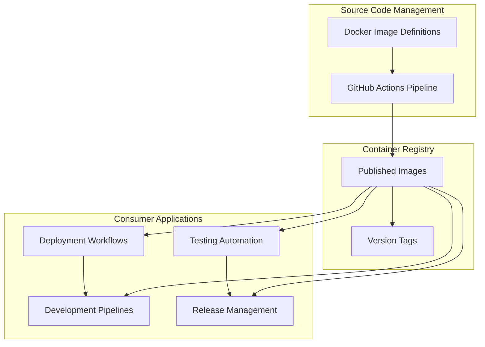

# Architecture & System Intent

**Last Reviewed:** 2024-12-19

## Purpose

Standardized CI/CD tooling infrastructure providing specialized Docker images for Kubernetes deployment, software development, testing, and release automation across WebGrip's engineering ecosystem.

## Executive Snapshot

- **Primary System**: Six specialized Docker images for CI/CD operations
- **Infrastructure Context**: Tool provisioning layer supporting Kubernetes deployment workflows
- **Runtime Environment**: GitHub Actions pipelines with automated Docker registry publishing
- **Integration Pattern**: Reusable container images consumed by downstream repositories

## Conceptual Architecture

The architecture follows a hub-and-spoke model where this repository serves as the centralized source for standardized tooling, distributed via container registry to consuming systems.

## Domain & Problem Framing

WebGrip's engineering teams require consistent, reproducible environments for:

- **Kubernetes Operations**: Deploying applications across multiple clusters with standardized toolchains
- **Multi-Language Development**: Supporting PHP, Rust, and JavaScript ecosystems with appropriate dependencies
- **Quality Assurance**: Browser automation testing with security-hardened execution environments
- **Release Automation**: Coordinated multi-artifact publishing with semantic versioning

Traditional approaches using ad-hoc CI environments create dependency drift, security inconsistencies, and maintenance overhead across projects.

## System Components & Responsibilities

### helm-deploy

**Intent**: Kubernetes deployment operations with standardized toolchain versions  
**Key Technology**: Alpine Linux, kubectl v1.32.2, Helm v3.17.1, doctl, sops, yq  
**Rationale**: Provides reproducible deployment environment with encrypted secrets support via SOPS and DigitalOcean integration for infrastructure management.

### github-runner

**Intent**: GitHub Actions execution environment for PHP-based applications  
**Key Technology**: GitHub Actions Runner v2.328.0, PHP 8.3 with extensions, Composer  
**Rationale**: Eliminates PHP version drift across projects while maintaining GitHub Actions compatibility for CI/CD workflows.

### rust-ci-runner

**Intent**: Rust development and continuous integration toolchain  
**Key Technology**: Rust v1.87.0, cargo tooling ecosystem (audit, deny, nextest, tarpaulin)  
**Rationale**: Multi-stage build optimizes image size while providing comprehensive Rust development tools including security scanning and test coverage analysis.

### rust-releaser

**Intent**: Cross-platform Rust release automation with semantic versioning  
**Key Technology**: Node.js v22, semantic-release, cargo-release, cross-compilation targets  
**Rationale**: Unifies JavaScript semantic-release ecosystem with Rust tooling for automated changelog generation and multi-platform binary distribution.

### playwright-runner

**Intent**: Browser automation testing with security constraints  
**Key Technology**: Playwright v1.51.0, PHP 8.3, custom seccomp profile  
**Rationale**: Provides headless browser testing capabilities with security hardening for CI environments while supporting PHP application testing workflows.

### act-runner

**Intent**: Local GitHub Actions workflow testing and development  
**Key Technology**: ACT CLI, Docker runtime, Alpine Linux  
**Rationale**: Enables local validation of GitHub Actions workflows reducing feedback cycles and CI resource consumption during development.

## External Dependencies & Rationale

### Base Images

- **Alpine Linux 3.21+**: Minimal attack surface, package manager stability
- **Debian Bookworm**: Comprehensive package ecosystem for complex toolchains
- **GitHub Actions Runner**: Official Microsoft container ensuring compatibility
- **Microsoft Playwright**: Vendor-maintained browser automation environment

### Tool Selections

- **Helm over raw kubectl**: Templating and release management capabilities
- **SOPS over native secrets**: Encrypted-at-rest configuration with key rotation
- **semantic-release over manual**: Automated versioning reduces human error
- **cargo-nextest over cargo test**: Faster test execution with improved reporting

### Version Pinning Strategy

All external tools use explicit version pins rather than `latest` tags to ensure reproducible builds and controlled upgrade cycles.

## Cross-Cutting Concerns

### Configuration Strategy

Environment-specific configuration injected at runtime via environment variables rather than build-time embedding. Secrets management delegated to SOPS with external key management systems.

### Observability

Container health monitored via Docker registry metrics and GitHub Actions workflow success rates. No internal application observability as images serve as execution environments rather than long-running services.

### Security Posture

- **Attack Surface**: Minimal base images, explicit dependency management
- **Isolation**: Container-based execution boundaries, custom seccomp profiles for browser testing
- **Secrets Approach**: External secret injection, no embedded credentials, SOPS encryption

## Operational Model

### Deployment Flow

1. **Source Change**: Dockerfile modifications trigger automated builds
2. **Quality Gates**: Multi-architecture builds validate image construction
3. **Registry Publishing**: Tagged images pushed to Docker Hub with SHA and latest tags
4. **Consumer Update**: Downstream repositories reference new image versions

### Environments

- **Development**: Local builds via `docker-compose.yml`
- **CI/CD**: Automated builds on main branch via GitHub Actions
- **Production**: Published registry images consumed by operational workflows

### Scaling & Resilience

Horizontal scaling achieved through parallel image builds. Resilience maintained via version pinning and registry redundancy. No runtime scaling concerns as images represent build-time tooling.

## Evolution & Constraints

### Explicit Trade-offs

- **Image Size vs. Capability**: Rust images prioritize comprehensive tooling over minimal size
- **Security vs. Convenience**: Browser testing requires relaxed security constraints for automation
- **Standardization vs. Flexibility**: Pinned versions reduce customization options

### Known Debt

- **Multi-architecture Support**: Limited to amd64 platforms, arm64 support pending
- **Image Layering**: Suboptimal layer caching in multi-stage builds
- **Dependency Updates**: Manual version bump process lacks automation

### Intentional Simplifications

- **No Runtime Orchestration**: Images designed for ephemeral CI usage
- **Shared Base Images**: Duplicate dependencies across images for isolation clarity
- **Static Configuration**: Build-time dependency installation over runtime package management

## Glossary

**act**: Tool for running GitHub Actions workflows locally during development  
**cargo-binstall**: Fast binary installer for Rust CLI tools avoiding compilation  
**doctl**: DigitalOcean command-line interface for cloud infrastructure management  
**helm**: Kubernetes package manager for application deployment and templating  
**seccomp**: Linux security facility restricting system calls for sandboxed execution  
**semantic-release**: Automated versioning and changelog generation based on commit conventions  
**sops**: Secrets management tool supporting encryption of configuration files  
**yq**: YAML processor for configuration file manipulation and querying

## References

[1] Helm – Package Manager for Kubernetes https://helm.sh/docs/  
[2] GitHub Actions Runner – Official Container https://github.com/actions/runner  
[3] SOPS – Secrets Operations https://github.com/mozilla/sops  
[4] Playwright – Browser Automation https://playwright.dev/docs/  
[5] ACT – Local GitHub Actions https://github.com/nektos/act  
[6] DigitalOcean CLI (doctl) https://docs.digitalocean.com/reference/doctl/  
[7] semantic-release – Automated Releases https://semantic-release.gitbook.io/  
[8] Rust Cargo Tools https://doc.rust-lang.org/cargo/  
[9] Alpine Linux – Security-oriented Distribution https://alpinelinux.org/about/  
[10] kubectl – Kubernetes Command Line Tool https://kubernetes.io/docs/reference/kubectl/