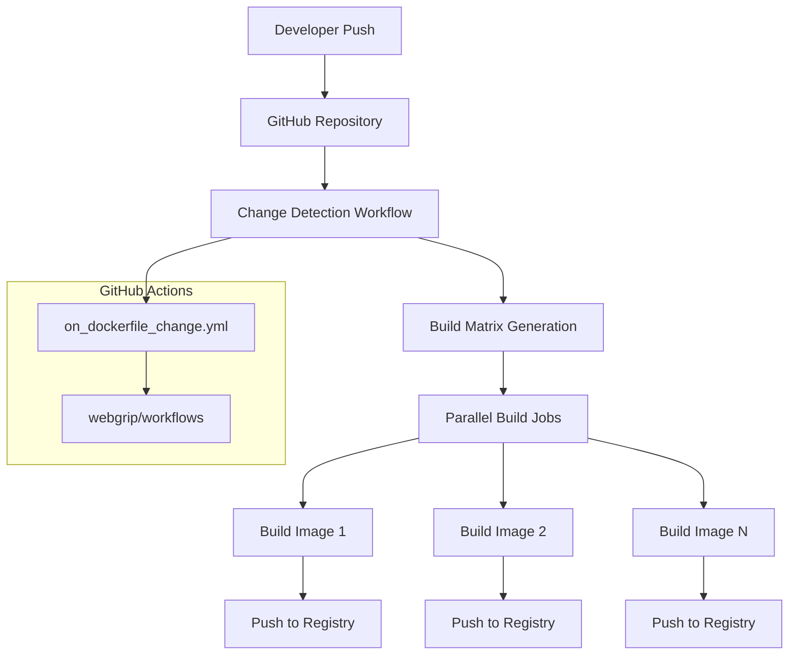
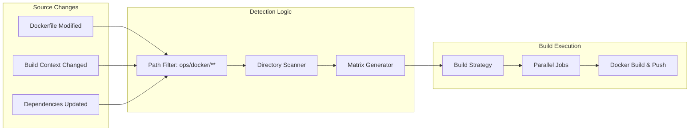

# Automated Building

Our automated building system ensures that Docker images are built, tested, and published whenever changes are made to the infrastructure repository.

## Overview

The automated building pipeline provides:

- ✅ **Change-triggered builds** - Only build images when their source code changes
- ✅ **Multi-platform support** - Build for different architectures where needed  
- ✅ **Automated publishing** - Push images to Docker Hub with proper tagging
- ✅ **Efficient resource usage** - Build only what's necessary using change detection
- ✅ **Parallel execution** - Build multiple images simultaneously when possible

## Architecture

### Build Trigger Flow



### Change Detection System



## Workflow Configuration

### Main Workflow: `on_dockerfile_change.yml`

Located at [`.github/workflows/on_dockerfile_change.yml`](../../../.github/workflows/on_dockerfile_change.yml), this workflow:

1. **Triggers** on pushes to `main` branch affecting `ops/docker/**` paths
2. **Detects** changed directories using a reusable workflow
3. **Builds** only the Docker images that have changes
4. **Publishes** images with both `:latest` and `:${{ github.sha }}` tags

```yaml
name: '[Workflow] On Dockerfile Change'

concurrency:
  group: push-${{ github.branch }}
  cancel-in-progress: true

on:
  push:
    branches: [main]
    paths: ['ops/docker/**']

jobs:
  determine-changed-directories:
    uses: webgrip/workflows/.github/workflows/determine-changed-directories.yml@ubuntu-latest
    with:
      inside-dir: 'ops/docker'

  build-and-push-changed-dirs:
    needs: [determine-changed-directories]
    if: needs.determine-changed-directories.outputs.matrix != '[]'
    strategy:
      fail-fast: false
      matrix:
        include: ${{ fromJson(needs.determine-changed-directories.outputs.matrix) }}
    uses: webgrip/workflows/.github/workflows/docker-build-and-push.yml@ubuntu-latest
    with:
      docker-context: ${{ matrix.path }}
      docker-file: Dockerfile
      docker-tags: |
        ${{ github.repository_owner }}/${{ matrix.basename }}:latest
        ${{ github.repository_owner }}/${{ matrix.basename }}:${{ github.sha }}
    secrets:
      DOCKER_USERNAME: ${{ secrets.DOCKER_USERNAME }}
      DOCKER_TOKEN: ${{ secrets.DOCKER_TOKEN }}
```

### Reusable Workflows

The pipeline leverages shared workflows from the [`webgrip/workflows`](https://github.com/webgrip/workflows) repository:

#### Change Detection Workflow
- **Purpose**: Identify which Docker image directories have changes
- **Output**: JSON matrix of changed directories for parallel building
- **Logic**: Compares current commit against previous commit

#### Docker Build & Push Workflow  
- **Purpose**: Build and publish individual Docker images
- **Features**: Multi-platform builds, layer caching, security scanning
- **Outputs**: Published images with proper tags

## Build Process Details

### Change Detection Algorithm

1. **Path Filtering**: Only triggers on changes to `ops/docker/**`
2. **Directory Scanning**: Identifies which subdirectories contain changes
3. **Matrix Generation**: Creates build matrix for parallel execution

```bash
# Example change detection logic
changed_dirs=$(git diff --name-only HEAD~1 HEAD | 
               grep '^ops/docker/' | 
               cut -d'/' -f1-3 | 
               sort -u)
```

### Build Matrix Example

When multiple images are changed simultaneously:

```json
{
  "include": [
    {
      "path": "ops/docker/rust-ci-runner",
      "basename": "rust-ci-runner"
    },
    {
      "path": "ops/docker/playwright-runner", 
      "basename": "playwright-runner"
    }
  ]
}
```

### Docker Image Tagging Strategy

Each successful build produces two tags:

| Tag Pattern | Purpose | Example |
|-------------|---------|---------|
| `:latest` | Latest stable version | `webgrip/rust-ci-runner:latest` |
| `:${{ github.sha }}` | Specific commit version | `webgrip/rust-ci-runner:a1b2c3d4` |

### Build Context and Optimization

Each Docker image build:

1. **Uses the correct context**: Each image's subdirectory (`ops/docker/image-name/`)
2. **Leverages layer caching**: Docker layer caching for faster builds
3. **Optimizes build args**: Build-time arguments for customization
4. **Implements security**: Vulnerability scanning during build

## Supported Images

The pipeline automatically builds and publishes these images:

| Directory | Image Name | Purpose |
|-----------|------------|---------|
| `ops/docker/rust-ci-runner` | `webgrip/rust-ci-runner` | [Rust development environment](../docker-images/rust-ci-runner.md) |
| `ops/docker/github-runner` | `webgrip/github-runner` | [Self-hosted GitHub Actions runner](../docker-images/github-runner.md) |
| `ops/docker/helm-deploy` | `webgrip/helm-deploy` | [Kubernetes deployment tools](../docker-images/helm-deploy.md) |
| `ops/docker/playwright-runner` | `webgrip/playwright-runner` | [E2E testing environment](../docker-images/playwright-runner.md) |
| `ops/docker/act-runner` | `webgrip/act-runner` | [Local GitHub Actions testing](../docker-images/act-runner.md) |
| `ops/docker/rust-releaser` | `webgrip/rust-releaser` | [Release automation](../docker-images/rust-releaser.md) |

## Performance Optimizations

### Parallel Execution

```yaml
strategy:
  fail-fast: false  # Continue building other images if one fails
  matrix:
    include: ${{ fromJson(needs.determine-changed-directories.outputs.matrix) }}
```

**Benefits**:
- Multiple images build simultaneously
- Faster overall pipeline execution
- Independent failure handling

### Build Caching

The pipeline implements several caching strategies:

1. **Docker Layer Caching**: Reuse unchanged layers between builds
2. **Registry Caching**: Pull existing layers from registry
3. **GitHub Actions Cache**: Cache build contexts and dependencies

### Resource Optimization

- **Change Detection**: Only build images with actual changes
- **Concurrency Control**: Prevent duplicate builds with `cancel-in-progress`
- **Selective Triggers**: Path-based triggering reduces unnecessary executions

## Security Features

### Build Security

1. **Vulnerability Scanning**: Images scanned during build process
2. **Secret Management**: Build credentials stored as GitHub secrets
3. **Signed Images**: Images signed for integrity verification
4. **Base Image Updates**: Regular updates to base images for security patches

### Access Control

```yaml
secrets:
  DOCKER_USERNAME: ${{ secrets.DOCKER_USERNAME }}
  DOCKER_TOKEN: ${{ secrets.DOCKER_TOKEN }}
```

- **Registry Access**: Controlled via organization-level secrets
- **Workflow Permissions**: Minimal required permissions
- **Branch Protection**: Only builds from protected `main` branch

## Monitoring and Observability

### Build Status Tracking

- **GitHub Actions UI**: Real-time build status and logs
- **Commit Status Checks**: Build status visible on pull requests
- **Notification Integration**: Slack/email notifications for failures

### Build Metrics

Track key metrics for pipeline health:

- **Build Duration**: Time to complete full pipeline
- **Success Rate**: Percentage of successful builds
- **Image Size**: Monitor image size growth over time
- **Vulnerability Count**: Security scan results

### Logging and Debugging

```bash
# Access build logs
gh run list --workflow="on_dockerfile_change.yml"
gh run view <run-id> --log

# Debug specific job
gh run view <run-id> --job="build-and-push-changed-dirs"
```

## Troubleshooting

### Common Build Issues

**"No changed directories detected"**
```bash
# Verify path filters
git diff --name-only HEAD~1 HEAD | grep "ops/docker/"

# Check workflow trigger paths
cat .github/workflows/on_dockerfile_change.yml | grep -A5 "paths:"
```

**Docker build failures**
```bash
# Check Dockerfile syntax
docker build --no-cache ops/docker/rust-ci-runner/

# Verify build context
ls -la ops/docker/rust-ci-runner/
```

**Registry push failures**
```bash
# Verify credentials
docker login --username $DOCKER_USERNAME

# Test manual push
docker push webgrip/rust-ci-runner:test
```

**Matrix generation errors**
```yaml
# Debug matrix output
- name: Debug Matrix
  run: echo '${{ needs.determine-changed-directories.outputs.matrix }}'
```

### Performance Issues

**Slow builds**
- Check for layer cache misses
- Optimize Dockerfile ordering
- Review base image sizes

**Resource limitations**
- Monitor GitHub Actions resource usage
- Consider self-hosted runners for heavy builds
- Implement build queue management

## Manual Build Procedures

### Emergency Manual Build

If automated builds fail, you can manually build and push:

```bash
# Build specific image
cd ops/docker/rust-ci-runner
docker build -t webgrip/rust-ci-runner:manual .

# Tag and push
docker tag webgrip/rust-ci-runner:manual webgrip/rust-ci-runner:latest
docker push webgrip/rust-ci-runner:latest
docker push webgrip/rust-ci-runner:manual
```

### Bulk Rebuild

To rebuild all images:

```bash
# Build all images locally
for dir in ops/docker/*/; do
  image_name=$(basename "$dir")
  echo "Building $image_name..."
  docker build -t "webgrip/$image_name:rebuild" "$dir"
done

# Push all images
for dir in ops/docker/*/; do
  image_name=$(basename "$dir")
  docker push "webgrip/$image_name:rebuild"
done
```

## Configuration Management

### Workflow Updates

To modify the build pipeline:

1. **Test changes locally** using [ACT Runner](../docker-images/act-runner.md)
2. **Create feature branch** for workflow changes
3. **Test in staging** before merging to main
4. **Monitor first builds** after changes

### Adding New Images

To add a new Docker image to the automated pipeline:

1. **Create image directory**: `ops/docker/new-image/`
2. **Add Dockerfile**: Follow existing patterns
3. **Test locally**: Verify build works
4. **Commit changes**: Pipeline will automatically detect and build

No workflow changes needed - the change detection system automatically includes new directories.

### Secrets Management

Required secrets for the pipeline:

| Secret | Purpose | Where to Set |
|--------|---------|--------------|
| `DOCKER_USERNAME` | Docker Hub authentication | GitHub org secrets |
| `DOCKER_TOKEN` | Docker Hub push token | GitHub org secrets |

## Related Documentation

- [Architecture Overview](../overview/architecture.md) - How CI/CD fits into our infrastructure
- [Docker Registry](docker-registry.md) - Registry configuration and management
- [Workflow Details](workflow-details.md) - Detailed workflow breakdown
- [ACT Runner](../docker-images/act-runner.md) - Local testing of workflows

## Maintenance

### Regular Maintenance Tasks

**Weekly**:
- Review build success rates
- Check for security vulnerabilities
- Monitor image sizes

**Monthly**:
- Update base images
- Review workflow performance
- Clean up old image tags

**Quarterly**:
- Audit secrets and permissions
- Review and optimize build times
- Update reusable workflows

### Update Procedures

**Workflow Updates**:
1. Test with ACT locally
2. Deploy to feature branch
3. Monitor initial builds
4. Merge to main

**Image Updates**:
1. Update Dockerfile
2. Test local build
3. Commit to trigger pipeline
4. Verify published image

---

> **Assumption**: Builds primarily target x86_64 architecture. Multi-architecture builds (ARM64, etc.) may require additional configuration in the reusable workflows. Validation needed: Confirm architecture requirements with development teams.

**Maintainer**: [WebGrip Ops Team](https://github.com/orgs/webgrip/teams/ops)  
**Source**: [`.github/workflows/on_dockerfile_change.yml`](../../../.github/workflows/on_dockerfile_change.yml)  
**Dependencies**: [`webgrip/workflows`](https://github.com/webgrip/workflows)