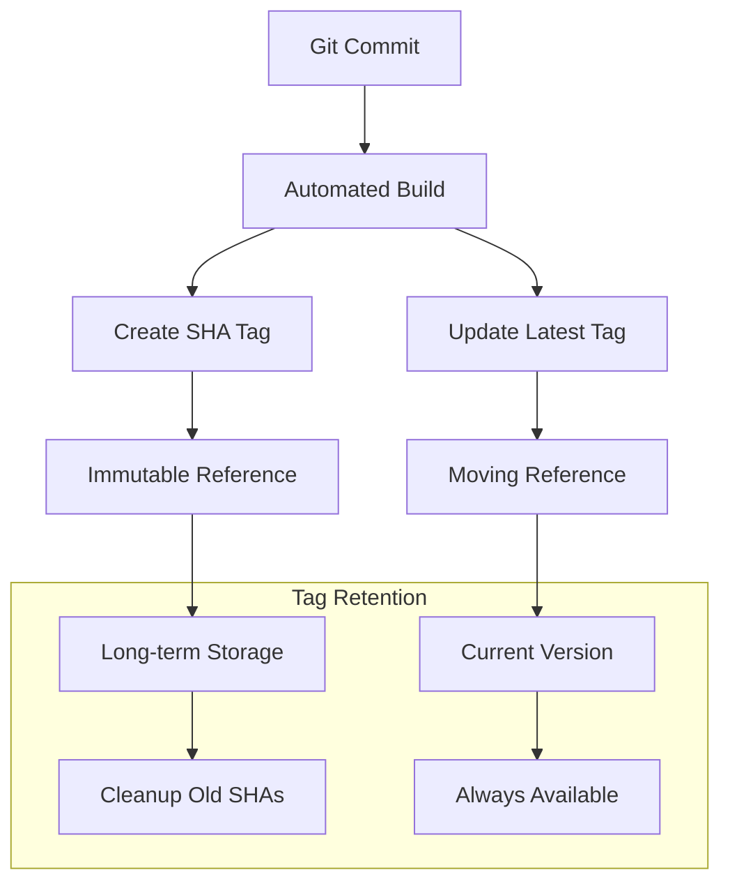
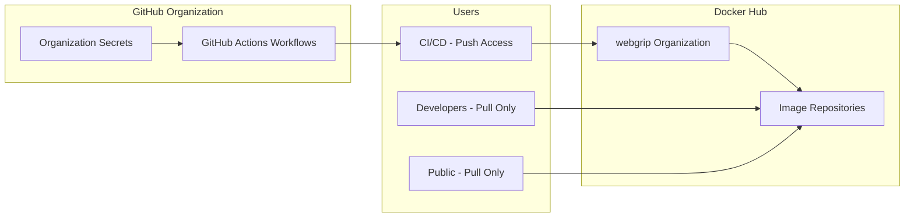
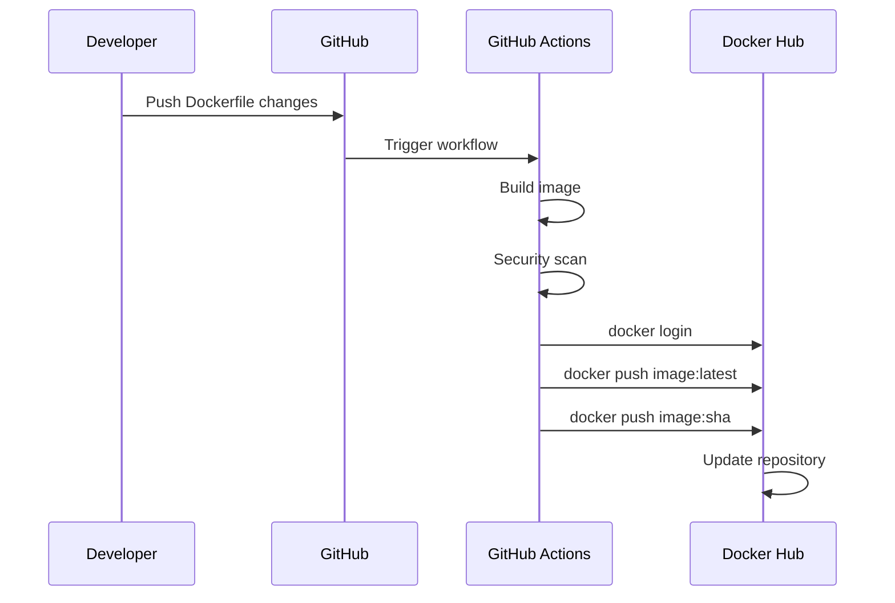
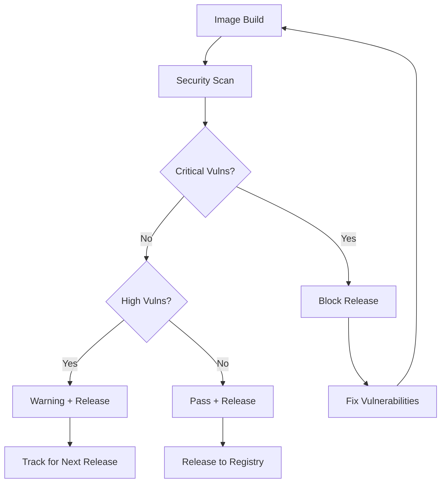
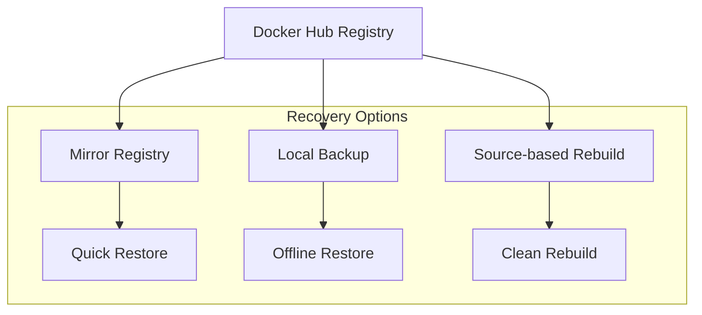

# Docker Registry

Our Docker Registry strategy and configuration for storing and distributing infrastructure container images.

## Overview

WebGrip uses **Docker Hub** as the primary registry for hosting our infrastructure container images, providing:

- ✅ **Public accessibility** for all team members and CI/CD systems
- ✅ **Automated pushing** from GitHub Actions workflows  
- ✅ **Version management** with semantic tagging strategies
- ✅ **Security scanning** and vulnerability management
- ✅ **Global CDN** for fast image pulls worldwide

## Registry Configuration

### Docker Hub Organization

**Organization**: [`webgrip`](https://hub.docker.com/u/webgrip)  
**Visibility**: Public repositories  
**Access Control**: Organization-managed credentials

### Image Repositories

| Repository | Purpose | Latest Size | Tags |
|------------|---------|-------------|------|
| [`webgrip/rust-ci-runner`](https://hub.docker.com/r/webgrip/rust-ci-runner) | Rust development environment | ~800MB | `latest`, commit SHAs |
| [`webgrip/github-runner`](https://hub.docker.com/r/webgrip/github-runner) | Self-hosted GitHub Actions runner | ~500MB | `latest`, commit SHAs |
| [`webgrip/helm-deploy`](https://hub.docker.com/r/webgrip/helm-deploy) | Kubernetes deployment tools | ~150MB | `latest`, commit SHAs |
| [`webgrip/playwright-runner`](https://hub.docker.com/r/webgrip/playwright-runner) | E2E testing environment | ~2GB | `latest`, commit SHAs |
| [`webgrip/act-runner`](https://hub.docker.com/r/webgrip/act-runner) | Local GitHub Actions testing | ~100MB | `latest`, commit SHAs |
| [`webgrip/rust-releaser`](https://hub.docker.com/r/webgrip/rust-releaser) | Release automation | ~2GB | `latest`, commit SHAs |

## Tagging Strategy

### Standard Tags

Every successful build produces consistent tags:

```bash
# Latest stable version (moves with each build)
webgrip/rust-ci-runner:latest

# Specific commit version (immutable)
webgrip/rust-ci-runner:a1b2c3d4567890abcdef1234567890abcdef1234
```

### Semantic Versioning (Future)

For stable releases, we plan to implement semantic versioning:

```bash
# Major.Minor.Patch versions
webgrip/rust-ci-runner:1.0.0
webgrip/rust-ci-runner:1.0.1
webgrip/rust-ci-runner:1.1.0

# Pre-release versions
webgrip/rust-ci-runner:2.0.0-beta.1
webgrip/rust-ci-runner:2.0.0-rc.1
```

### Tag Lifecycle



## Authentication and Access

### Registry Credentials

Access to push images is controlled via GitHub organization secrets:

| Secret | Purpose | Access Level |
|--------|---------|--------------|
| `DOCKER_USERNAME` | Docker Hub username | Organization-wide |
| `DOCKER_TOKEN` | Docker Hub access token | Organization-wide |

### Access Patterns

```yaml
# CI/CD Push Access
- name: Login to Docker Hub
  uses: docker/login-action@v2
  with:
    username: ${{ secrets.DOCKER_USERNAME }}
    password: ${{ secrets.DOCKER_TOKEN }}

# Public Pull Access (no authentication required)
docker pull webgrip/rust-ci-runner:latest
```

### Permission Model



## Image Management

### Build and Push Process

The automated pipeline follows this sequence:

1. **Change Detection**: Identify modified Docker images
2. **Parallel Building**: Build changed images simultaneously  
3. **Security Scanning**: Scan for vulnerabilities
4. **Registry Push**: Upload with both tags
5. **Cleanup**: Remove temporary build artifacts



### Image Size Optimization

We implement several strategies to keep images small:

#### Multi-stage Builds
```dockerfile
# Example from rust-ci-runner
FROM rust:1.87.0-slim-bookworm AS build
# ... build tools and dependencies

FROM debian:bookworm-slim AS final
# ... copy only necessary artifacts
```

#### Layer Optimization
```dockerfile
# Combine RUN commands to reduce layers
RUN apt-get update -qq && \
    apt-get install -y --no-install-recommends \
      ca-certificates build-essential && \
    rm -rf /var/lib/apt/lists/*
```

#### Base Image Selection
- **Alpine Linux**: For minimal footprint (`act-runner`, `helm-deploy`)
- **Debian Slim**: For compatibility (`rust-ci-runner`)
- **Official Images**: For feature completeness (`playwright-runner`)

### Registry Storage Management

#### Automated Cleanup

**Current State**: Manual cleanup of old SHA tags  
**Planned**: Automated retention policies

```bash
# Manual cleanup script (planned automation)
#!/bin/bash
# Keep last 50 SHA tags, remove older ones
docker_tags=$(curl -s "https://hub.docker.com/v2/repositories/webgrip/rust-ci-runner/tags/" | \
             jq -r '.results[].name' | \
             grep -E '^[a-f0-9]{40}$' | \
             tail -n +51)

for tag in $docker_tags; do
  # Delete old SHA tags
  curl -X DELETE \
    -H "Authorization: Bearer $DOCKER_TOKEN" \
    "https://hub.docker.com/v2/repositories/webgrip/rust-ci-runner/tags/$tag/"
done
```

#### Storage Monitoring

Track registry usage metrics:

- **Total storage**: Sum of all image layers across repositories
- **Bandwidth usage**: Download statistics for optimization
- **Tag proliferation**: Number of tags per repository

## Security and Compliance

### Image Security Scanning

Images are scanned for vulnerabilities during the build process:

```yaml
# Security scanning in CI pipeline
- name: Scan image for vulnerabilities
  uses: docker/scout-action@v1
  with:
    command: cves
    image: webgrip/rust-ci-runner:latest
```

### Vulnerability Management



### Supply Chain Security

1. **Base Image Verification**: Use official, signed base images
2. **Dependency Scanning**: Scan package dependencies for vulnerabilities
3. **SBOM Generation**: Generate Software Bill of Materials
4. **Image Signing**: Plan to implement image signing with cosign

### Access Security

- **Token Rotation**: Regular rotation of Docker Hub access tokens
- **Least Privilege**: Minimal permissions for CI/CD access
- **Audit Logging**: Track all registry access and modifications

## Performance and Optimization

### Pull Performance

Optimize image pull times through:

#### Layer Caching Strategy
```dockerfile
# Order layers by change frequency (least to most)
COPY requirements.txt .
RUN pip install -r requirements.txt  # Changes infrequently

COPY . .                             # Changes frequently
RUN python setup.py install         # Changes frequently
```

#### Registry Proximity
- **Global CDN**: Docker Hub provides global edge locations
- **Regional Caching**: Consider additional registry mirrors for high-usage regions

### Build Performance

#### Parallel Builds
```yaml
strategy:
  matrix:
    image: [rust-ci-runner, playwright-runner, helm-deploy]
  
jobs:
  build:
    runs-on: ubuntu-latest
    steps:
      - name: Build ${{ matrix.image }}
        run: docker build ops/docker/${{ matrix.image }}
```

#### Build Cache Optimization
```yaml
- name: Setup Docker Buildx
  uses: docker/setup-buildx-action@v2
  with:
    driver-opts: |
      image=moby/buildkit:master
      network=host

- name: Build with cache
  uses: docker/build-push-action@v4
  with:
    cache-from: type=gha
    cache-to: type=gha,mode=max
```

## Monitoring and Alerting

### Registry Health Monitoring

Track key metrics for registry health:

```yaml
# Example monitoring checks
registry_metrics:
  - name: "Image pull success rate"
    threshold: "> 99%"
    
  - name: "Average pull time"
    threshold: "< 30s"
    
  - name: "Storage usage growth"
    threshold: "< 10% per month"
    
  - name: "Security scan pass rate"
    threshold: "> 95%"
```

### Alerting Configuration

**Critical Alerts**:
- Registry authentication failures
- Critical security vulnerabilities detected
- Registry storage quota exceeded

**Warning Alerts**:
- Slow image pull times
- High vulnerability counts
- Unusual download patterns

## Backup and Disaster Recovery

### Backup Strategy



### Recovery Procedures

#### Quick Recovery (Mirror Registry)
```bash
# Pull from backup registry
docker pull backup-registry.com/webgrip/rust-ci-runner:latest
docker tag backup-registry.com/webgrip/rust-ci-runner:latest webgrip/rust-ci-runner:latest
docker push webgrip/rust-ci-runner:latest
```

#### Source-based Recovery
```bash
# Rebuild from source
git clone https://github.com/webgrip/infrastructure
cd infrastructure
make rebuild-all-images
```

#### Local Backup Recovery
```bash
# Restore from local backup
docker load < backups/webgrip-rust-ci-runner-latest.tar
docker push webgrip/rust-ci-runner:latest
```

## Future Improvements

### Planned Enhancements

1. **Multi-architecture Builds**: Support ARM64 and other architectures
2. **Private Registry**: Consider private registry for sensitive images
3. **Image Signing**: Implement cosign for image verification
4. **Automated Cleanup**: Implement automated tag retention policies
5. **Registry Mirrors**: Deploy regional mirrors for faster access

### Migration Considerations

**To Private Registry**:
- Update authentication mechanisms
- Modify CI/CD workflows
- Update documentation and access patterns

**To Multi-registry Strategy**:
- Implement registry selection logic
- Add failover mechanisms
- Update monitoring and alerting

## Troubleshooting

### Common Issues

**"Authentication failed" errors**
```bash
# Verify credentials
docker login --username $DOCKER_USERNAME

# Test with docker command
echo $DOCKER_TOKEN | docker login --username $DOCKER_USERNAME --password-stdin
```

**Image pull failures**
```bash
# Check image exists
docker manifest inspect webgrip/rust-ci-runner:latest

# Try different tag
docker pull webgrip/rust-ci-runner:latest
docker pull webgrip/rust-ci-runner:$(git rev-parse HEAD)
```

**Large image sizes**
```bash
# Analyze image layers
docker history webgrip/rust-ci-runner:latest

# Use dive for detailed analysis
dive webgrip/rust-ci-runner:latest
```

**Registry quota exceeded**
```bash
# Check registry usage
curl -s -H "Authorization: Bearer $DOCKER_TOKEN" \
  "https://hub.docker.com/v2/repositories/webgrip/?page_size=100"

# Clean up old images
# (See automated cleanup script above)
```

## Related Documentation

- [Automated Building](automated-building.md) - How images are built and pushed
- [Workflow Details](workflow-details.md) - Detailed CI/CD workflow information
- [Architecture Overview](../overview/architecture.md) - Registry role in infrastructure
- [Docker Images](../docker-images/) - Individual image documentation

---

> **Assumption**: Docker Hub public repositories meet current needs. Future growth may require private registries or multi-cloud registry strategy. Validation needed: Confirm long-term registry strategy with infrastructure team.

**Maintainer**: [WebGrip Ops Team](https://github.com/orgs/webgrip/teams/ops)  
**Registry**: [Docker Hub webgrip organization](https://hub.docker.com/u/webgrip)  
**Authentication**: Organization-level GitHub secrets