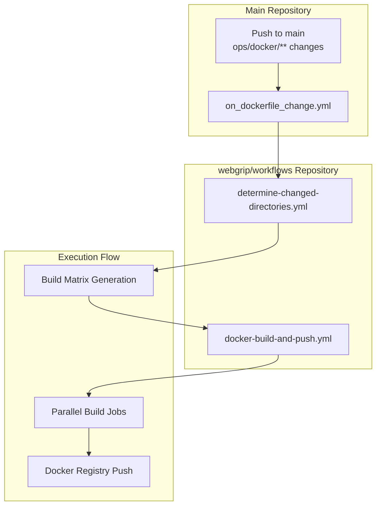
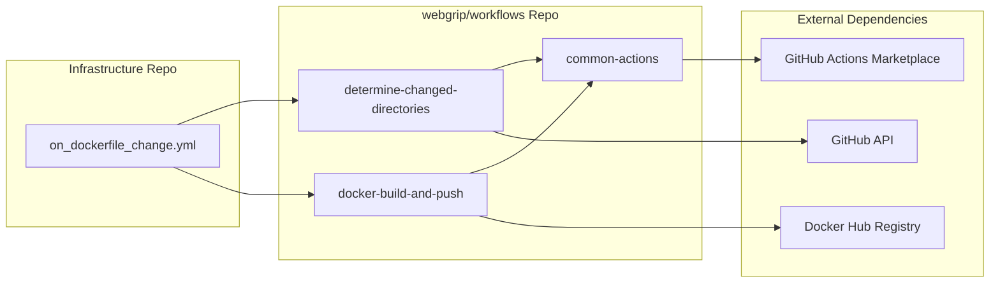
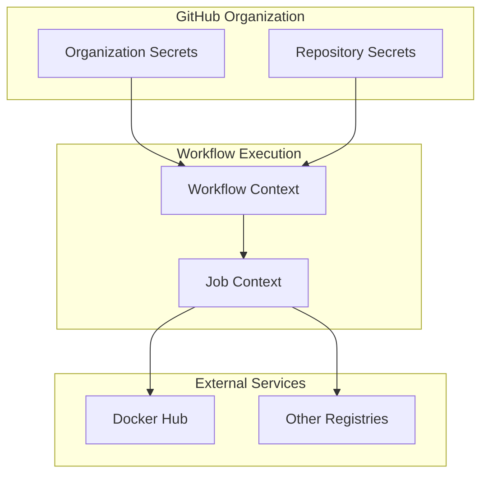
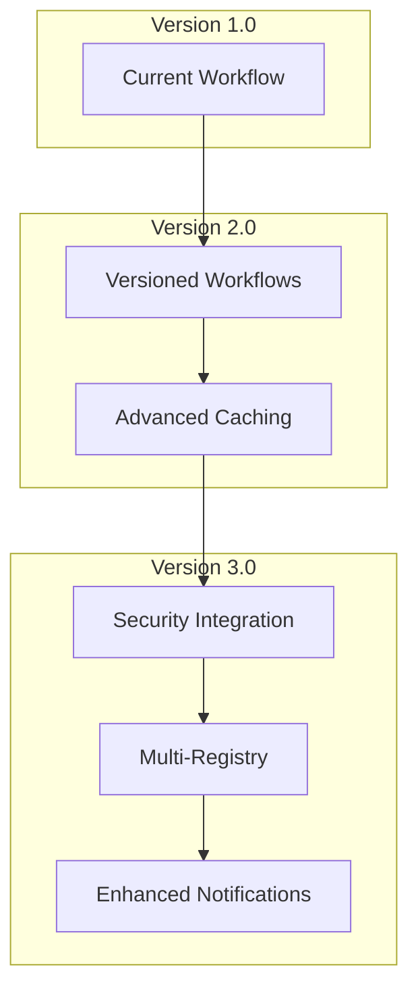

# Workflow Details

Detailed breakdown of our GitHub Actions workflows, their dependencies, and integration patterns.

## Overview

Our CI/CD workflows are built on a foundation of **reusable workflows** from the [`webgrip/workflows`](https://github.com/webgrip/workflows) repository, providing:

- ✅ **Standardized patterns** across all WebGrip repositories
- ✅ **Centralized maintenance** of common workflow logic
- ✅ **Consistent behavior** for builds, tests, and deployments
- ✅ **Reduced duplication** through reusable components
- ✅ **Version management** of workflow dependencies

## Workflow Architecture

### Primary Workflow: Dockerfile Change Detection



### Workflow Dependencies



## Workflow Breakdown

### 1. Trigger Configuration

```yaml
# .github/workflows/on_dockerfile_change.yml
on:
  push:
    branches: [main]
    paths: ['ops/docker/**']
```

**Trigger Logic**:
- **Branch Filter**: Only `main` branch pushes
- **Path Filter**: Only changes to `ops/docker/**` 
- **File Types**: Any file changes in Docker image directories

**Concurrency Control**:
```yaml
concurrency:
  group: push-${{ github.branch }}
  cancel-in-progress: true
```

### 2. Change Detection Job

```yaml
determine-changed-directories:
  uses: webgrip/workflows/.github/workflows/determine-changed-directories.yml@ubuntu-latest
  with:
    inside-dir: 'ops/docker'
```

**Purpose**: Identify which Docker image directories contain changes

**Inputs**:
- `inside-dir`: Directory to scan for changes (`ops/docker`)

**Outputs**:
- `matrix`: JSON array of changed directories for parallel building

**Algorithm**:
1. Compare current commit with previous commit
2. Filter changes to specified directory
3. Group changes by subdirectory
4. Generate matrix for parallel execution

### 3. Build and Push Job

```yaml
build-and-push-changed-dirs:
  needs: [determine-changed-directories]
  if: needs.determine-changed-directories.outputs.matrix != '[]'
  strategy:
    fail-fast: false
    matrix:
      include: ${{ fromJson(needs.determine-changed-directories.outputs.matrix) }}
  uses: webgrip/workflows/.github/workflows/docker-build-and-push.yml@ubuntu-latest
```

**Conditional Execution**: Only runs if changes detected

**Parallel Strategy**:
- `fail-fast: false`: Continue building other images if one fails
- Dynamic matrix from change detection output

**Per-Image Inputs**:
```yaml
with:
  docker-context: ${{ matrix.path }}
  docker-file: Dockerfile
  docker-tags: |
    ${{ github.repository_owner }}/${{ matrix.basename }}:latest
    ${{ github.repository_owner }}/${{ matrix.basename }}:${{ github.sha }}
```

## Reusable Workflow Details

### determine-changed-directories.yml

**Location**: `webgrip/workflows/.github/workflows/determine-changed-directories.yml`

**Purpose**: Detect which directories have changes and create build matrix

**Inputs**:
| Input | Required | Description | Default |
|-------|----------|-------------|---------|
| `inside-dir` | Yes | Directory to scan for changes | N/A |
| `exclude-dirs` | No | Directories to exclude | `""` |

**Outputs**:
| Output | Description | Example |
|--------|-------------|---------|
| `matrix` | JSON build matrix | `[{"path": "ops/docker/rust-ci", "basename": "rust-ci"}]` |
| `changed-count` | Number of changed directories | `2` |

**Implementation Logic**:
```bash
# Simplified logic
git diff --name-only HEAD~1 HEAD | \
  grep "^${inside_dir}/" | \
  cut -d'/' -f1-3 | \
  sort -u | \
  jq -R -s 'split("\n") | map(select(length > 0)) | map({"path": ., "basename": split("/")[-1]})'
```

### docker-build-and-push.yml

**Location**: `webgrip/workflows/.github/workflows/docker-build-and-push.yml`

**Purpose**: Build and push individual Docker images

**Inputs**:
| Input | Required | Description | Default |
|-------|----------|-------------|---------|
| `docker-context` | Yes | Build context directory | N/A |
| `docker-file` | No | Dockerfile name | `Dockerfile` |
| `docker-tags` | Yes | Newline-separated tags | N/A |
| `platforms` | No | Target platforms | `linux/amd64` |
| `build-args` | No | Build arguments | `""` |

**Secrets**:
| Secret | Required | Description |
|--------|----------|-------------|
| `DOCKER_USERNAME` | Yes | Docker Hub username |
| `DOCKER_TOKEN` | Yes | Docker Hub access token |

**Workflow Steps**:
1. **Checkout**: Source code checkout
2. **Setup**: Docker Buildx setup for advanced features
3. **Login**: Authenticate with Docker registry
4. **Build**: Build image with specified context and tags
5. **Push**: Push to registry with all specified tags
6. **Cleanup**: Clean up build artifacts

## Advanced Workflow Features

### Multi-Platform Builds

```yaml
# Example multi-platform configuration
with:
  docker-context: ops/docker/rust-ci-runner
  platforms: |
    linux/amd64
    linux/arm64
  docker-tags: |
    webgrip/rust-ci-runner:latest
    webgrip/rust-ci-runner:${{ github.sha }}
```

**Supported Platforms**:
- `linux/amd64` - Intel/AMD 64-bit (primary)
- `linux/arm64` - ARM 64-bit (experimental)
- `linux/arm/v7` - ARM 32-bit (on request)

### Build Arguments

```yaml
# Pass build-time arguments
with:
  build-args: |
    RUST_VERSION=1.87.0
    NODE_VERSION=20
    BUILD_DATE=${{ github.event.head_commit.timestamp }}
```

### Registry Configuration

```yaml
# Alternative registry configuration
with:
  registry: ghcr.io
  docker-tags: |
    ghcr.io/webgrip/rust-ci-runner:latest
    ghcr.io/webgrip/rust-ci-runner:${{ github.sha }}
secrets:
  DOCKER_USERNAME: ${{ github.actor }}
  DOCKER_TOKEN: ${{ secrets.GITHUB_TOKEN }}
```

## Workflow Security

### Secret Management



### Permission Model

**Workflow Permissions**:
```yaml
permissions:
  contents: read    # Read repository contents
  packages: write   # Push to GitHub Packages (if needed)
  actions: read     # Read workflow status
```

**Secret Access**:
- **Organization Level**: `DOCKER_USERNAME`, `DOCKER_TOKEN`
- **Repository Level**: Project-specific secrets
- **Environment Level**: Environment-specific overrides

### Security Best Practices

1. **Minimal Permissions**: Workflows use least-privilege access
2. **Secret Rotation**: Regular rotation of access tokens
3. **Audit Logging**: All workflow executions logged and auditable
4. **Branch Protection**: Only protected branches can trigger builds

## Workflow Monitoring

### Execution Tracking

```yaml
# Built-in monitoring via GitHub Actions
- name: Report build status
  if: always()
  run: |
    echo "Workflow: ${{ github.workflow }}"
    echo "Run ID: ${{ github.run_id }}"
    echo "Status: ${{ job.status }}"
```

### Performance Metrics

Track key workflow performance indicators:

| Metric | Target | Current | Monitoring |
|--------|--------|---------|------------|
| **Build Time** | < 10 minutes | ~5 minutes | GitHub Actions UI |
| **Success Rate** | > 95% | ~98% | Workflow status API |
| **Parallel Efficiency** | > 80% | ~85% | Job duration analysis |
| **Cache Hit Rate** | > 70% | ~75% | Build logs analysis |

### Alerting Configuration

```yaml
# Example workflow notification
- name: Notify on failure
  if: failure()
  uses: 8398a7/action-slack@v3
  with:
    status: failure
    webhook_url: ${{ secrets.SLACK_WEBHOOK }}
    message: |
      Docker build failed for ${{ matrix.basename }}
      Run: ${{ github.server_url }}/${{ github.repository }}/actions/runs/${{ github.run_id }}
```

## Troubleshooting Workflows

### Common Issues

**Matrix generation empty**
```yaml
# Debug matrix output
- name: Debug Matrix
  run: |
    echo "Matrix: ${{ needs.determine-changed-directories.outputs.matrix }}"
    echo "Changed count: ${{ needs.determine-changed-directories.outputs.changed-count }}"
```

**Build context errors**
```yaml
# Verify build context
- name: List build context
  run: |
    echo "Context: ${{ matrix.path }}"
    ls -la ${{ matrix.path }}/
    cat ${{ matrix.path }}/Dockerfile
```

**Registry authentication failures**
```yaml
# Test registry access
- name: Test Docker login
  run: |
    echo "Testing Docker Hub connection..."
    docker info
    echo "${{ secrets.DOCKER_TOKEN }}" | docker login --username "${{ secrets.DOCKER_USERNAME }}" --password-stdin
```

**Workflow dependency issues**
```yaml
# Check reusable workflow versions
- name: Check workflow versions
  run: |
    echo "Using workflows from: webgrip/workflows@ubuntu-latest"
    # Consider pinning to specific versions for stability
```

### Debugging Strategies

1. **Enable Debug Logging**:
   ```yaml
   env:
     ACTIONS_STEP_DEBUG: true
     ACTIONS_RUNNER_DEBUG: true
   ```

2. **Add Debug Steps**:
   ```yaml
   - name: Debug Environment
     run: |
       echo "GitHub Context:"
       echo "${{ toJson(github) }}"
       echo "Matrix Context:"
       echo "${{ toJson(matrix) }}"
   ```

3. **Local Testing**:
   ```bash
   # Use ACT for local workflow testing
   docker run --rm -v $(pwd):/workspace -w /workspace \
     webgrip/act-runner:latest \
     -W .github/workflows/on_dockerfile_change.yml
   ```

## Workflow Optimization

### Performance Improvements

1. **Build Caching**:
   ```yaml
   - name: Setup Docker Buildx
     uses: docker/setup-buildx-action@v2
     with:
       driver-opts: network=host
   
   - name: Build with cache
     uses: docker/build-push-action@v4
     with:
       cache-from: type=gha
       cache-to: type=gha,mode=max
   ```

2. **Parallel Execution**:
   ```yaml
   strategy:
     fail-fast: false
     max-parallel: 4  # Limit concurrent jobs
   ```

3. **Conditional Execution**:
   ```yaml
   if: |
     needs.determine-changed-directories.outputs.matrix != '[]' &&
     !contains(github.event.head_commit.message, '[skip ci]')
   ```

### Resource Optimization

```yaml
# Optimize runner resources
runs-on: ubuntu-latest  # Use GitHub-hosted runners
# Consider self-hosted for heavy builds:
# runs-on: [self-hosted, linux, x64]
```

## Future Enhancements

### Planned Improvements

1. **Workflow Versioning**: Pin reusable workflows to specific versions
2. **Advanced Caching**: Implement cross-workflow caching strategies
3. **Multi-Registry**: Support multiple Docker registries
4. **Security Scanning**: Integrate security scanning into workflows
5. **Notification Integration**: Enhanced Slack/email notifications

### Workflow Evolution



## Related Documentation

- [Automated Building](automated-building.md) - High-level build process overview
- [Docker Registry](docker-registry.md) - Registry configuration and management
- [ACT Runner](../docker-images/act-runner.md) - Local workflow testing
- [Architecture Overview](../overview/architecture.md) - CI/CD in our infrastructure

---

> **Assumption**: Reusable workflows from webgrip/workflows repository remain stable and backward-compatible. Major changes should be coordinated across all consuming repositories. Validation needed: Establish workflow versioning and compatibility policies.

**Maintainer**: [WebGrip Ops Team](https://github.com/orgs/webgrip/teams/ops)  
**Source**: [`.github/workflows/on_dockerfile_change.yml`](../../../.github/workflows/on_dockerfile_change.yml)  
**Dependencies**: [`webgrip/workflows`](https://github.com/webgrip/workflows)