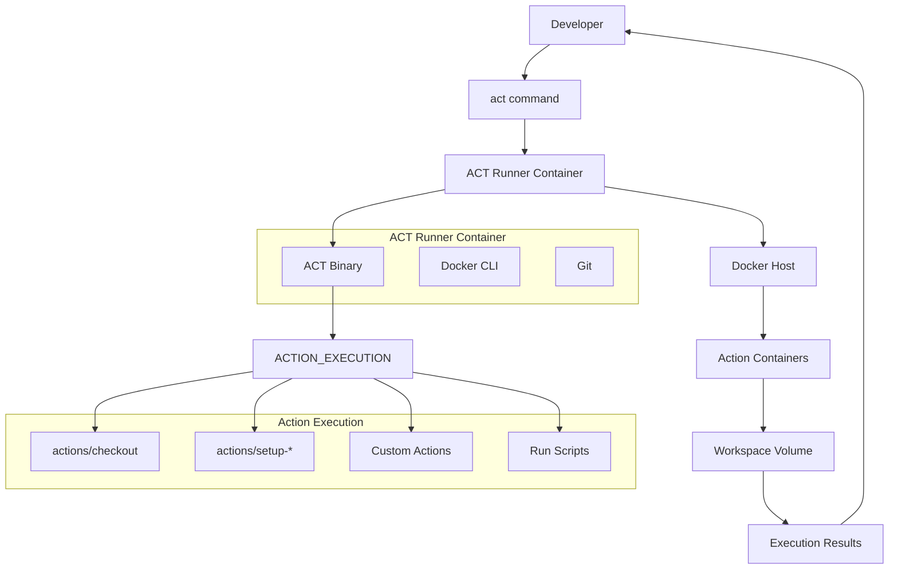

# ACT Runner

A lightweight Alpine-based container for running GitHub Actions workflows locally using the ACT (Actions Container Toolkit) tool.

## Purpose

The ACT Runner enables **local GitHub Actions testing** by providing:

- ✅ **Local workflow execution** without pushing to GitHub
- ✅ **Fast iteration cycles** for workflow development
- ✅ **Debugging capabilities** for complex GitHub Actions
- ✅ **Cost reduction** by testing locally before using GitHub Actions minutes
- ✅ **Offline development** when internet connectivity is limited

## Image Details

| Property | Value |
|----------|-------|
| **Base Image** | `alpine:3.22.1` |
| **Size** | ~100MB (minimal Alpine + ACT + Docker CLI) |
| **Architecture** | AMD64 |
| **Registry** | `webgrip/act-runner` |
| **Dockerfile** | [`ops/docker/act-runner/Dockerfile`](../../../ops/docker/act-runner/Dockerfile) |

## Installed Tools

### Core Tools

| Tool | Purpose | Installation Method |
|------|---------|-------------------|
| **ACT** | GitHub Actions local runner | Official install script |
| **Docker CLI** | Container management | Alpine package |
| **Git** | Version control integration | Alpine package |
| **Bash** | Shell scripting environment | Alpine package |
| **curl** | HTTP client for API calls | Alpine package |

### System Components

- **Alpine Linux 3.22.1** - Minimal, security-focused base OS
- **Docker socket access** - Required for running containerized actions
- **Workspace directory** - `/workspace` for project files

## Architecture

### Local Workflow Execution



### Docker-in-Docker Pattern

```mermaid
flowchart LR
    subgraph "Host System"
        DOCKER_DAEMON[Docker Daemon]
        HOST_WORKSPACE[Host Workspace]
    end
    
    subgraph "ACT Runner Container"
        ACT[ACT Process]
        DOCKER_CLI[Docker CLI]
        WORKSPACE_MOUNT[/workspace]
    end
    
    subgraph "Action Containers"
        UBUNTU[ubuntu-latest]
        NODE[actions/setup-node]
        CUSTOM_ACTION[Custom Actions]
    end
    
    ACT --> DOCKER_CLI
    DOCKER_CLI -.->|Socket| DOCKER_DAEMON
    DOCKER_DAEMON --> UBUNTU
    DOCKER_DAEMON --> NODE
    DOCKER_DAEMON --> CUSTOM_ACTION
    HOST_WORKSPACE --> WORKSPACE_MOUNT
```

## Usage Examples

### Basic Workflow Testing

```bash
# Run all workflows in the current repository
docker run --rm \
  -v $(pwd):/workspace \
  -v /var/run/docker.sock:/var/run/docker.sock \
  -w /workspace \
  webgrip/act-runner:latest
```

### Specific Workflow Execution

```bash
# Run a specific workflow file
docker run --rm \
  -v $(pwd):/workspace \
  -v /var/run/docker.sock:/var/run/docker.sock \
  -w /workspace \
  webgrip/act-runner:latest \
  -W .github/workflows/ci.yml
```

### Event-specific Testing

```bash
# Test push event
docker run --rm \
  -v $(pwd):/workspace \
  -v /var/run/docker.sock:/var/run/docker.sock \
  -w /workspace \
  webgrip/act-runner:latest \
  push

# Test pull request event
docker run --rm \
  -v $(pwd):/workspace \
  -v /var/run/docker.sock:/var/run/docker.sock \
  -w /workspace \
  webgrip/act-runner:latest \
  pull_request
```

### Job-specific Execution

```bash
# Run specific job
docker run --rm \
  -v $(pwd):/workspace \
  -v /var/run/docker.sock:/var/run/docker.sock \
  -w /workspace \
  webgrip/act-runner:latest \
  -j test

# List available jobs
docker run --rm \
  -v $(pwd):/workspace \
  -v /var/run/docker.sock:/var/run/docker.sock \
  -w /workspace \
  webgrip/act-runner:latest \
  -l
```

## Advanced Usage

### Custom Platform Configuration

```bash
# Create custom platform mapping
cat > .actrc << EOF
-P ubuntu-latest=catthehacker/ubuntu:act-latest
-P ubuntu-20.04=catthehacker/ubuntu:act-20.04
-P ubuntu-18.04=catthehacker/ubuntu:act-18.04
EOF

# Use custom platforms
docker run --rm \
  -v $(pwd):/workspace \
  -v /var/run/docker.sock:/var/run/docker.sock \
  -w /workspace \
  webgrip/act-runner:latest \
  --platform-file .actrc
```

### Environment Variables and Secrets

```bash
# Pass environment variables
docker run --rm \
  -v $(pwd):/workspace \
  -v /var/run/docker.sock:/var/run/docker.sock \
  -w /workspace \
  -e GITHUB_TOKEN=your_token \
  webgrip/act-runner:latest \
  --env GITHUB_TOKEN

# Use secrets file
echo "GITHUB_TOKEN=your_token" > .secrets
docker run --rm \
  -v $(pwd):/workspace \
  -v /var/run/docker.sock:/var/run/docker.sock \
  -w /workspace \
  webgrip/act-runner:latest \
  --secret-file .secrets
```

### Interactive Debugging

```bash
# Run interactively for debugging
docker run -it --rm \
  -v $(pwd):/workspace \
  -v /var/run/docker.sock:/var/run/docker.sock \
  -w /workspace \
  --entrypoint=/bin/bash \
  webgrip/act-runner:latest

# Inside container - manual ACT execution
act --help
act -l
act -n  # Dry run
```

## Development Workflow Integration

### Pre-commit Hook

```bash
#!/bin/bash
# .git/hooks/pre-commit

echo "🧪 Testing GitHub Actions locally with ACT..."

docker run --rm \
  -v $(pwd):/workspace \
  -v /var/run/docker.sock:/var/run/docker.sock \
  -w /workspace \
  webgrip/act-runner:latest \
  -n --verbose

if [ $? -ne 0 ]; then
    echo "❌ GitHub Actions workflow validation failed!"
    exit 1
fi

echo "✅ GitHub Actions workflows validated successfully!"
```

### Makefile Integration

```makefile
# Makefile
.PHONY: test-actions
test-actions:
	@echo "Testing GitHub Actions locally..."
	docker run --rm \
		-v $(PWD):/workspace \
		-v /var/run/docker.sock:/var/run/docker.sock \
		-w /workspace \
		webgrip/act-runner:latest \
		-n

.PHONY: run-actions
run-actions:
	@echo "Running GitHub Actions locally..."
	docker run --rm \
		-v $(PWD):/workspace \
		-v /var/run/docker.sock:/var/run/docker.sock \
		-w /workspace \
		webgrip/act-runner:latest

.PHONY: debug-actions
debug-actions:
	@echo "Debugging GitHub Actions..."
	docker run -it --rm \
		-v $(PWD):/workspace \
		-v /var/run/docker.sock:/var/run/docker.sock \
		-w /workspace \
		--entrypoint=/bin/bash \
		webgrip/act-runner:latest
```

### VS Code Integration

```json
// .vscode/tasks.json
{
  "version": "2.0.0",
  "tasks": [
    {
      "label": "Test GitHub Actions",
      "type": "shell",
      "command": "docker",
      "args": [
        "run", "--rm",
        "-v", "${workspaceFolder}:/workspace",
        "-v", "/var/run/docker.sock:/var/run/docker.sock",
        "-w", "/workspace",
        "webgrip/act-runner:latest",
        "-n"
      ],
      "group": "test",
      "presentation": {
        "echo": true,
        "reveal": "always",
        "focus": false,
        "panel": "shared"
      }
    }
  ]
}
```

## Configuration

### ACT Configuration File

```yaml
# .actrc or ~/.actrc
# Platform mappings
-P ubuntu-latest=catthehacker/ubuntu:act-latest
-P ubuntu-20.04=catthehacker/ubuntu:act-20.04

# Default secrets
--secret-file .secrets

# Default environment
--env-file .env

# Verbose output
--verbose

# Reuse containers for faster execution
--reuse
```

### Docker Compose Integration

```yaml
# docker-compose.yml
version: '3.8'

services:
  act-runner:
    image: webgrip/act-runner:latest
    volumes:
      - .:/workspace
      - /var/run/docker.sock:/var/run/docker.sock
    working_dir: /workspace
    command: ["--list"]
    
  act-test:
    extends: act-runner
    command: ["--dryrun"]
    
  act-debug:
    extends: act-runner
    entrypoint: ["/bin/bash"]
    stdin_open: true
    tty: true
```

Usage:
```bash
# List workflows
docker-compose run act-runner

# Test workflows (dry run)
docker-compose run act-test

# Debug interactively
docker-compose run act-debug
```

## Testing Specific WebGrip Workflows

### Rust CI Testing

```bash
# Test Rust CI workflow with custom image
docker run --rm \
  -v $(pwd):/workspace \
  -v /var/run/docker.sock:/var/run/docker.sock \
  -w /workspace \
  webgrip/act-runner:latest \
  -P ubuntu-latest=webgrip/rust-ci-runner:latest \
  -j test
```

### Dockerfile Build Testing

```bash
# Test Docker image building workflow
docker run --rm \
  -v $(pwd):/workspace \
  -v /var/run/docker.sock:/var/run/docker.sock \
  -w /workspace \
  webgrip/act-runner:latest \
  -W .github/workflows/on_dockerfile_change.yml \
  push
```

### E2E Testing with Playwright

```bash
# Test E2E workflow
docker run --rm \
  -v $(pwd):/workspace \
  -v /var/run/docker.sock:/var/run/docker.sock \
  -w /workspace \
  webgrip/act-runner:latest \
  -P ubuntu-latest=webgrip/playwright-runner:latest \
  -j e2e-test
```

## Troubleshooting

### Common Issues

**Docker socket permission denied**
```bash
# Ensure Docker socket is accessible
ls -la /var/run/docker.sock

# On some systems, add to docker group
sudo usermod -aG docker $USER

# Or run with elevated privileges
docker run --rm --privileged \
  -v $(pwd):/workspace \
  -v /var/run/docker.sock:/var/run/docker.sock \
  webgrip/act-runner:latest
```

**ACT runner image not found**
```bash
# Pull missing runner images
docker pull catthehacker/ubuntu:act-latest
docker pull catthehacker/ubuntu:act-20.04

# Or use custom platform mapping
docker run --rm \
  -v $(pwd):/workspace \
  -v /var/run/docker.sock:/var/run/docker.sock \
  -w /workspace \
  webgrip/act-runner:latest \
  -P ubuntu-latest=ubuntu:20.04
```

**Workflow file not found**
```bash
# Check workflow file paths
ls -la .github/workflows/

# Specify exact workflow file
docker run --rm \
  -v $(pwd):/workspace \
  -v /var/run/docker.sock:/var/run/docker.sock \
  -w /workspace \
  webgrip/act-runner:latest \
  -W .github/workflows/ci.yml
```

**Action execution failures**
```bash
# Debug with verbose output
docker run --rm \
  -v $(pwd):/workspace \
  -v /var/run/docker.sock:/var/run/docker.sock \
  -w /workspace \
  webgrip/act-runner:latest \
  --verbose --dryrun

# Check action logs
docker logs <action-container-id>
```

### Performance Issues

**Slow container startup**
```bash
# Reuse containers between runs
docker run --rm \
  -v $(pwd):/workspace \
  -v /var/run/docker.sock:/var/run/docker.sock \
  -w /workspace \
  webgrip/act-runner:latest \
  --reuse

# Use smaller base images
-P ubuntu-latest=alpine:latest
```

**Network timeouts**
```bash
# Increase timeouts
docker run --rm \
  -v $(pwd):/workspace \
  -v /var/run/docker.sock:/var/run/docker.sock \
  -w /workspace \
  webgrip/act-runner:latest \
  --container-timeout 10m
```

## Security Considerations

### Docker Socket Security

**Risk**: Mounting Docker socket provides root access to host system.

**Mitigations**:
1. **Rootless Docker**: Use rootless Docker daemon when possible
2. **User namespaces**: Configure user namespace remapping
3. **Restricted environments**: Only run on development machines, not production
4. **Network isolation**: Use isolated networks for ACT execution

```bash
# Safer execution with network isolation
docker network create act-network

docker run --rm \
  --network act-network \
  -v $(pwd):/workspace \
  -v /var/run/docker.sock:/var/run/docker.sock \
  -w /workspace \
  webgrip/act-runner:latest
```

### Secrets Management

```bash
# Use environment-specific secrets
echo "DEV_API_KEY=dev_key_value" > .secrets.dev
echo "STAGING_API_KEY=staging_key_value" > .secrets.staging

# Never commit secrets files
echo ".secrets*" >> .gitignore

# Use secrets file
docker run --rm \
  -v $(pwd):/workspace \
  -v /var/run/docker.sock:/var/run/docker.sock \
  -w /workspace \
  webgrip/act-runner:latest \
  --secret-file .secrets.dev
```

## Customization

### Extended ACT Runner

```dockerfile
# Dockerfile.custom
FROM webgrip/act-runner:latest

# Add additional tools
RUN apk add --no-cache \
    jq \
    yq \
    python3 \
    py3-pip

# Add GitHub CLI
RUN apk add --no-cache --repository=https://dl-cdn.alpinelinux.org/alpine/edge/community \
    github-cli

# Custom ACT configuration
COPY .actrc /root/.actrc
```

### Project-specific Runner

```dockerfile
FROM webgrip/act-runner:latest

# Add project-specific tools
RUN apk add --no-cache nodejs npm

# Pre-configure for project
COPY package.json package-lock.json ./
RUN npm ci

# Custom entry point
COPY act-entrypoint.sh /usr/local/bin/
ENTRYPOINT ["/usr/local/bin/act-entrypoint.sh"]
```

## Related Documentation

- [Architecture Overview](../overview/architecture.md) - Local development in our infrastructure
- [GitHub Runner](github-runner.md) - Production GitHub Actions runner
- [CI/CD Pipeline](../cicd/automated-building.md) - Our GitHub Actions workflows
- [Quick Start Guide](../overview/quick-start.md) - Getting started with local testing

## Maintenance

### Update Schedule

- **ACT version**: Updated quarterly or when new features needed
- **Alpine version**: Updated when new Alpine releases available
- **Docker CLI**: Updated with Alpine package updates

### Version Compatibility

| Image Version | ACT | Alpine | Docker CLI | Status |
|---------------|-----|--------|------------|--------|
| `latest` | Latest | 3.22.1 | Latest | Active |
| `v0.2` | v0.2.x | 3.22.x | 24.x | Supported |
| `v0.1` | v0.1.x | 3.21.x | 23.x | Deprecated |

---

> **Assumption**: Developers have Docker installed locally and are comfortable with command-line tools. ACT runner is primarily for development/testing, not production CI/CD. Validation needed: Confirm developer tooling standards and local development practices.

**Maintainer**: [WebGrip Ops Team](https://github.com/orgs/webgrip/teams/ops)  
**Source**: [`ops/docker/act-runner/Dockerfile`](../../../ops/docker/act-runner/Dockerfile)  
**Registry**: [webgrip/act-runner](https://hub.docker.com/r/webgrip/act-runner)