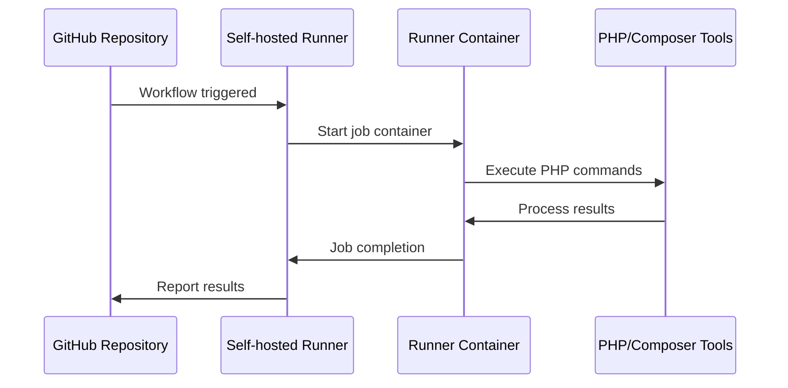
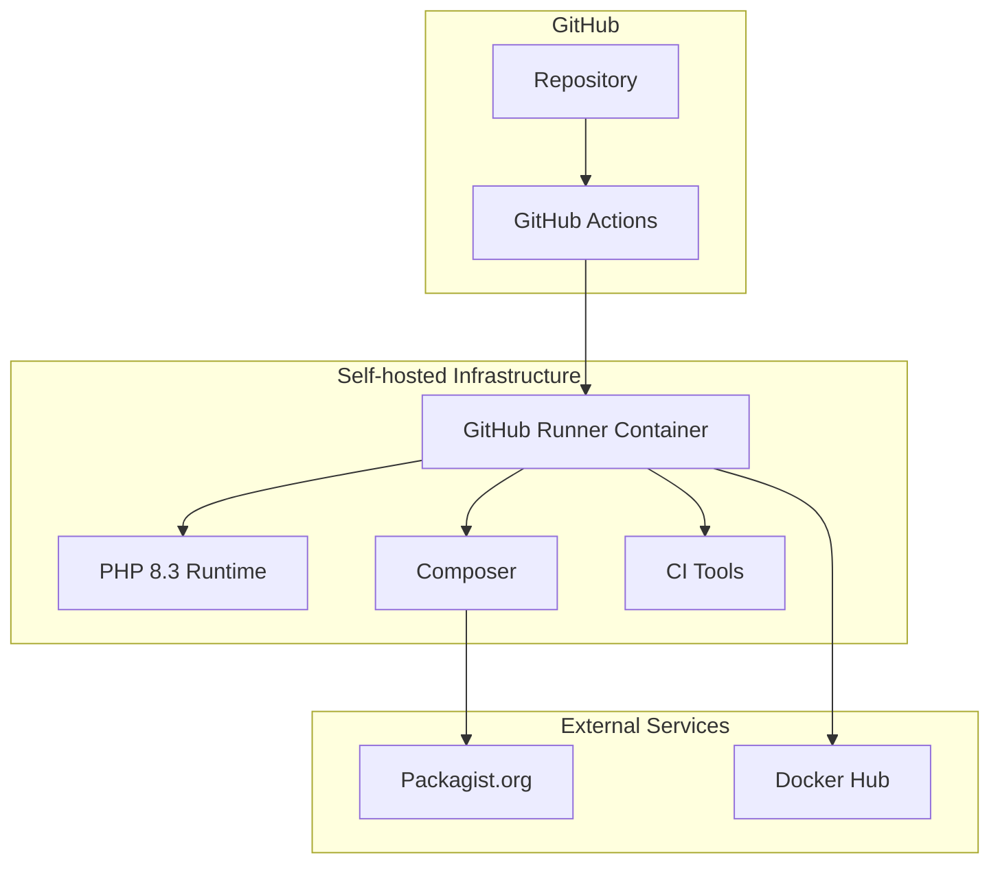

# GitHub Actions Runner

A self-hosted GitHub Actions runner with enhanced tooling for PHP development and general CI/CD workflows.

## Purpose

This image provides a **self-hosted GitHub Actions runner** that extends the official Actions runner with additional tools commonly needed in WebGrip's development workflows:

- ✅ **Self-hosted execution** for faster builds and custom environments
- ✅ **PHP 8.3 ecosystem** with Composer for PHP projects
- ✅ **Standard CI tools** (git, curl, jq) for automation workflows
- ✅ **Custom runner configuration** tailored to WebGrip's needs

## Image Details

| Property | Value |
|----------|-------|
| **Base Image** | `ghcr.io/actions/actions-runner:2.328.0` |
| **PHP Version** | 8.3 with common extensions |
| **Architecture** | AMD64 |
| **Registry** | `webgrip/github-runner` |
| **Dockerfile** | [`ops/docker/github-runner/Dockerfile`](../../../ops/docker/github-runner/Dockerfile) |

## Installed Tools & Software

### Core Runner Components

- **GitHub Actions Runner**: Version 2.328.0 from official Microsoft image
- **Runner User**: Non-root `runner` user for security

### Development Tools

| Tool | Version | Purpose |
|------|---------|---------|
| **PHP** | 8.3 | PHP development and application runtime |
| **Composer** | Latest | PHP dependency management |
| **Git** | System default | Version control |
| **curl** | System default | HTTP client for API calls |
| **jq** | System default | JSON processing |
| **bash** | System default | Shell scripting |
| **rsync** | System default | File synchronization |
| **unzip** | System default | Archive extraction |

### PHP Extensions

Complete PHP 8.3 setup with commonly used extensions:

- `php8.3-cli` - Command line interface
- `php8.3-common` - Common functionality
- `php8.3-bcmath` - Arbitrary precision mathematics
- `php8.3-curl` - cURL support
- `php8.3-gd` - Image processing
- `php8.3-intl` - Internationalization
- `php8.3-mbstring` - Multibyte string handling
- `php8.3-mysql` - MySQL database support
- `php8.3-soap` - SOAP protocol support
- `php8.3-sockets` - Socket communication
- `php8.3-xml` - XML processing
- `php8.3-zip` - ZIP archive handling

## Architecture

### Runner Lifecycle



### Integration Points



## Usage Examples

### Self-hosted Runner Setup

**Note**: This image requires proper runner registration with GitHub. It cannot be run directly without GitHub Actions runner token.

```bash
# Example runner registration (requires GitHub token)
docker run -d --name github-runner \
  -e GITHUB_URL=https://github.com/webgrip/your-repo \
  -e GITHUB_TOKEN=your_runner_token \
  -v /var/run/docker.sock:/var/run/docker.sock \
  webgrip/github-runner:latest
```

### Workflow Configuration

```yaml
# .github/workflows/php-ci.yml
name: PHP CI
on: [push, pull_request]

jobs:
  test:
    runs-on: [self-hosted, webgrip-runner]
    steps:
      - uses: actions/checkout@v4
      
      - name: Validate Composer
        run: composer validate --strict
        
      - name: Install dependencies
        run: composer install --prefer-dist --no-progress
        
      - name: Run tests
        run: |
          vendor/bin/phpunit
          vendor/bin/phpstan analyse
          
      - name: Check code style
        run: vendor/bin/php-cs-fixer fix --dry-run --diff
```

### PHP Project Examples

```bash
# Inside the runner container - PHP development workflow
composer create-project laravel/laravel my-app
cd my-app

# Install dependencies
composer install

# Run PHP-specific tools
php artisan migrate
php artisan test

# Quality assurance
composer run-script phpstan
composer run-script php-cs-fixer
```

## Configuration

### Environment Variables

During runner registration:

| Variable | Required | Purpose |
|----------|----------|---------|
| `GITHUB_URL` | Yes | Repository or organization URL |
| `GITHUB_TOKEN` | Yes | Runner registration token |
| `RUNNER_NAME` | No | Custom runner name (default: hostname) |
| `RUNNER_LABELS` | No | Additional runner labels |

### PHP Configuration

The image uses system default PHP configuration. For custom settings:

```bash
# Custom php.ini settings via environment
docker run -e "PHP_INI_SCAN_DIR=/usr/local/etc/php/conf.d" \
  -v $(pwd)/php.ini:/usr/local/etc/php/conf.d/custom.ini \
  webgrip/github-runner:latest
```

## Security Considerations

### Runner Security

1. **Non-root execution**: Runner operates as `runner` user
2. **Isolated environments**: Each job runs in isolated containers
3. **Token management**: Registration tokens should be short-lived
4. **Network isolation**: Consider firewall rules for runner hosts

### PHP Security

1. **Updated packages**: PHP 8.3 with latest security patches
2. **Minimal extensions**: Only necessary PHP extensions installed
3. **Composer security**: Always use `composer audit` in workflows

### Best Practices

```yaml
# Secure workflow example
jobs:
  secure-php:
    runs-on: [self-hosted, webgrip-runner]
    steps:
      - uses: actions/checkout@v4
      
      # Security checks first
      - name: Audit dependencies
        run: composer audit
        
      - name: Check for vulnerabilities
        run: |
          composer require --dev roave/security-advisories
          composer install
          
      # Then proceed with normal workflow
      - name: Run tests
        run: vendor/bin/phpunit
```

## Performance Optimization

### Runner Performance

1. **Persistent cache**: Use runner-local caches for Composer
   ```yaml
   - name: Cache Composer dependencies
     uses: actions/cache@v3
     with:
       path: ~/.composer/cache
       key: composer-${{ hashFiles('**/composer.lock') }}
   ```

2. **Parallel execution**: Configure multiple runner instances
   ```bash
   # Run multiple runner containers
   for i in {1..3}; do
     docker run -d --name "github-runner-$i" \
       -e RUNNER_NAME="webgrip-runner-$i" \
       webgrip/github-runner:latest
   done
   ```

### PHP Performance

1. **OPcache configuration**: Enable OPcache for production-like testing
2. **Memory limits**: Adjust PHP memory limits for large applications
3. **Composer optimization**: Use `--optimize-autoloader` flag

## Troubleshooting

### Common Issues

**Runner registration fails**
```bash
# Check runner logs
docker logs github-runner

# Verify token and URL
echo "URL: $GITHUB_URL"
echo "Token: ${GITHUB_TOKEN:0:4}..." # Only show first 4 chars
```

**PHP memory errors**
```bash
# Increase PHP memory limit
echo "memory_limit = 512M" > custom-php.ini
docker run -v $(pwd)/custom-php.ini:/etc/php/8.3/cli/conf.d/99-custom.ini \
  webgrip/github-runner:latest php -m
```

**Composer timeouts**
```bash
# Configure Composer timeout
composer config --global process-timeout 2000
```

**Permission issues**
```bash
# Check runner user permissions
docker exec github-runner id runner
docker exec github-runner ls -la /home/runner
```

### Debugging

```bash
# Interactive debugging session
docker run -it --entrypoint=/bin/bash webgrip/github-runner:latest

# Inside container - verify tools
php --version
composer --version
which git curl jq
```

## Customization

### Adding Additional Tools

```dockerfile
# Dockerfile.custom
FROM webgrip/github-runner:latest

USER root

# Add Node.js for frontend builds
RUN curl -fsSL https://deb.nodesource.com/setup_20.x | bash - && \
    apt-get install -y nodejs

# Add database clients
RUN apt-get install -y postgresql-client mysql-client

USER runner
```

### Custom Runner Configuration

```bash
# Environment file for runner configuration
cat > runner.env << EOF
GITHUB_URL=https://github.com/webgrip/infrastructure
RUNNER_NAME=webgrip-infra-runner
RUNNER_LABELS=php,infra,webgrip
RUNNER_WORKDIR=/tmp/runner-work
EOF

docker run --env-file runner.env webgrip/github-runner:latest
```

## Maintenance

### Update Schedule

- **Runner version**: Updated monthly following GitHub Actions runner releases  
- **PHP version**: Updated when new PHP 8.3.x releases available
- **Security patches**: Applied immediately when available

### Monitoring

```bash
# Check runner health
docker exec github-runner ps aux | grep Runner.Listener
docker exec github-runner systemctl status actions.runner.service
```

### Backup & Recovery

- **Runner configuration**: Stored in GitHub organization settings
- **Custom configurations**: Version controlled in this repository
- **Data persistence**: Use volumes for persistent runner data

## Integration with WebGrip Infrastructure

### Related Services

- **Rust CI Runner**: For Rust projects that also need PHP components
- **Playwright Runner**: Shares PHP tooling for full-stack testing
- **Helm Deploy**: Used by this runner for Kubernetes deployments

### Workflow Integration

```yaml
# Multi-stage workflow using multiple WebGrip images
jobs:
  php-build:
    runs-on: [self-hosted, webgrip-runner]
    steps:
      - name: Build PHP application
        run: composer install --no-dev --optimize-autoloader
        
  rust-build:
    runs-on: ubuntu-latest
    container: webgrip/rust-ci-runner:latest
    steps:
      - name: Build Rust components
        run: cargo build --release
        
  deploy:
    needs: [php-build, rust-build]
    runs-on: ubuntu-latest
    container: webgrip/helm-deploy:latest
    steps:
      - name: Deploy to Kubernetes
        run: helm upgrade --install myapp ./charts/myapp
```

## Related Documentation

- [Architecture Overview](../overview/architecture.md) - How runners fit into our CI/CD
- [CI/CD Pipeline](../cicd/automated-building.md) - Automated runner image building
- [Playwright Runner](playwright-runner.md) - Complementary testing image with PHP
- [Operations Guide](../operations/contributing-images.md) - Contributing to runner improvements

---

> **Assumption**: Self-hosted runners are deployed in secure, managed environments with proper network isolation and monitoring. Validation needed: Confirm runner deployment strategy and security requirements with ops team.

**Maintainer**: [WebGrip Ops Team](https://github.com/orgs/webgrip/teams/ops)  
**Source**: [`ops/docker/github-runner/Dockerfile`](../../../ops/docker/github-runner/Dockerfile)  
**Registry**: [webgrip/github-runner](https://hub.docker.com/r/webgrip/github-runner)