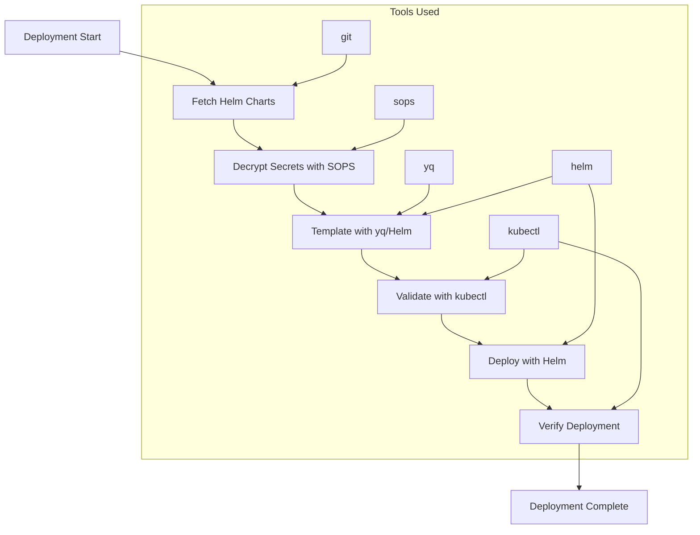
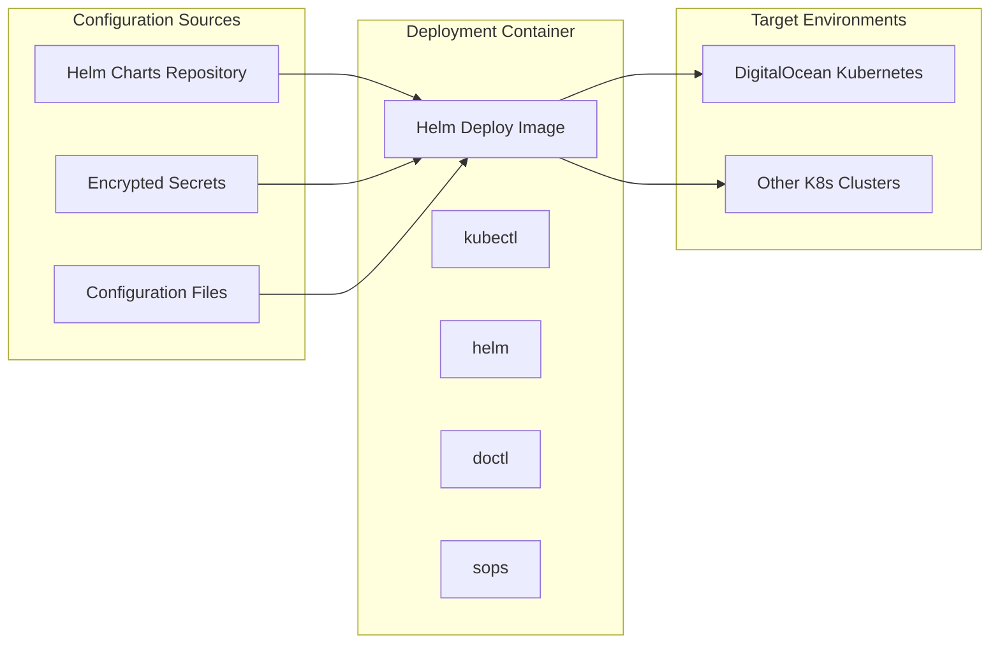

# Helm Deploy

A lightweight, Alpine-based container optimized for Kubernetes deployments using Helm, kubectl, and additional DevOps tooling.

## Purpose

The Helm Deploy image serves as a **specialized deployment environment** for Kubernetes infrastructure, providing:

- ✅ **Kubernetes deployment** via Helm charts and kubectl
- ✅ **Multi-cloud support** with DigitalOcean CLI integration
- ✅ **Secrets management** using SOPS for encrypted configurations
- ✅ **YAML processing** capabilities for configuration manipulation
- ✅ **Minimal footprint** based on Alpine Linux for fast execution

## Image Details

| Property | Value |
|----------|-------|
| **Base Image** | `alpine:3.21.3` |
| **Size** | ~150MB (minimal Alpine + tools) |
| **Architecture** | AMD64 |
| **Registry** | `webgrip/helm-deploy` |
| **Dockerfile** | [`ops/docker/helm-deploy/Dockerfile`](../../../ops/docker/helm-deploy/Dockerfile) |

## Installed Tools & Versions

### Core Deployment Tools

| Tool | Version | Purpose |
|------|---------|---------|
| **kubectl** | v1.32.2 | Kubernetes command-line tool |
| **Helm** | 3.17.1 | Kubernetes package manager |
| **doctl** | 1.123.0 | DigitalOcean CLI |
| **SOPS** | 3.7.3 | Secrets encryption/decryption |
| **yq** | 4.45.1 | YAML processing tool |

### System Utilities

- **git** - Version control for chart repositories
- **curl/wget** - HTTP clients for API interactions
- **bash** - Shell scripting environment
- **tar** - Archive handling
- **gnupg** - GPG encryption for SOPS
- **openssl** - SSL/TLS utilities
- **ca-certificates** - Certificate authority bundle

## Architecture

### Deployment Workflow



### Multi-Cloud Architecture



## Usage Examples

### Basic Helm Deployment

```bash
# Deploy a Helm chart to Kubernetes
docker run --rm \
  -v $(pwd):/workspace \
  -v ~/.kube:/root/.kube \
  -w /workspace \
  webgrip/helm-deploy:latest \
  helm upgrade --install myapp ./charts/myapp
```

### DigitalOcean Kubernetes Deployment

```bash
# Deploy to DigitalOcean managed Kubernetes
docker run --rm \
  -v $(pwd):/workspace \
  -e DIGITALOCEAN_ACCESS_TOKEN=$DO_TOKEN \
  -w /workspace \
  webgrip/helm-deploy:latest \
  bash -c "
    doctl kubernetes cluster kubeconfig save my-cluster
    helm upgrade --install myapp ./charts/myapp --namespace production
  "
```

### Secrets Management with SOPS

```bash
# Decrypt secrets and deploy
docker run --rm \
  -v $(pwd):/workspace \
  -v ~/.kube:/root/.kube \
  -v ~/.gnupg:/root/.gnupg \
  -w /workspace \
  webgrip/helm-deploy:latest \
  bash -c "
    # Decrypt secrets
    sops -d secrets/production.enc.yaml > secrets/production.yaml
    
    # Deploy with decrypted secrets
    helm upgrade --install myapp ./charts/myapp \
      --values secrets/production.yaml \
      --namespace production
  "
```

### Configuration Processing with yq

```bash
# Process YAML configurations before deployment
docker run --rm \
  -v $(pwd):/workspace \
  -w /workspace \
  webgrip/helm-deploy:latest \
  bash -c "
    # Modify configuration using yq
    yq eval '.image.tag = \"v1.2.3\"' values.yaml > values-updated.yaml
    
    # Deploy with updated values
    helm upgrade --install myapp ./charts/myapp \
      --values values-updated.yaml
  "
```

## CI/CD Integration

### GitHub Actions Workflow

```yaml
# .github/workflows/deploy.yml
name: Deploy to Kubernetes
on:
  push:
    branches: [main]

jobs:
  deploy:
    runs-on: ubuntu-latest
    container: webgrip/helm-deploy:latest
    steps:
      - uses: actions/checkout@v4
      
      - name: Setup DigitalOcean CLI
        env:
          DIGITALOCEAN_ACCESS_TOKEN: ${{ secrets.DO_TOKEN }}
        run: |
          doctl kubernetes cluster kubeconfig save ${{ vars.CLUSTER_NAME }}
          
      - name: Decrypt secrets
        env:
          SOPS_AGE_KEY: ${{ secrets.SOPS_AGE_KEY }}
        run: |
          echo "$SOPS_AGE_KEY" > /tmp/age-key
          export SOPS_AGE_KEY_FILE=/tmp/age-key
          sops -d secrets/production.enc.yaml > secrets/production.yaml
          
      - name: Deploy application
        run: |
          helm dependency update ./charts/myapp
          helm upgrade --install myapp ./charts/myapp \
            --namespace production \
            --create-namespace \
            --values secrets/production.yaml \
            --set image.tag=${{ github.sha }}
            
      - name: Verify deployment
        run: |
          kubectl rollout status deployment/myapp -n production
          kubectl get pods -n production
```

### Multi-Environment Deployment

```yaml
# Deploy to multiple environments
strategy:
  matrix:
    environment: [staging, production]
    
steps:
  - name: Deploy to ${{ matrix.environment }}
    run: |
      # Setup environment-specific configuration
      export NAMESPACE=${{ matrix.environment }}
      export VALUES_FILE=values-${{ matrix.environment }}.yaml
      
      # Decrypt environment-specific secrets
      sops -d secrets/${{ matrix.environment }}.enc.yaml > secrets/${{ matrix.environment }}.yaml
      
      # Deploy with environment-specific settings
      helm upgrade --install myapp-${{ matrix.environment }} ./charts/myapp \
        --namespace $NAMESPACE \
        --create-namespace \
        --values $VALUES_FILE \
        --values secrets/${{ matrix.environment }}.yaml
```

## Configuration

### Environment Variables

| Variable | Purpose | Example |
|----------|---------|---------|
| `DIGITALOCEAN_ACCESS_TOKEN` | DigitalOcean API authentication | `dop_v1_xxx...` |
| `KUBECONFIG` | Kubernetes configuration file path | `/root/.kube/config` |
| `SOPS_AGE_KEY_FILE` | Age key file for SOPS decryption | `/tmp/age-key` |
| `SOPS_AGE_KEY` | Age key content for SOPS | `AGE-SECRET-KEY-1XXX...` |
| `HELM_CACHE_HOME` | Helm cache directory | `/tmp/.helm` |

### Volume Mounts

```bash
# Essential volume mounts for deployment
docker run --rm \
  -v $(pwd):/workspace \                    # Project files
  -v ~/.kube:/root/.kube \                  # Kubernetes config
  -v ~/.gnupg:/root/.gnupg \                # GPG keys for SOPS
  -v helm-cache:/tmp/.helm \                # Helm cache
  webgrip/helm-deploy:latest
```

## Advanced Usage

### Custom Helm Chart Development

```bash
# Create and test new Helm charts
docker run -it --rm \
  -v $(pwd):/workspace \
  -w /workspace \
  webgrip/helm-deploy:latest \
  bash -c "
    # Create new chart
    helm create myapp
    
    # Validate chart
    helm lint myapp/
    
    # Test template rendering
    helm template myapp myapp/ --values myapp/values.yaml
    
    # Package chart
    helm package myapp/
  "
```

### Blue-Green Deployments

```bash
# Blue-green deployment strategy
docker run --rm \
  -v $(pwd):/workspace \
  -v ~/.kube:/root/.kube \
  -w /workspace \
  webgrip/helm-deploy:latest \
  bash -c "
    # Deploy green version
    helm upgrade --install myapp-green ./charts/myapp \
      --set color=green \
      --set image.tag=$NEW_VERSION \
      --namespace production
    
    # Wait for green to be ready
    kubectl rollout status deployment/myapp-green -n production
    
    # Switch traffic (update service selector)
    yq eval '.spec.selector.color = \"green\"' service.yaml | kubectl apply -f -
    
    # Remove blue version after verification
    helm uninstall myapp-blue --namespace production
  "
```

### Disaster Recovery

```bash
# Backup current deployment
docker run --rm \
  -v $(pwd):/workspace \
  -v ~/.kube:/root/.kube \
  -w /workspace \
  webgrip/helm-deploy:latest \
  bash -c "
    # Get current values
    helm get values myapp -n production > backup/current-values.yaml
    
    # Get current manifests  
    helm get manifest myapp -n production > backup/current-manifest.yaml
    
    # Backup persistent volumes
    kubectl get pv -o yaml > backup/persistent-volumes.yaml
  "
```

## Security Best Practices

### Secrets Management

1. **Use SOPS for encryption**:
   ```bash
   # Encrypt secrets file
   sops -e secrets/production.yaml > secrets/production.enc.yaml
   
   # Never commit unencrypted secrets
   echo "secrets/*.yaml" >> .gitignore
   ```

2. **Age keys for SOPS**:
   ```bash
   # Generate age key pair
   age-keygen -o age-key.txt
   
   # Use in CI/CD
   export SOPS_AGE_KEY_FILE=/tmp/age-key
   ```

3. **Kubernetes RBAC**:
   ```yaml
   # Limit deployment permissions
   apiVersion: rbac.authorization.k8s.io/v1
   kind: Role
   metadata:
     name: helm-deployer
   rules:
   - apiGroups: ["apps", ""]
     resources: ["deployments", "services", "configmaps"]
     verbs: ["get", "list", "create", "update", "patch"]
   ```

### Network Security

```bash
# Use private registries
docker run --rm \
  -v ~/.docker:/root/.docker \
  webgrip/helm-deploy:latest \
  helm upgrade --install myapp ./charts/myapp \
    --set image.repository=private-registry.com/myapp
```

## Troubleshooting

### Common Issues

**"Unable to connect to the server"**
```bash
# Verify Kubernetes configuration
docker run --rm -v ~/.kube:/root/.kube webgrip/helm-deploy:latest kubectl cluster-info

# Check kubeconfig
kubectl config view
kubectl config current-context
```

**"Helm chart not found"**
```bash
# Update Helm repositories
helm repo update

# Search for charts
helm search repo myapp

# Verify chart path
ls -la charts/myapp/Chart.yaml
```

**SOPS decryption failures**
```bash
# Verify age key
echo "$SOPS_AGE_KEY" | age-keygen -y

# Test decryption
sops -d secrets/production.enc.yaml
```

**DigitalOcean authentication issues**
```bash
# Verify token
doctl auth list
doctl account get

# Test cluster access
doctl kubernetes cluster list
```

### Performance Issues

**Slow Helm operations**
```bash
# Use Helm cache
export HELM_CACHE_HOME=/tmp/.helm
helm repo update

# Parallel operations
helm upgrade --install app1 ./charts/app1 &
helm upgrade --install app2 ./charts/app2 &
wait
```

**Large chart deployments**
```bash
# Increase timeout
helm upgrade --install myapp ./charts/myapp --timeout 10m

# Use atomic deployments
helm upgrade --install myapp ./charts/myapp --atomic
```

## Customization

### Adding Cloud Providers

```dockerfile
# Dockerfile.custom
FROM webgrip/helm-deploy:latest

# Add AWS CLI
RUN apk add --no-cache python3 py3-pip && \
    pip3 install awscli

# Add Azure CLI
RUN apk add --no-cache py3-pip && \
    pip3 install azure-cli

# Add Google Cloud SDK
RUN wget https://dl.google.com/dl/cloudsdk/channels/rapid/google-cloud-sdk.tar.gz && \
    tar -xzf google-cloud-sdk.tar.gz && \
    ./google-cloud-sdk/install.sh --quiet
```

### Custom Helm Plugins

```bash
# Install Helm plugins in derived image
FROM webgrip/helm-deploy:latest

RUN helm plugin install https://github.com/databus23/helm-diff
RUN helm plugin install https://github.com/jkroepke/helm-secrets
```

## Related Documentation

- [Architecture Overview](../overview/architecture.md) - Kubernetes deployment architecture
- [CI/CD Pipeline](../cicd/automated-building.md) - Automated image building
- [GitHub Runner](github-runner.md) - Self-hosted runner that uses this image
- [Operations Guide](../operations/contributing-images.md) - Contributing improvements

## Maintenance

### Update Schedule

- **Tool versions**: Updated quarterly or when security issues discovered
- **Alpine base**: Updated when new Alpine releases available
- **Kubernetes compatibility**: Tested against latest K8s versions

### Version Matrix

| Image Version | kubectl | Helm | Alpine | Status |
|---------------|---------|------|--------|--------|
| `latest` | v1.32.2 | 3.17.1 | 3.21.3 | Active |
| `v1.32` | v1.32.x | 3.17.x | 3.21.x | Supported |
| `v1.31` | v1.31.x | 3.16.x | 3.20.x | Deprecated |

---

> **Assumption**: Deployments primarily target DigitalOcean Kubernetes clusters. Support for other cloud providers (AWS EKS, GCP GKE, Azure AKS) may require additional CLI tools. Validation needed: Confirm cloud provider requirements with infrastructure team.

**Maintainer**: [WebGrip Ops Team](https://github.com/orgs/webgrip/teams/ops)  
**Source**: [`ops/docker/helm-deploy/Dockerfile`](../../../ops/docker/helm-deploy/Dockerfile)  
**Registry**: [webgrip/helm-deploy](https://hub.docker.com/r/webgrip/helm-deploy)