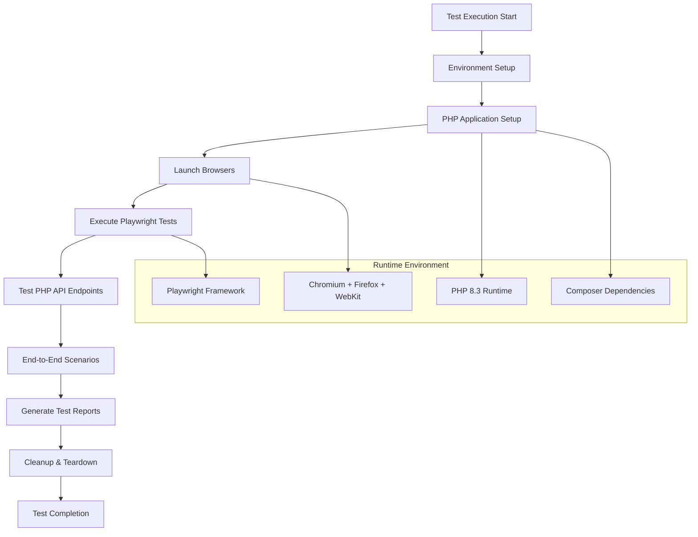
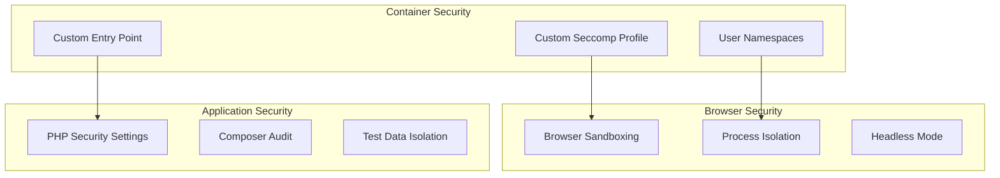

# Playwright Runner

A comprehensive end-to-end testing environment built on Microsoft's official Playwright image, enhanced with PHP tooling for full-stack web application testing.

## Purpose

The Playwright Runner provides a **complete browser testing environment** that supports:

- ✅ **Multi-browser testing** with Chromium, Firefox, and WebKit
- ✅ **PHP application testing** with full PHP 8.3 ecosystem
- ✅ **Modern web testing** with Playwright's powerful automation capabilities
- ✅ **CI/CD integration** optimized for automated testing workflows
- ✅ **Security hardening** with custom seccomp profile

## Image Details

| Property | Value |
|----------|-------|
| **Base Image** | `mcr.microsoft.com/playwright:v1.51.0-noble` |
| **Node.js Version** | Latest LTS (from base image) |
| **PHP Version** | 8.3 with common extensions |
| **Browsers** | Chromium, Firefox, WebKit (pre-installed) |
| **Registry** | `webgrip/playwright-runner` |
| **Dockerfile** | [`ops/docker/playwright-runner/Dockerfile`](../../../ops/docker/playwright-runner/Dockerfile) |

## Installed Tools & Software

### Browser Testing Stack

| Tool | Version | Purpose |
|------|---------|---------|
| **Playwright** | v1.51.0 | Browser automation framework |
| **Chromium** | Latest stable | Chrome-based testing |
| **Firefox** | Latest stable | Firefox-based testing |
| **WebKit** | Latest stable | Safari-based testing |
| **Node.js** | LTS | JavaScript runtime for Playwright |

### PHP Development Stack

Complete PHP 8.3 setup matching the [GitHub Runner](github-runner.md):

| Tool | Version | Purpose |
|------|---------|---------|
| **PHP** | 8.3 | Server-side application runtime |
| **Composer** | Latest | PHP dependency management |
| **Common Extensions** | 8.3.x | bcmath, curl, gd, mysql, xml, zip, etc. |

### System Utilities

- **curl** - HTTP client for API testing
- **bash** - Shell scripting environment  
- **jq** - JSON processing for test data
- **git** - Version control integration
- **yq** - YAML processing for configuration
- **rsync** - File synchronization
- **unzip** - Archive handling

## Architecture

### Testing Workflow



### Security Architecture



## Usage Examples

### Basic Playwright Testing

```bash
# Run Playwright tests in your project
docker run --rm \
  -v $(pwd):/app \
  -w /app \
  webgrip/playwright-runner:latest \
  npx playwright test
```

### PHP + Playwright Integration

```bash
# Full-stack testing with PHP backend
docker run --rm \
  -v $(pwd):/app \
  -w /app \
  webgrip/playwright-runner:latest \
  bash -c "
    # Setup PHP application
    composer install
    php artisan migrate --env=testing
    php artisan serve --port=8000 &
    
    # Wait for PHP server to start
    sleep 5
    
    # Run end-to-end tests
    npx playwright test --config=playwright-e2e.config.js
  "
```

### Headless vs. Headed Testing

```bash
# Headless testing (default)
docker run --rm -v $(pwd):/app -w /app \
  webgrip/playwright-runner:latest \
  npx playwright test --headed=false

# Headed testing with X11 forwarding (Linux)
docker run --rm \
  -v $(pwd):/app \
  -v /tmp/.X11-unix:/tmp/.X11-unix \
  -e DISPLAY=$DISPLAY \
  -w /app \
  webgrip/playwright-runner:latest \
  npx playwright test --headed=true
```

### Test Report Generation

```bash
# Generate HTML reports
docker run --rm \
  -v $(pwd):/app \
  -w /app \
  webgrip/playwright-runner:latest \
  bash -c "
    npx playwright test --reporter=html
    
    # Copy reports to host
    cp -r playwright-report/ /app/reports/
  "
```

## CI/CD Integration

### GitHub Actions Workflow

```yaml
# .github/workflows/e2e-tests.yml
name: End-to-End Tests
on: [push, pull_request]

jobs:
  e2e-tests:
    runs-on: ubuntu-latest
    container: webgrip/playwright-runner:latest
    
    services:
      postgres:
        image: postgres:15
        env:
          POSTGRES_PASSWORD: postgres
          POSTGRES_DB: testing
        options: >-
          --health-cmd pg_isready
          --health-interval 10s
          --health-timeout 5s
          --health-retries 5
          
    steps:
      - uses: actions/checkout@v4
      
      - name: Install PHP dependencies
        run: composer install --prefer-dist --no-progress
        
      - name: Setup application
        env:
          DB_CONNECTION: pgsql
          DB_HOST: postgres
          DB_DATABASE: testing
          DB_USERNAME: postgres
          DB_PASSWORD: postgres
        run: |
          php artisan key:generate
          php artisan migrate --force
          php artisan db:seed --force
          
      - name: Start PHP server
        run: php artisan serve --port=8000 &
        
      - name: Wait for server
        run: |
          timeout 30 bash -c 'until curl -f http://localhost:8000/health; do sleep 1; done'
          
      - name: Run Playwright tests
        run: |
          npx playwright test --config=playwright.config.js
          
      - name: Upload test reports
        uses: actions/upload-artifact@v3
        if: always()
        with:
          name: playwright-report
          path: playwright-report/
```

### Multi-Browser Testing

```yaml
# Test matrix for different browsers
strategy:
  matrix:
    browser: [chromium, firefox, webkit]
    
steps:
  - name: Run ${{ matrix.browser }} tests
    run: |
      npx playwright test --project=${{ matrix.browser }} \
        --reporter=json --output-dir=results-${{ matrix.browser }}
```

### Parallel Test Execution

```yaml
# Parallel execution with sharding
strategy:
  matrix:
    shard: [1, 2, 3, 4]
    
steps:
  - name: Run tests (Shard ${{ matrix.shard }})
    run: |
      npx playwright test --shard=${{ matrix.shard }}/4 \
        --reporter=json --output-dir=results-shard-${{ matrix.shard }}
```

## Configuration

### Environment Variables

| Variable | Default | Purpose |
|----------|---------|---------|
| `TZ` | `Europe/Amsterdam` | Container timezone |
| `NODE_ENV` | `test` | Node.js environment |
| `PLAYWRIGHT_BROWSERS_PATH` | System default | Browser installation path |
| `PLAYWRIGHT_SKIP_BROWSER_DOWNLOAD` | `1` | Skip browser download (pre-installed) |

### Playwright Configuration

```javascript
// playwright.config.js
module.exports = {
  testDir: './tests/e2e',
  timeout: 30000,
  retries: process.env.CI ? 2 : 0,
  workers: process.env.CI ? 1 : undefined,
  
  use: {
    baseURL: 'http://localhost:8000',
    trace: 'on-first-retry',
    screenshot: 'only-on-failure',
    video: 'retain-on-failure',
  },
  
  projects: [
    {
      name: 'chromium',
      use: { ...devices['Desktop Chrome'] },
    },
    {
      name: 'firefox',
      use: { ...devices['Desktop Firefox'] },
    },
    {
      name: 'webkit',
      use: { ...devices['Desktop Safari'] },
    },
  ],
  
  webServer: {
    command: 'php artisan serve',
    port: 8000,
    reuseExistingServer: !process.env.CI,
  },
};
```

### Security Configuration

The image includes a custom seccomp profile ([`seccomp_profile.json`](../../../ops/docker/playwright-runner/seccomp_profile.json)) that allows user namespaces required for browser sandboxing:

```json
{
  "comment": "Allow create user namespaces",
  "names": ["clone", "setns", "unshare"],
  "action": "SCMP_ACT_ALLOW"
}
```

## Advanced Testing Patterns

### API Testing Integration

```javascript
// tests/api-integration.spec.js
import { test, expect } from '@playwright/test';

test.describe('API Integration', () => {
  test('should test PHP API endpoints', async ({ request }) => {
    // Test PHP API directly
    const response = await request.get('/api/users');
    expect(response.status()).toBe(200);
    
    const users = await response.json();
    expect(users).toHaveLength(3);
  });
  
  test('should test UI with API data', async ({ page }) => {
    // Navigate to UI that consumes API
    await page.goto('/users');
    
    // Verify UI displays API data correctly
    await expect(page.locator('[data-testid="user-list"]')).toContainText('John Doe');
  });
});
```

### Database Testing

```javascript
// tests/database-e2e.spec.js
import { test, expect } from '@playwright/test';
import { execSync } from 'child_process';

test.describe('Database E2E', () => {
  test.beforeEach(async () => {
    // Reset database state
    execSync('php artisan migrate:fresh --seed', { stdio: 'inherit' });
  });
  
  test('should create user through UI and verify in database', async ({ page }) => {
    await page.goto('/users/create');
    await page.fill('[name="name"]', 'Test User');
    await page.fill('[name="email"]', 'test@example.com');
    await page.click('button[type="submit"]');
    
    // Verify user was created
    const result = execSync('php artisan tinker --execute="User::where(\'email\', \'test@example.com\')->count()"').toString();
    expect(parseInt(result.trim())).toBe(1);
  });
});
```

### Visual Regression Testing

```javascript
// tests/visual-regression.spec.js
import { test, expect } from '@playwright/test';

test.describe('Visual Regression', () => {
  test('should match homepage screenshot', async ({ page }) => {
    await page.goto('/');
    
    // Take screenshot and compare with baseline
    await expect(page).toHaveScreenshot('homepage.png');
  });
  
  test('should match mobile view', async ({ page }) => {
    await page.setViewportSize({ width: 375, height: 667 });
    await page.goto('/');
    
    await expect(page).toHaveScreenshot('homepage-mobile.png');
  });
});
```

## Performance Testing

### Load Testing Integration

```javascript
// tests/performance.spec.js
import { test, expect } from '@playwright/test';

test.describe('Performance', () => {
  test('should load homepage within performance budget', async ({ page }) => {
    await page.goto('/');
    
    // Wait for network idle
    await page.waitForLoadState('networkidle');
    
    // Check performance metrics
    const performanceEntries = await page.evaluate(() => {
      return JSON.stringify(performance.getEntriesByType('navigation'));
    });
    
    const navigation = JSON.parse(performanceEntries)[0];
    expect(navigation.loadEventEnd - navigation.fetchStart).toBeLessThan(3000);
  });
});
```

## Troubleshooting

### Common Issues

**Browser launch failures**
```bash
# Check browser installation
docker run --rm webgrip/playwright-runner:latest \
  npx playwright --version

# Verify browser binaries
ls -la /ms-playwright/
```

**Permission errors with seccomp**
```bash
# Run with custom seccomp profile
docker run --rm \
  --security-opt seccomp=/etc/seccomp_profile.json \
  -v $(pwd):/app -w /app \
  webgrip/playwright-runner:latest \
  npx playwright test
```

**PHP server connection issues**
```bash
# Debug PHP server
docker run -it --rm -v $(pwd):/app -w /app \
  webgrip/playwright-runner:latest bash

# Inside container
php artisan serve --host=0.0.0.0 --port=8000 &
curl http://localhost:8000/health
```

**Test timeout issues**
```bash
# Increase timeouts
npx playwright test --timeout=60000 --global-timeout=300000
```

### Debug Mode

```bash
# Run with debug output
docker run --rm \
  -e DEBUG=pw:* \
  -v $(pwd):/app -w /app \
  webgrip/playwright-runner:latest \
  npx playwright test --debug
```

### Performance Issues

```bash
# Run with reduced parallelism
docker run --rm \
  -v $(pwd):/app -w /app \
  webgrip/playwright-runner:latest \
  npx playwright test --workers=1

# Use faster test runner
npx playwright test --reporter=dot
```

## Customization

### Adding Custom Browsers

```dockerfile
# Dockerfile.custom
FROM webgrip/playwright-runner:latest

# Install additional browsers or versions
RUN npx playwright install chrome@beta
RUN npx playwright install firefox@beta
```

### Custom PHP Extensions

```dockerfile
FROM webgrip/playwright-runner:latest

USER root

# Add additional PHP extensions
RUN apt-get update && apt-get install -y \
    php8.3-redis \
    php8.3-mongodb \
    && apt-get clean

USER playwright
```

## Related Documentation

- [Architecture Overview](../overview/architecture.md) - E2E testing in our infrastructure
- [GitHub Runner](github-runner.md) - Complementary CI runner with PHP support  
- [Testing Guide](../testing/playwright-setup.md) - Detailed Playwright configuration
- [CI/CD Pipeline](../cicd/automated-building.md) - Automated image building

## Maintenance

### Update Schedule

- **Playwright version**: Updated monthly following Playwright releases
- **Browser versions**: Updated automatically with Playwright updates
- **PHP version**: Synchronized with GitHub Runner updates
- **Security patches**: Applied immediately when available

### Version Compatibility

| Image Version | Playwright | Node.js | PHP | Status |
|---------------|------------|---------|-----|--------|
| `latest` | v1.51.0 | 20 LTS | 8.3 | Active |
| `v1.51` | v1.51.x | 20 LTS | 8.3 | Supported |
| `v1.50` | v1.50.x | 18 LTS | 8.3 | Deprecated |

---

> **Assumption**: Tests primarily target web applications with PHP backends. Support for other backend technologies (Python, Ruby, etc.) may require additional runtime dependencies. Validation needed: Confirm backend technology requirements with development teams.

**Maintainer**: [WebGrip Ops Team](https://github.com/orgs/webgrip/teams/ops)  
**Source**: [`ops/docker/playwright-runner/Dockerfile`](../../../ops/docker/playwright-runner/Dockerfile)  
**Registry**: [webgrip/playwright-runner](https://hub.docker.com/r/webgrip/playwright-runner)