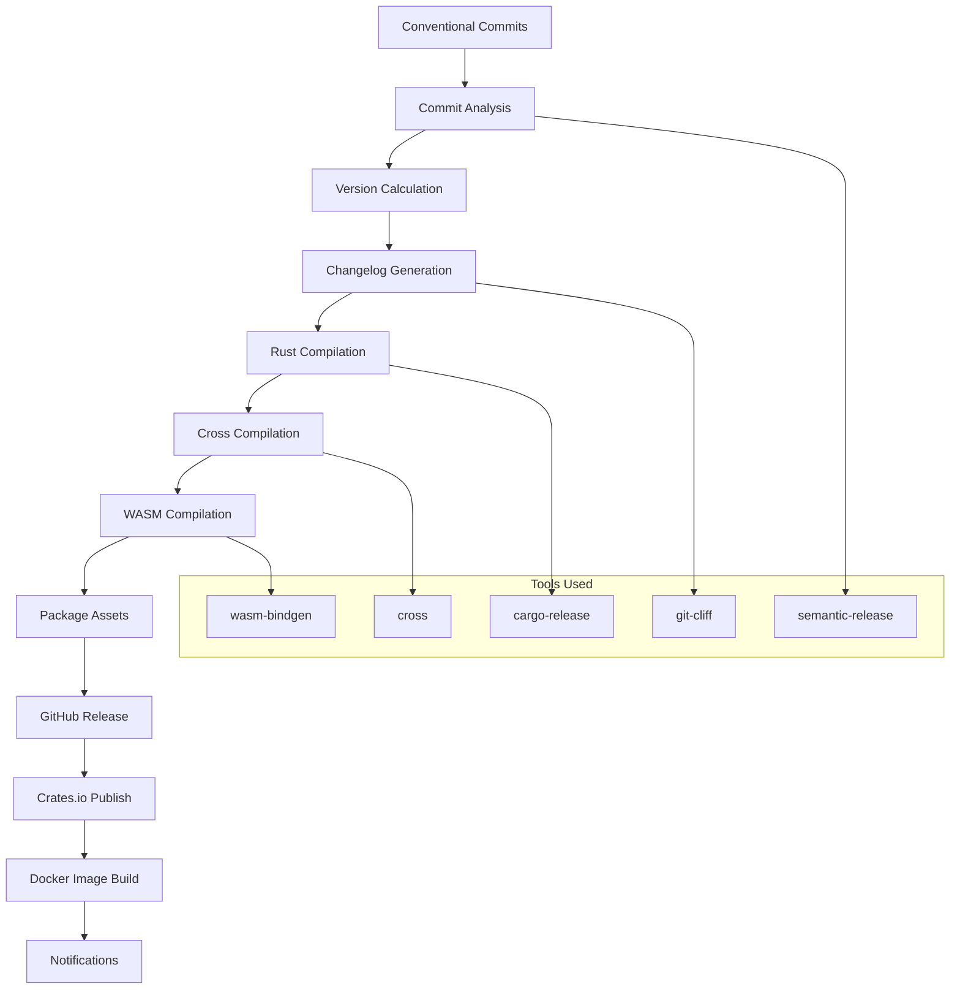
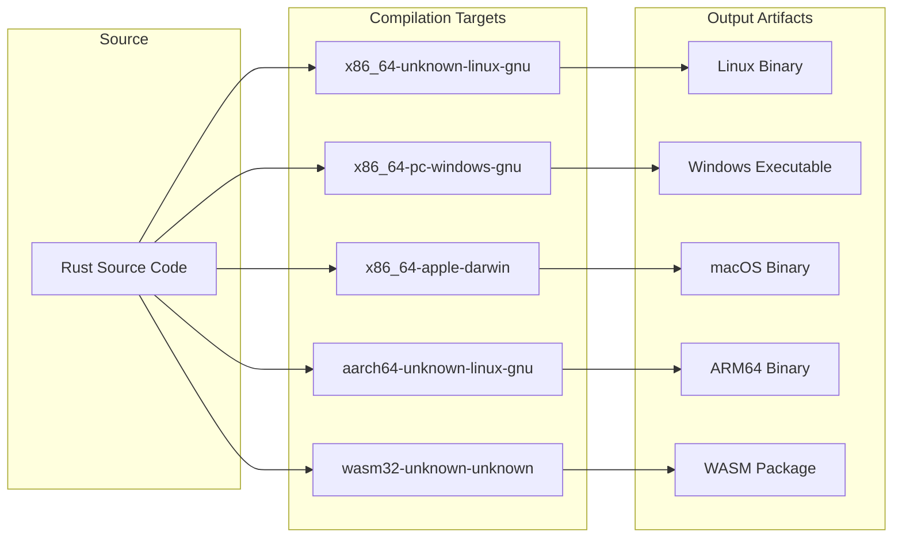

# Rust Releaser

A comprehensive release automation environment combining Node.js semantic-release tooling with Rust cross-compilation capabilities for automated software releases.

## Purpose

The Rust Releaser provides **automated release management** for Rust projects by combining:

- ✅ **Semantic Release** automation with conventional commits
- ✅ **Rust cross-compilation** for multiple target platforms
- ✅ **Multi-format releases** supporting crates, binaries, and container images
- ✅ **WASM support** for WebAssembly compilation targets
- ✅ **Changelog generation** with automated versioning
- ✅ **GitHub integration** for releases and asset publishing

## Image Details

| Property | Value |
|----------|-------|
| **Base Image** | `node:22-bookworm-slim` |
| **Size** | ~2GB (includes Rust toolchains + cross-compilation targets) |
| **Architecture** | AMD64 (with cross-compilation support) |
| **Registry** | `webgrip/rust-releaser` |
| **Dockerfile** | [`ops/docker/rust-releaser/Dockerfile`](../../../ops/docker/rust-releaser/Dockerfile) |

## Installed Tools & Software

### Release Automation Stack

| Tool | Version | Purpose |
|------|---------|---------|
| **Node.js** | 22 LTS | Runtime for semantic-release |
| **semantic-release** | Latest | Automated release management |
| **git-cliff** | Latest | Changelog generation |
| **cargo-release** | Latest | Rust-specific release tooling |

### Rust Compilation Environment

| Component | Purpose |
|-----------|---------|
| **Rust Stable** | Primary compilation toolchain |
| **cross** | Cross-compilation tool |
| **cargo-binstall** | Fast binary installation |
| **wasm-bindgen-cli** | WebAssembly binding generation |
| **wasm32-unknown-unknown** | WebAssembly compilation target |

### System Build Tools

- **build-essential** - GCC, make, and related build tools
- **pkg-config** - Library configuration
- **libssl-dev** - SSL/TLS development headers
- **Docker CLI** - Container image building
- **QEMU** - Cross-platform emulation for builds

### Semantic Release Plugins

| Plugin | Purpose |
|--------|---------|
| `@semantic-release/changelog` | Generate changelog files |
| `@semantic-release/commit-analyzer` | Analyze commits for release type |
| `@semantic-release/exec` | Execute custom release commands |
| `@semantic-release/git` | Commit and tag releases |
| `@semantic-release/github` | GitHub release integration |
| `@semantic-release/release-notes-generator` | Generate release notes |
| `semantic-release-cargo` | Rust/Cargo integration |
| `semantic-release-github-actions-tags` | GitHub Actions tag management |
| `semantic-release-helm3` | Helm chart releases |

## Architecture

### Release Pipeline Architecture



### Cross-Compilation Targets



## Usage Examples

### Basic Semantic Release

```bash
# Run semantic release for Rust project
docker run --rm \
  -v $(pwd):/workspace \
  -w /workspace \
  -e GITHUB_TOKEN=$GITHUB_TOKEN \
  -e CARGO_REGISTRY_TOKEN=$CARGO_TOKEN \
  webgrip/rust-releaser:latest \
  npx semantic-release
```

### Cross-Platform Binary Release

```bash
# Build and release for multiple platforms
docker run --rm \
  -v $(pwd):/workspace \
  -w /workspace \
  -e GITHUB_TOKEN=$GITHUB_TOKEN \
  webgrip/rust-releaser:latest \
  bash -c "
    # Build for multiple targets
    cross build --release --target x86_64-unknown-linux-gnu
    cross build --release --target x86_64-pc-windows-gnu
    cross build --release --target aarch64-unknown-linux-gnu
    
    # Create release with binaries
    npx semantic-release
  "
```

### WASM Package Release

```bash
# Build and release WebAssembly package
docker run --rm \
  -v $(pwd):/workspace \
  -w /workspace \
  -e GITHUB_TOKEN=$GITHUB_TOKEN \
  -e NPM_TOKEN=$NPM_TOKEN \
  webgrip/rust-releaser:latest \
  bash -c "
    # Build WASM package
    wasm-pack build --target web --out-dir pkg
    
    # Run semantic release
    npx semantic-release
  "
```

### Docker Image Release

```bash
# Build and release Docker images
docker run --rm \
  -v $(pwd):/workspace \
  -v /var/run/docker.sock:/var/run/docker.sock \
  -w /workspace \
  -e GITHUB_TOKEN=$GITHUB_TOKEN \
  -e DOCKER_TOKEN=$DOCKER_TOKEN \
  webgrip/rust-releaser:latest \
  bash -c "
    # Build Docker image
    docker build -t myapp:latest .
    
    # Run semantic release with Docker publishing
    npx semantic-release
  "
```

## Configuration

### Semantic Release Configuration

```json
// .releaserc.json
{
  "branches": ["main"],
  "plugins": [
    "@semantic-release/commit-analyzer",
    "@semantic-release/release-notes-generator",
    "@semantic-release/changelog",
    [
      "semantic-release-cargo",
      {
        "cargoWorkspace": true,
        "publishToCargoRegistry": true
      }
    ],
    [
      "@semantic-release/exec",
      {
        "prepareCmd": "cross build --release --target x86_64-unknown-linux-gnu && cross build --release --target x86_64-pc-windows-gnu",
        "publishCmd": "echo 'Custom publish steps'"
      }
    ],
    [
      "@semantic-release/github",
      {
        "assets": [
          {
            "path": "target/x86_64-unknown-linux-gnu/release/myapp",
            "name": "myapp-linux-amd64",
            "label": "Linux AMD64 Binary"
          },
          {
            "path": "target/x86_64-pc-windows-gnu/release/myapp.exe",
            "name": "myapp-windows-amd64.exe",
            "label": "Windows AMD64 Executable"
          }
        ]
      }
    ],
    [
      "@semantic-release/git",
      {
        "assets": ["CHANGELOG.md", "Cargo.toml", "Cargo.lock"],
        "message": "chore(release): ${nextRelease.version} [skip ci]\n\n${nextRelease.notes}"
      }
    ]
  ]
}
```

### Cross-Compilation Configuration

```toml
# Cross.toml
[build]
pre-build = [
    "dpkg --add-architecture $CROSS_DEB_ARCH",
    "apt-get update && apt-get --assume-yes install libssl-dev:$CROSS_DEB_ARCH"
]

[target.x86_64-pc-windows-gnu]
pre-build = [
    "apt-get update && apt-get install -y mingw-w64"
]

[target.aarch64-unknown-linux-gnu]
pre-build = [
    "dpkg --add-architecture arm64",
    "apt-get update && apt-get install -y libssl-dev:arm64"
]
```

### Environment Variables

| Variable | Required | Purpose | Example |
|----------|----------|---------|---------|
| `GITHUB_TOKEN` | Yes | GitHub API authentication | `ghp_xxxxxxxxxxxx` |
| `CARGO_REGISTRY_TOKEN` | Optional | Crates.io publishing | `cio_xxxxxxxx` |
| `NPM_TOKEN` | Optional | npm package publishing | `npm_xxxxxxxx` |
| `DOCKER_TOKEN` | Optional | Docker Hub publishing | `dckr_pat_xxxxx` |

## CI/CD Integration

### GitHub Actions Workflow

```yaml
# .github/workflows/release.yml
name: Release
on:
  push:
    branches: [main]

jobs:
  release:
    runs-on: ubuntu-latest
    container: webgrip/rust-releaser:latest
    steps:
      - uses: actions/checkout@v4
        with:
          fetch-depth: 0
          token: ${{ secrets.GITHUB_TOKEN }}
          
      - name: Configure Git
        run: |
          git config --global user.name "github-actions[bot]"
          git config --global user.email "41898282+github-actions[bot]@users.noreply.github.com"
          
      - name: Cache Rust dependencies
        uses: actions/cache@v3
        with:
          path: |
            ~/.cargo/registry
            ~/.cargo/git
            target/
          key: ${{ runner.os }}-cargo-${{ hashFiles('**/Cargo.lock') }}
          
      - name: Build cross-platform binaries
        run: |
          cross build --release --target x86_64-unknown-linux-gnu
          cross build --release --target x86_64-pc-windows-gnu
          cross build --release --target aarch64-unknown-linux-gnu
          
      - name: Build WASM package
        run: |
          wasm-pack build --target web --out-dir pkg
          
      - name: Run semantic release
        env:
          GITHUB_TOKEN: ${{ secrets.GITHUB_TOKEN }}
          CARGO_REGISTRY_TOKEN: ${{ secrets.CARGO_REGISTRY_TOKEN }}
          NPM_TOKEN: ${{ secrets.NPM_TOKEN }}
        run: npx semantic-release
```

### Multi-Package Workspace Release

```yaml
# Release multiple packages in workspace
name: Workspace Release
on:
  push:
    branches: [main]

jobs:
  release:
    runs-on: ubuntu-latest
    container: webgrip/rust-releaser:latest
    strategy:
      matrix:
        package: [core, cli, web]
    steps:
      - uses: actions/checkout@v4
        with:
          fetch-depth: 0
          
      - name: Release ${{ matrix.package }}
        env:
          GITHUB_TOKEN: ${{ secrets.GITHUB_TOKEN }}
          CARGO_REGISTRY_TOKEN: ${{ secrets.CARGO_REGISTRY_TOKEN }}
        run: |
          cd packages/${{ matrix.package }}
          npx semantic-release
```

## Advanced Release Patterns

### Helm Chart Release

```json
// .releaserc.json for Helm chart
{
  "plugins": [
    "@semantic-release/commit-analyzer",
    "@semantic-release/release-notes-generator",
    [
      "semantic-release-helm3",
      {
        "chartPath": "./charts/myapp",
        "registry": "oci://registry-1.docker.io/webgrip"
      }
    ],
    "@semantic-release/github"
  ]
}
```

### Container Image with Binaries

```bash
# Multi-stage release with container images
docker run --rm \
  -v $(pwd):/workspace \
  -v /var/run/docker.sock:/var/run/docker.sock \
  -w /workspace \
  -e GITHUB_TOKEN=$GITHUB_TOKEN \
  webgrip/rust-releaser:latest \
  bash -c "
    # Build optimized release binary
    cross build --release --target x86_64-unknown-linux-musl
    
    # Build minimal container image
    docker build -f Dockerfile.release -t myapp:latest .
    
    # Tag with semantic version
    NEXT_VERSION=\$(npx semantic-release --dry-run | grep 'Published release' | awk '{print \$3}')
    docker tag myapp:latest myapp:\$NEXT_VERSION
    
    # Run full release
    npx semantic-release
  "
```

### Beta/Pre-release Workflow

```json
// .releaserc.json with pre-release
{
  "branches": [
    "main",
    {
      "name": "beta",
      "prerelease": true
    },
    {
      "name": "alpha",
      "prerelease": true
    }
  ],
  "plugins": [
    "@semantic-release/commit-analyzer",
    "@semantic-release/release-notes-generator",
    [
      "semantic-release-cargo",
      {
        "publishToCargoRegistry": false  // Skip publishing pre-releases
      }
    ],
    "@semantic-release/github"
  ]
}
```

## Performance Optimization

### Build Caching

```bash
# Use build cache for faster releases
docker run --rm \
  -v $(pwd):/workspace \
  -v rust-cache:/usr/local/cargo/registry \
  -v target-cache:/workspace/target \
  -w /workspace \
  webgrip/rust-releaser:latest \
  npx semantic-release
```

### Parallel Compilation

```bash
# Enable parallel builds
docker run --rm \
  -v $(pwd):/workspace \
  -w /workspace \
  -e CARGO_BUILD_JOBS=4 \
  webgrip/rust-releaser:latest \
  cross build --release --target x86_64-unknown-linux-gnu
```

## Troubleshooting

### Common Issues

**Cross-compilation failures**
```bash
# Debug cross-compilation
docker run -it --rm \
  -v $(pwd):/workspace \
  -w /workspace \
  webgrip/rust-releaser:latest bash

# Inside container
cross build --target x86_64-pc-windows-gnu --verbose
```

**Semantic release authentication**
```bash
# Verify tokens
echo $GITHUB_TOKEN | cut -c1-10
curl -H "Authorization: token $GITHUB_TOKEN" https://api.github.com/user
```

**WASM build issues**
```bash
# Check WASM tools
wasm-pack --version
rustup target list | grep wasm

# Install missing targets
rustup target add wasm32-unknown-unknown
```

**Docker socket access**
```bash
# Verify Docker access
docker run --rm \
  -v /var/run/docker.sock:/var/run/docker.sock \
  webgrip/rust-releaser:latest \
  docker version
```

### Performance Issues

**Slow builds**
```bash
# Use cached layers
docker run --rm \
  -v $(pwd):/workspace \
  -v /usr/local/cargo/registry:/usr/local/cargo/registry \
  webgrip/rust-releaser:latest \
  cargo build --release
```

**Large artifacts**
```bash
# Strip debug symbols
cross build --release --target x86_64-unknown-linux-gnu
strip target/x86_64-unknown-linux-gnu/release/myapp
```

## Security Considerations

### Token Management

```bash
# Use short-lived tokens
export GITHUB_TOKEN=$(gh auth token --expire 1h)

# Rotate registry tokens regularly
cargo logout
cargo login $NEW_CARGO_TOKEN
```

### Binary Verification

```bash
# Generate checksums for releases
sha256sum target/release/myapp > myapp.sha256
```

### Container Security

```bash
# Scan container images
docker run --rm \
  -v /var/run/docker.sock:/var/run/docker.sock \
  webgrip/rust-releaser:latest \
  docker scan myapp:latest
```

## Customization

### Project-specific Releaser

```dockerfile
# Dockerfile.custom
FROM webgrip/rust-releaser:latest

# Add project-specific tools
RUN cargo install cargo-audit cargo-deny

# Custom release configuration
COPY .releaserc.json /workspace/
COPY Cross.toml /workspace/

# Custom entry point
COPY release-script.sh /usr/local/bin/
ENTRYPOINT ["/usr/local/bin/release-script.sh"]
```

### Extended Target Support

```dockerfile
FROM webgrip/rust-releaser:latest

# Add additional cross-compilation targets
RUN rustup target add \
    armv7-unknown-linux-gnueabihf \
    mips64-unknown-linux-gnuabi64 \
    powerpc64-unknown-linux-gnu

# Install additional cross-compilation tools
RUN apt-get update && apt-get install -y \
    gcc-arm-linux-gnueabihf \
    gcc-mips64-linux-gnuabi64 \
    gcc-powerpc64-linux-gnu
```

## Related Documentation

- [Architecture Overview](../overview/architecture.md) - Release automation in our infrastructure
- [Rust CI Runner](rust-ci-runner.md) - Development and testing environment
- [CI/CD Pipeline](../cicd/automated-building.md) - Automated building and releasing
- [GitHub Runner](github-runner.md) - Self-hosted runner for releases

## Maintenance

### Update Schedule

- **semantic-release**: Updated monthly for new features and security
- **Rust toolchain**: Updated quarterly following Rust release schedule
- **Node.js**: Updated when new LTS versions available
- **Cross-compilation tools**: Updated as needed for platform support

### Version Compatibility

| Image Version | semantic-release | Rust | Node.js | Status |
|---------------|------------------|------|---------|--------|
| `latest` | Latest | Stable | 22 LTS | Active |
| `v2.x` | v2.x | Stable | 22 LTS | Supported |
| `v1.x` | v1.x | Stable | 20 LTS | Deprecated |

---

> **Assumption**: Release workflows primarily target GitHub and crates.io. Support for additional registries (private registries, alternative Git providers) may require additional configuration. Validation needed: Confirm release target requirements with development teams.

**Maintainer**: [WebGrip Ops Team](https://github.com/orgs/webgrip/teams/ops)  
**Source**: [`ops/docker/rust-releaser/Dockerfile`](../../../ops/docker/rust-releaser/Dockerfile)  
**Registry**: [webgrip/rust-releaser](https://hub.docker.com/r/webgrip/rust-releaser)