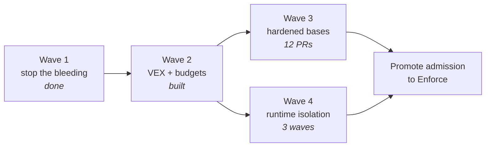

# Hardening roadmap

> Baseline measured 2026-07-31. This document is the plan **and** the honest account of what the
> measurement found — including the parts that had been quietly broken for a month.

## The short version

WebGrip signs every image it publishes, generates an SBOM for each one, attests both with a key that
never leaves OpenBao, and verifies them at admission. That is genuinely more supply-chain machinery
than most organisations run.

It was also, on 2026-07-31, **partly not working**, in ways that were invisible precisely because
the machinery existed. Three findings, in ascending order of how uncomfortable they are:

1. Dependency-Track had ingested **nothing** since run 133 — roughly fifty releases. A syft bump
   crossed a CycloneDX schema boundary and the upload started returning `400`. The step was
   `fail-soft`, so it emitted a `::warning::` and exited 0, every time.
2. This repository carried a Kyverno policy targeting `ghcr.io/webgrip/*` with a Fulcio identity —
   a registry we no longer publish to, verified by a mechanism we no longer use. The live policy in
   `homelab-cluster` was correct; this copy was fiction that read as a guarantee.
3. Nobody had ever looked at the scan results. Harbor has had `auto_scan: true` on the `webgrip`
   project the whole time.

None of these are exotic failures. They are the ordinary failure mode of security tooling: **the
control existed, so nobody checked whether it worked.**

## What the numbers actually say

From in-cluster Trivy Operator `VulnerabilityReports`:

| Image | Critical | High | Medium |
| --- | --- | --- | --- |
| `ci-runner` | 8 | 136 | 258 |
| `agent-runner` | 1 | 51 | 40 |
| `ploegd` (Go service, for contrast) | 0 | 1 | 0 |

The distribution is the finding. One image carries more criticals than the rest of the estate
combined — and it is the image with Harbor push credentials and OpenBao signing capability. The
compiled Go service with a minimal runtime is effectively clean.

This is why "make all our images CVE-free" is the wrong project. The right project is "make the one
dangerous image less dangerous, and stop the others regressing."

## Principles this plan commits to

**A metric is not a security property.** A scanner reports what it can *name*. Debian scores badly
partly because its tracker marks CVEs "won't fix" while scanners count them anyway; distroless
scores zero partly because there is nothing left to fingerprint. Optimising the number and improving
security overlap, but they are not the same activity, and where they diverge we follow security.

**A control nobody reads is not a control.** Every gate added here fails loudly or is not added.
`fail-soft` is reserved for genuine outages and must never be the response to malformed input —
that distinction is now enforced in code.

**Budgets, not aspirations.** A threshold that cannot be met gets an exception, then another, then
it is decoration. Every image's budget starts at its *measured* count and ratchets down.

**Prefer deletion to justification.** A VEX statement is the second-best outcome. `ci-runner` ships
the GitHub CLI, from a third-party apt source, in an organisation that no longer uses GitHub —
deleting that retires findings permanently and needs no justification from anyone.

## Wave 1 — stop the bleeding (done, 2026-07-31)

| Change | Effect |
| --- | --- |
| Pin syft to `cyclonedx-json@1.6` | Restores Dependency-Track ingestion across all 17 images |
| `4xx` from Dependency-Track now emits `::error::` | A malformed payload can never again hide behind a warning |
| Delete `ops/kyverno/cluster-policies/` | One source of truth for admission, in `homelab-cluster` |
| Retire `image-verify-audit`, `image-attestations-audit` | Both had zero PolicyReport results; no `ghcr.io/webgrip` image runs |
| Repoint OCI `source`/`url`/`documentation` labels at Forgejo | Image provenance points at the actual source of truth |
| [ADR-0004](../../../adrs/0004-supply-chain-on-forgejo-harbor-openbao.md) supersedes ADR-0002 | The decision record matches the running system, including what the migration cost |

## Wave 2 — make the evidence mean something (built, awaiting first release)

**OpenVEX** ([`ops/vex/`](../../../../ops/vex/README.md)). Hand-authored, PR-reviewed statements
with a justification from OpenVEX's closed vocabulary. Stamped with the built digest and attested
with the same OpenBao key as the SBOM. Harbor's project-wide `cve_allowlist` stays empty — it has no
product scope, no justification, no author and no expiry, and is an allowlist wearing a VEX costume.

**CVE budgets** ([`ops/security/cve-budgets.yaml`](../../../../ops/security/cve-budgets.yaml)).
Per-image `critical`/`high` ceilings with `warn`/`enforce` modes. New images start in `warn`, the
pipeline measures them, the budget is set at the observed number, then it only goes down.

**Gate before signature.** The gate runs *before* `cosign sign`. An over-budget image is still in
Harbor but unsigned — and unsigned is what admission refuses. This makes a webgrip signature mean
*"built by CI **and** within budget"* rather than *"built by CI"*.

See [ADR-0005](../../../adrs/0005-openvex-and-cve-budgets.md).

**Next action:** cut one release, read the budget table in the step summary, fill in the fourteen
unmeasured images, flip them to `enforce`.

## Wave 3 — bring the numbers down

[ADR-0006](../../../adrs/0006-hardened-base-images.md) — **Docker Hardened Images** as the default
base. The catalog went Apache 2.0 and free in December 2025, which is what makes this viable:
Chainguard's free tier is five images restricted to `latest`, structurally incompatible with a repo
that digest-pins everything and lets Renovate move it.

### The reference implementation

[`cve-gate`](../docker-images/cve-gate.md) is the worked example every other migration copies. It is
the gate itself, held to the standard it enforces — the only image starting at `enforce` 0/0:

- DHI `alpine-base`, `-dev` variant as a **build stage only**; the runtime stage has no package
  manager, so nothing can be installed into a running container.
- Tools **copied from hardened upstream images**, not fetched at release time. The first version of
  this gate ran `curl -sSfL raw.githubusercontent.com/anchore/grype/main/install.sh | sh` — an
  unpinned script from a mutable branch, executed in the job that decides whether an image is fit to
  sign. A supply-chain hole inside a supply-chain control.
- Non-root (65532), read-only rootfs, `--cap-drop ALL`, `no-new-privileges`, `/tmp` the only
  writable path.
- Build-time assertions that the toolchain runs **as the non-root user** before it is baked in.

Two things it surfaced that apply to every Wave 3 migration:

1. **`dhi.io` is free but not anonymous** (`401` on `/v2/`) — yet this never reaches CI. Builders
   authenticate to nothing; bases resolve through a `dhi` Harbor proxy project, matching how
   `REGISTRY_DOCKERHUB`/`REGISTRY_GHCR`/`REGISTRY_MCR` already work. And no new account: `dhi.io`
   advertises `service="registry.docker.io"`, the same Docker identity service as Docker Hub, so the
   existing Docker Hub credential authenticates it. **The proxy project is a prerequisite for the
   whole wave**, not a per-image detail — provisioned in `webgrip/homelab-cluster`.
2. **Digests resolve once the proxy exists** — and they are now pinned (2026-07-31), via
   `harbor.webgrip.dev/dhi`. Verified live: the `dhi` endpoint is healthy on the reused Docker Hub
   credential, and an anonymous pull of `dhi/alpine-base:3.23` through Harbor returns a genuine DHI
   manifest. Each base is one ARG carrying tag *and* digest, so Renovate cannot bump one without the
   other.

- **Stage 1** (near drop-in): the `semantic-release` trio, `rust-releaser`, `node-ci-runner`.
- **Stage 2** (verify first): `agent-runner`, `rust-ci-runner`, `act-runner`, `helm-deploy`,
  `php-ci-runner`, `techdocs-builder`.
- **Stage 3** (structural exceptions, not migrating): `ci-runner`, `playwright-runner`.

Highest-value single item outside the staging: `techdocs-builder` runs
`eclipse-temurin:11.0.31-jre-jammy`. Java 11 on Jammy is the oldest surface in the repository.

Each migration lands as its own PR with before/after gate numbers and lowers that image's ceiling in
the same commit.

## Wave 4 — a real boundary for the dangerous image

`ci-runner` cannot be fixed by a base swap: no hardened `actions-runner` exists. But the base image
was never the interesting risk. The interesting risk is that **a CI job executes arbitrary
repository code while holding Harbor push credentials and OpenBao signing capability**, separated
from the host only by namespaces and cgroups.

An escape there is not a node compromise. It is a supply-chain signing compromise — and because the
key is non-extractable in OpenBao, an attacker does not need the key. They need thirty seconds
inside the job that is allowed to ask for signatures.

[RFC: Container runtime isolation](https://forgejo.webgrip.dev/webgrip/homelab-cluster) (in
`homelab-cluster`, `docs/techdocs/docs/rfc/rfc-container-runtime-isolation.md`) proposes gVisor and
Kata via Talos system extensions, in three measured waves. Talos ships gVisor as a **core-tier**
extension and Kata as **extra** — no host packages, just a boot-asset rebuild and a `RuntimeClass`.

This wave complements rather than replaces
[ADR-0026](https://forgejo.webgrip.dev/webgrip/homelab-cluster) (rootless CI builds): that one
removes *privilege* from the build engine, this one hardens the *boundary* around everything the
runner executes.

## Findings backlog (2026-08-01)

Recorded here rather than fixed immediately, because each one is a separate change with its own
blast radius.

### Harbor `prevent_vul` — block vulnerable images at pull time

Harbor can refuse to serve an image whose scan exceeds a severity threshold. It is **off**, and the
per-project `cve_allowlist` is empty (deliberately — suppressions live in OpenVEX, not in registry
state). Turning it on is a project-metadata change:

```bash
# preview current state
curl -sS -u "$ROBOT" https://harbor.webgrip.dev/api/v2.0/projects/webgrip/metadatas

# enable: refuse to serve anything with a High or worse
curl -sS -u "$ROBOT" -X PUT \
  -H 'Content-Type: application/json' \
  -d '{"prevent_vul":"true","severity":"high"}' \
  https://harbor.webgrip.dev/api/v2.0/projects/webgrip/metadatas/prevent_vul
```

**Do not turn this on yet.** `ci-runner` currently measures 8 critical / 136 high, so a `high`
threshold would immediately make the CI runner image unpullable and stop all CI. The safe sequence
is: bring the runner images down first (ADR-0006 migration), then enable at `critical`, then tighten
to `high` once the numbers support it. Set it declaratively in the `harbor-proxy-config` provisioner
alongside `ensure_project_scanning`, not by hand — a curl'd change is invisible to GitOps and will be
reverted by the next reconcile.

### `ci-runner` carries the GitHub CLI

`ops/docker/ci-runner/Dockerfile` adds `cli.github.com` as a third-party apt source and installs
`gh` — in an organisation that no longer uses GitHub. That is a package set *and* an external
repository key, in the worst-scoring and most privileged image in the estate. Removing it retires
findings permanently and needs no VEX justification from anyone. Deferred to the image consolidation
pass rather than done piecemeal.

### Not every "fixed in X" is reachable

Trivy reported the Moby findings as *fixed in 29.3.1 / 29.5.1*, which reads like a version bump.
`github.com/docker/docker` has **no v29** — it tops out at `v28.5.2+incompatible`. Docker Engine 29.x
lives at a different module path (`github.com/moby/moby/v2`), so consuming the fix requires the
*dependent* to migrate modules. A "fix version" in a scanner is a fact about the upstream project,
not a promise that the module you depend on has one.

### A dependency floor can introduce a vulnerability

`go get mod@version` sets an **exact** requirement, not a minimum. Applied unconditionally it moves
modules *down* and drags their dependents with them. In `cve-gate` 0.2.0 it downgraded grype
`0.116.1 → 0.116.0`, syft `1.50.0 → 1.48.0`, and `x/crypto 0.54.0 → 0.53.0` — the last of which is
where that build's `GO-2026-5932` finding came from. Floors must read the resolved version first and
raise only when strictly below. The build now asserts grype resolves to exactly the requested
version, which is the check that would have caught it.

### Two SBOMs per image, one consumer

With BuildKit provenance enabled (`webgrip/workflows` #41) every image carries a BuildKit-generated
SBOM *and* the syft SBOM that `cosign-sign-attest` attests. Different origins — one from inside the
build, one from the pushed image — but only the cosign one is consumed by Dependency-Track and
Kyverno. Keeping both costs build time on a memory-constrained runner. Decide once there is data on
the delta.

## Known gaps, stated rather than hidden

- ~~**No SLSA build provenance.**~~ **Closed 2026-08-01** — BuildKit emits the same in-toto SLSA
  predicate natively (`--provenance=mode=max`), attached as an OCI referrer, with no GitHub
  involvement. `webgrip/workflows` #41. This was the largest single regression from the GitHub
  migration and it turned out to be a two-line fix; the gap was one of attention, not capability.
- **No public transparency log.** Deliberate — Rekor would publish our image inventory and add an
  internet dependency to admission — but it means an OpenBao compromise plus registry write access
  would be externally undetectable.
- **Seven workloads fail admission verification on "missing digest".** `erfbeeld-backend` and
  `ploegd` are deployed by tag, so `verifyDigest` cannot evaluate them. The fix is either
  `mutateDigest: true` on the Harbor policy (a mutating change to live workload specs — deliberately
  **not** applied unilaterally) or deploying those two by digest. Decide, then do one.
- **Admission is Audit, not Enforce.** `image-verify-harbor-audit` reports 6 pass / 7 fail. It
  cannot be promoted until the digest issue above is resolved.
- **Budgets default to `warn`.** An image nobody promotes is gated by nothing. Needs periodic audit.
- **ARC is still installed** (`arc-systems`, 234 days, runner sets at 0/0) — GitHub Actions
  infrastructure in an organisation that no longer uses GitHub. Tracked in `homelab-cluster`'s
  RFC: GitHub Actions retirement.

## Sequencing



Wave 3 and Wave 4 are independent and can run in parallel — one lowers the numbers on twelve small
images, the other addresses the one image where the numbers were never the point.

## Related records

- [ADR-0004 — Signing, SBOM and attestation on Forgejo/Harbor/OpenBao](../../../adrs/0004-supply-chain-on-forgejo-harbor-openbao.md)
- [ADR-0005 — OpenVEX statements and per-image CVE budgets](../../../adrs/0005-openvex-and-cve-budgets.md)
- [ADR-0006 — Docker Hardened Images as the default base](../../../adrs/0006-hardened-base-images.md)
- [ADR-0002 — superseded, retained for why keyless was chosen](../../../adrs/0002-supply-chain-security.md)
- [`ops/vex/README.md`](../../../../ops/vex/README.md) — VEX authoring and review discipline
