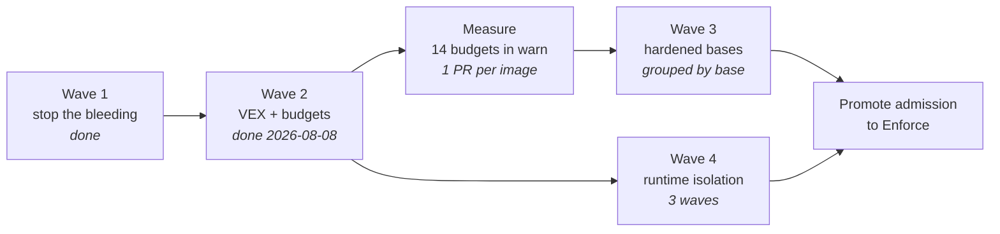

# Hardening roadmap

> Baseline measured 2026-07-31. This document is the plan **and** the honest account of what the
> measurement found — including the parts that had been quietly broken for a month.

## The short version

WebGrip signs every image it publishes, generates an SBOM for each one, attests both with a key that
never leaves OpenBao, and verifies them at admission. That is genuinely more supply-chain machinery
than most organisations run.

It was also, on 2026-07-31, **partly not working**, in ways that were invisible precisely because
the machinery existed. Three findings, in ascending order of how uncomfortable they are:

1. Dependency-Track had ingested **nothing** since run 133 — roughly fifty releases. A syft bump
   crossed a CycloneDX schema boundary and the upload started returning `400`. The step was
   `fail-soft`, so it emitted a `::warning::` and exited 0, every time.
2. This repository carried a Kyverno policy targeting `ghcr.io/webgrip/*` with a Fulcio identity —
   a registry we no longer publish to, verified by a mechanism we no longer use. The live policy in
   `homelab-cluster` was correct; this copy was fiction that read as a guarantee.
3. Nobody had ever looked at the scan results. Harbor has had `auto_scan: true` on the `webgrip`
   project the whole time.

None of these are exotic failures. They are the ordinary failure mode of security tooling: **the
control existed, so nobody checked whether it worked.**

## What the numbers actually say

From in-cluster Trivy Operator `VulnerabilityReports`:

| Image | Critical | High | Medium |
| --- | --- | --- | --- |
| `ci-runner` | 8 | 136 | 258 |
| `agent-runner` | 1 | 51 | 40 |
| `ploegd` (Go service, for contrast) | 0 | 1 | 0 |

The distribution is the finding. One image carries more criticals than the rest of the estate
combined — and it is the image with Harbor push credentials and OpenBao signing capability. The
compiled Go service with a minimal runtime is effectively clean.

This is why "make all our images CVE-free" is the wrong project. The right project is "make the one
dangerous image less dangerous, and stop the others regressing."

## Principles this plan commits to

**A metric is not a security property.** A scanner reports what it can *name*. Debian scores badly
partly because its tracker marks CVEs "won't fix" while scanners count them anyway; distroless
scores zero partly because there is nothing left to fingerprint. Optimising the number and improving
security overlap, but they are not the same activity, and where they diverge we follow security.

**A control nobody reads is not a control.** Every gate added here fails loudly or is not added.
`fail-soft` is reserved for genuine outages and must never be the response to malformed input —
that distinction is now enforced in code.

**Budgets, not aspirations.** A threshold that cannot be met gets an exception, then another, then
it is decoration. Every image's budget starts at its *measured* count and ratchets down.

**Prefer deletion to justification.** A VEX statement is the second-best outcome. `ci-runner` ships
the GitHub CLI, from a third-party apt source, in an organisation that no longer uses GitHub —
deleting that retires findings permanently and needs no justification from anyone.

## Wave 1 — stop the bleeding (done, 2026-07-31)

| Change | Effect |
| --- | --- |
| Pin syft to `cyclonedx-json@1.6` | Restores Dependency-Track ingestion across all 17 images |
| `4xx` from Dependency-Track now emits `::error::` | A malformed payload can never again hide behind a warning |
| Delete `ops/kyverno/cluster-policies/` | One source of truth for admission, in `homelab-cluster` |
| Retire `image-verify-audit`, `image-attestations-audit` | Both had zero PolicyReport results; no `ghcr.io/webgrip` image runs |
| Repoint OCI `source`/`url`/`documentation` labels at Forgejo | Image provenance points at the actual source of truth |
| [ADR-0004](../../../adrs/0004-supply-chain-on-forgejo-harbor-openbao.md) supersedes ADR-0002 | The decision record matches the running system, including what the migration cost |

## Wave 2 — make the evidence mean something (complete, 2026-08-08)

**OpenVEX** ([`ops/vex/`](../../../../ops/vex/README.md)). Hand-authored, PR-reviewed statements
with a justification from OpenVEX's closed vocabulary. Stamped with the built digest and attested
with the same OpenBao key as the SBOM. Harbor's project-wide `cve_allowlist` stays empty — it has no
product scope, no justification, no author and no expiry, and is an allowlist wearing a VEX costume.

**CVE budgets** ([`ops/security/cve-budgets.yaml`](../../../../ops/security/cve-budgets.yaml)).
Per-image `critical`/`high` ceilings with `warn`/`enforce` modes. New images start in `warn`, the
pipeline measures them, the budget is set at the observed number, then it only goes down.

**Gate before signature.** The gate runs *before* `cosign sign`. An over-budget image is still in
Harbor but unsigned — and unsigned is what admission refuses. This makes a webgrip signature mean
*"built by CI **and** within budget"* rather than *"built by CI"*.

See [ADR-0005](../../../adrs/0005-openvex-and-cve-budgets.md).

**Closed 2026-08-08 by `cve-gate` 0.3.4** — the first image out of this pipeline carrying a
signature:

```text
cve-gate: critical=0/0 OK  high=0/0 OK  vex-suppressed=1
verdict: pass
```

signature + three attestations (CycloneDX SBOM, OpenVEX, `cve-budget/v1`), signed by OpenBao
Transit against `repo:webgrip/infrastructure:ref:refs/tags/cve-gate-v0.3.4`.

It took eight releases to get there, and the honest summary is that **not one of the eight failures
was about finding a CVE**. Every one was plumbing between the gate and the thing it was scanning:
`docker cp` into a read-only rootfs, a version pin naming a tag nothing had built, a seccomp rule
that denied exactly what its own comment said it allowed, a 2 GB tmpfs, cache volumes created
root-owned, root without `CAP_CHOWN` to fix them, grype returning zero bytes because its stderr was
a TTY, and finally VEX statements naming CVEs while grype matches on GHSA.

The last one is the one worth remembering: **five reviewed statements suppressed nothing for eight
releases, and every number the gate printed looked identical to having no statements at all.** The
fix was one `aliases` field. The lasting change is the guard that now warns when statements are
applied and nothing is suppressed — see [ADR-0008](../../../adrs/0008-cve-gate-runs-as-a-step.md)
for why the gate stopped running in a container at all.

## Wave 3 — bring the numbers down

**Where this actually stands (2026-08-08):**

| | count |
| --- | --- |
| images in `ops/docker/` | 18 |
| with a CVE budget | 4 |
| with reviewed OpenVEX | 1 |
| on a hardened base | 1 |

So fourteen images are ungated: no budget, therefore nothing to exceed, therefore signed on the
strength of nothing. That is the gap Wave 3 closes, and it is a bigger one than "the numbers are
high".

### What the first estate-wide measurement actually found (2026-08-08, runs 272/287)

A read-only diagnostic (`.forgejo/workflows/measure_cve_budgets.yml`) ran the release gate's own
binary against the highest Harbor tag of every image — no builds, no releases. The numbers, after
VEX subtraction:

| image | tag | critical | high |
| --- | --- | ---: | ---: |
| **techdocs-builder** | 1.2.21 | **131** | **501** |
| **techdocs-runner** | 1.0.2 | **131** | **503** |
| **mkdocs-runner** | 1.0.2 | **125** | **474** |
| rust-releaser | 1.2.0 | 67 | 258 |
| tauri-ci-runner | 1.1.0 | 59 | 401 |
| playwright-runner | 1.1.1 | 56 | 117 |
| rust-ci-runner | 1.4.0 | 50 | 114 |
| agent-runner | 1.0.3 | 43 | 105 |
| act-runner | 1.2.2 | 40 | 123 |
| semantic-release-rust | 0.1.0 | 38 | 77 |
| semantic-release-monorepo | 0.1.0 | 36 | 73 |
| semantic-release | 0.1.2 | 36 | 74 |
| helm-deploy | 1.2.2 | 21 | 105 |
| ci-runner | 1.2.3 | 15 | 106 |
| vikunja-mcp | 0.1.0 | 8 | 66 |
| php-ci-runner | 1.3.0 | 1 | 12 |
| node-ci-runner | 1.0.0 | 1 | 12 |
| **cve-gate** | 0.3.4 | **0** | **0** |

Three conclusions that reorder the plan:

1. **The techdocs chain, not ci-runner, is the worst surface in the estate.** ci-runner's
   8/136 reputation dated from July; the real outlier is `techdocs-builder` at 131/501, with
   both children inheriting nearly all of it — three of the estate's top four are one chain,
   fed by unwatched alpine3.20 node/python stages and Java 11 on Jammy. `tauri-ci-runner`'s
   59/401 is the same shape: its GUI-toolkit apt layer alone adds ~290 highs over its parent.
2. **These are stale-artifact numbers.** Ten images resolved their base at build time, so the
   running tags describe bases that upstream has long rebuilt. That is exactly why the pin train
   below comes first — and why budgets get set from the *fresh* numbers the pinned releases
   report, not from this table.
3. **The one image held to `enforce` holds.** cve-gate 0.3.4 measures 0/0 in the wild with its
   single VEX suppression matching. The standard is real when it is enforced; fourteen images
   simply aren't yet.

(Known instrument bug, non-blocking: on Debian-based images the `vexSuppressed` figure in the
predicate also counts grype's *default* ignores — binary packages deduplicated against their
owning OS package, ~1200 per node-slim image — not just reviewed OpenVEX suppressions. Critical
and high counts are unaffected. The gate should count only ignores whose applied rule is the VEX
rule; tracked for the next cve-gate release.)

### Stage 1/2 executed — the measured table (2026-08-11/12)

Six swaps landed, one release each, every number from the release gate itself:

| image | move | before | after |
| --- | --- | --- | --- |
| act-runner | alpine -> dhi/alpine-base | 40/123 | 6/25 |
| helm-deploy | alpine -> dhi/alpine-base | 16/63 | 8/54 |
| node-ci-runner | node-alpine -> dhi/node-alpine | 1/11 | **0/5** |
| semantic-release | node-slim -> dhi/node-alpine | 36/73 | **0/9** |
| semantic-release-monorepo | node-slim -> dhi/node-alpine | 36/72 | **0/8** |

**Four images in the estate now hold critical-zero** (with cve-gate). Every budget was ratcheted
to its measured floor the same day.

**The negative result matters most**: semantic-release's first swap took the debian13 `-dev`
variant and the gate measured it WORSE than stock (62/114 vs 36/73 — the -dev image ships perl,
curl and libssh2 that `bookworm-slim` never carried, and trixie's advisory backlog is young). It
was corrected to the alpine variant the same day. That is the whole argument for
measure-every-swap: "hardened" is a marketing word; the gate's number is not. Details and the
two portability gotchas (`/usr/local/bin` absent on all DHI bases; `-dev` variants are the root
ones) live in ADR-0006's history.

**Held back, with reasons**: `vikunja-mcp` (upstream app-image base — nothing to swap);
`semantic-release-rust` (cargo verification compiles make musl-vs-glibc a behavioral change —
needs a consumer-crate check); `playwright-runner` and `ci-runner` (the standing ADR-0006
structural exceptions). Remaining migratable: the techdocs chain (the 141/502 prize — DHI
node+python stages plus the Java 11 question), `agent-runner` (dhi/python), `php-ci-runner`
(dhi/php availability to confirm), `rust-ci-runner`/`rust-releaser` (dhi/rust).

### Order of operations, and why

**Pin before measuring, measure before hardening.** The first measurement found ten images whose
base reference floated (tag without digest) and six tool installs pinned to `latest` — a budget
measured against a floating tag is a number about the past, and the first `enforce` failure it
causes will be an upstream rebuild nobody made. So the actual sequence is: pin everything so the
artifact is deterministic (PRs #106–#117, #119), release, and set budgets from what those
releases' gates report. A budget invented without a scan is a guess, and a guess that fails
closed blocks releases for no security reason.

**No blanket non-root for CI job images.** Sixteen of eighteen images run as root, and for the
job-container images that stays deliberate for now: Forgejo Actions job containers receive
root-owned workspace volumes, so a non-root `USER` breaks checkout the same way the hardened
cve-gate container broke six releases — data plumbing, not security. Non-root is for images that
run as *services* (vikunja-mcp already runs as uid 1000 via its Deployment's securityContext) and
for the DHI runtime bases where ADR-0006 migration brings it naturally.

**One image per PR.** Not preference — mechanism. `release-per-image` sets `max-parallel: 1` and
**Forgejo ignores it**, so a PR touching N image directories fans out to N simultaneous builds
against one runner pool and one Harbor. That is how a routine change becomes an outage.

**Group by base, not by image.** Four of the fourteen share one base, so one decision moves four
images. Two more are chains where fixing the parent fixes the child for free.

| Group | Images | Shared base | Leverage |
| --- | --- | --- | --- |
| semantic-release family | `semantic-release`, `-monorepo`, `-rust`, `rust-releaser` | `node:24-bookworm-slim` | 4 images, 1 base decision |
| techdocs chain | `techdocs-builder` → `techdocs-runner`, `mkdocs-runner` | node alpine | fix the parent, children inherit |
| rust chain | `rust-ci-runner` → `tauri-ci-runner` | rust slim-bookworm | fix the parent, child inherits |
| small leaves | `act-runner`, `helm-deploy`, `vikunja-mcp` | alpine | smallest blast radius — start here |
| standalone | `node-ci-runner`, `php-ci-runner` | node alpine, composer | independent |
| constrained | `playwright-runner` | `mcr.microsoft.com/playwright` | browser deps pin the base; budget it, do not move it |
| the big one | `ci-runner` | actions-runner | 8 critical / 136 high, used by every job — **last**, once the pattern is proven |

Start with the small leaves. They are the cheapest place to be wrong, and the point of going first
is to find out what breaks before it breaks something that matters.

**Then, and only then, `warn` → `enforce`.** An image is promoted when its measured budget has been
stable across two releases. Flipping earlier converts a monitoring signal into an outage.

[ADR-0006](../../../adrs/0006-hardened-base-images.md) — **Docker Hardened Images** as the default
base. The catalog went Apache 2.0 and free in December 2025, which is what makes this viable:
Chainguard's free tier is five images restricted to `latest`, structurally incompatible with a repo
that digest-pins everything and lets Renovate move it.

### The reference implementation

[`cve-gate`](../docker-images/cve-gate.md) is the worked example every other migration copies. It is
the gate itself, held to the standard it enforces — the only image starting at `enforce` 0/0:

- **`dhi/static` runtime**: two static Go binaries, no shell, no libc, no package manager, no
  package database. Nothing left to be missing.
- **grype built from source**, not fetched at release time. The first version ran
  `curl -sSfL raw.githubusercontent.com/anchore/grype/main/install.sh | sh` — an unpinned script from
  a mutable branch, executed in the job that decides whether an image is fit to sign. A supply-chain
  hole inside a supply-chain control.
- Non-root (65532), read-only rootfs, `--cap-drop ALL`, `no-new-privileges`, a `noexec` tmpfs, and a
  seccomp profile that also blocks `io_uring`.
- Reproducible: `SOURCE_DATE_EPOCH` + `rewrite-timestamp` + `-trimpath -buildvcs=false`.

**Measured result — this is the argument for ADR-0006 in one line:**

| Image | Crit | High | Medium | Total |
| --- | --- | --- | --- | --- |
| `helm-deploy` (stock alpine) | 5 | 106 | 117 | **252** |
| `cve-gate` 0.1.0 (DHI alpine + jq/yq) | 0 | 4 | 2 | 8 |
| `cve-gate` 0.2.0 (static) | 0 | 3 | 2 | **6** |

Both are Alpine-lineage CI tools of comparable scope. **252 against 6.**

The path from 0.1.0 to 0.2.0 is also instructive: the shell was the root cause of every build
failure, not `jq`. A shell script forces a shell in the runtime, which forces `jq` and `yq`, and
`jq` is dynamically linked. Rewriting ~250 lines of shell as Go removed the entire class.

Two things it surfaced that apply to every Wave 3 migration:

1. **`dhi.io` is free but not anonymous** (`401` on `/v2/`) — yet this never reaches CI. Builders
   authenticate to nothing; bases resolve through a `dhi` Harbor proxy project, matching how
   `REGISTRY_DOCKERHUB`/`REGISTRY_GHCR`/`REGISTRY_MCR` already work. And no new account: `dhi.io`
   advertises `service="registry.docker.io"`, the same Docker identity service as Docker Hub, so the
   existing Docker Hub credential authenticates it. **The proxy project is a prerequisite for the
   whole wave**, not a per-image detail — provisioned in `webgrip/homelab-cluster`.
2. **Digests resolve once the proxy exists** — and they are now pinned (2026-07-31), via
   `harbor.webgrip.dev/dhi`. Verified live: the `dhi` endpoint is healthy on the reused Docker Hub
   credential, and an anonymous pull of `dhi/alpine-base:3.23` through Harbor returns a genuine DHI
   manifest. Each base is one ARG carrying tag *and* digest, so Renovate cannot bump one without the
   other.

- **Stage 1** (near drop-in): the `semantic-release` trio, `rust-releaser`, `node-ci-runner`.
- **Stage 2** (verify first): `agent-runner`, `rust-ci-runner`, `act-runner`, `helm-deploy`,
  `php-ci-runner`, `techdocs-builder`.
- **Stage 3** (structural exceptions, not migrating): `ci-runner`, `playwright-runner`.

Highest-value single item outside the staging: `techdocs-builder` runs
`eclipse-temurin:11.0.31-jre-jammy`. Java 11 on Jammy is the oldest surface in the repository.

Each migration lands as its own PR with before/after gate numbers and lowers that image's ceiling in
the same commit.

## Wave 4 — a real boundary for the dangerous image

`ci-runner` cannot be fixed by a base swap: no hardened `actions-runner` exists. But the base image
was never the interesting risk. The interesting risk is that **a CI job executes arbitrary
repository code while holding Harbor push credentials and OpenBao signing capability**, separated
from the host only by namespaces and cgroups.

An escape there is not a node compromise. It is a supply-chain signing compromise — and because the
key is non-extractable in OpenBao, an attacker does not need the key. They need thirty seconds
inside the job that is allowed to ask for signatures.

[RFC: Container runtime isolation](https://forgejo.webgrip.dev/webgrip/homelab-cluster) (in
`homelab-cluster`, `docs/techdocs/docs/rfc/rfc-container-runtime-isolation.md`) proposes gVisor and
Kata via Talos system extensions, in three measured waves. Talos ships gVisor as a **core-tier**
extension and Kata as **extra** — no host packages, just a boot-asset rebuild and a `RuntimeClass`.

This wave complements rather than replaces
[ADR-0026](https://forgejo.webgrip.dev/webgrip/homelab-cluster) (rootless CI builds): that one
removes *privilege* from the build engine, this one hardens the *boundary* around everything the
runner executes.

## Findings backlog (2026-08-01)

Recorded here rather than fixed immediately, because each one is a separate change with its own
blast radius.

### Harbor `prevent_vul` — what it actually does

Badly named. It is **not** "prevent vulnerable images from running" in any runtime sense — Harbor
has no view of your cluster. It refuses to **serve the manifest on pull**. The block happens at
`docker pull` / kubelet image-pull time, and the symptom is an `ImagePullBackOff`, not a rejected
Pod.

**It is a severity threshold, not a count.** There is no "N vulnerabilities allowed" setting
anywhere. You pick one severity, and *any single finding at or above it* blocks the pull. The knob
is two fields on project metadata:

| Field | Values |
| --- | --- |
| `prevent_vul` | `"true"` / `"false"` |
| `severity` | `none` · `low` · `medium` · `high` · `critical` |

```bash
# read current state
curl -sS -u "$ROBOT" https://harbor.webgrip.dev/api/v2.0/projects/webgrip/metadatas

# set it (UI equivalent: Project -> Configuration -> Deployment security)
curl -sS -u "$ROBOT" -X PUT -H 'Content-Type: application/json' \
  -d '{"severity":"critical"}' \
  https://harbor.webgrip.dev/api/v2.0/projects/webgrip/metadatas/severity
curl -sS -u "$ROBOT" -X PUT -H 'Content-Type: application/json' \
  -d '{"prevent_vul":"true"}' \
  https://harbor.webgrip.dev/api/v2.0/projects/webgrip/metadatas/prevent_vul
```

Docs: [Harbor — Deployment security](https://goharbor.io/docs/2.1.0/administration/vulnerability-scanning/deployment-security/)
and [Project configuration](https://goharbor.io/docs/2.5.0/working-with-projects/project-configuration/).

**Two properties that matter more than the setting itself:**

1. **It fails OPEN on unscanned images.** An image Harbor has never scanned is served normally —
   the threshold only applies to artifacts with a scan result
   ([goharbor/harbor#16218](https://github.com/goharbor/harbor/issues/16218),
   [#16732](https://github.com/goharbor/harbor/issues/16732)). So it is not a control you can rely
   on alone: anything that lands without a scan bypasses it silently. Our CVE gate has the opposite
   failure mode — it exits non-zero when it cannot run, which blocks signing, which blocks
   admission. **Fail-closed beats fail-open, so the gate remains the primary control and this is
   defence in depth.**
2. **The project `cve_allowlist` is what it honours — not our OpenVEX.** Harbor has no idea our VEX
   statements exist. So an OpenVEX-suppressed finding still counts toward this threshold. That is a
   real divergence: the gate and Harbor will disagree about the same image, deliberately, because
   only the gate applies VEX.

**Do not enable it yet.** `ci-runner` measures 8 critical / 136 high, so `high` — or even
`critical` — makes the runner image unpullable and stops all CI immediately. Sequence:

1. Bring the runner images down (ADR-0006 migration).
2. Enable at `critical` once no image carries one.
3. Tighten to `high` only when the numbers support it.

Set it in the `harbor-proxy-config` provisioner next to `ensure_project_scanning`, not by hand — a
curl'd change is invisible to GitOps and survives only until the next reconcile.

### `ci-runner` carries the GitHub CLI

`ops/docker/ci-runner/Dockerfile` adds `cli.github.com` as a third-party apt source and installs
`gh` — in an organisation that no longer uses GitHub. That is a package set *and* an external
repository key, in the worst-scoring and most privileged image in the estate. Removing it retires
findings permanently and needs no VEX justification from anyone. Deferred to the image consolidation
pass rather than done piecemeal.

### Not every "fixed in X" is reachable

Trivy reported the Moby findings as *fixed in 29.3.1 / 29.5.1*, which reads like a version bump.
`github.com/docker/docker` has **no v29** — it tops out at `v28.5.2+incompatible`. Docker Engine 29.x
lives at a different module path (`github.com/moby/moby/v2`), so consuming the fix requires the
*dependent* to migrate modules. A "fix version" in a scanner is a fact about the upstream project,
not a promise that the module you depend on has one.

### A dependency floor can introduce a vulnerability

`go get mod@version` sets an **exact** requirement, not a minimum. Applied unconditionally it moves
modules *down* and drags their dependents with them. In `cve-gate` 0.2.0 it downgraded grype
`0.116.1 → 0.116.0`, syft `1.50.0 → 1.48.0`, and `x/crypto 0.54.0 → 0.53.0` — the last of which is
where that build's `GO-2026-5932` finding came from. Floors must read the resolved version first and
raise only when strictly below. The build now asserts grype resolves to exactly the requested
version, which is the check that would have caught it.

### Two SBOMs per image, one consumer

With BuildKit provenance enabled (`webgrip/workflows` #41) every image carries a BuildKit-generated
SBOM *and* the syft SBOM that `cosign-sign-attest` attests. Different origins — one from inside the
build, one from the pushed image — but only the cosign one is consumed by Dependency-Track and
Kyverno. Keeping both costs build time on a memory-constrained runner. Decide once there is data on
the delta.

### The VEX-to-registry gap, and what everyone else does about it

Harbor's UI shows six vulnerabilities on a signed `cve-gate` 0.3.4 with **"Listed In CVE Allowlist:
No"** against every one, while the gate that signed it reports `high=0/0 OK`. Both are correct.
They are measuring different things with different tools, and only one of them is load-bearing.

**The mechanism is already there — Harbor just does not use it.** Trivy has supported VEX natively
for some time, with [four input methods](https://trivy.dev/docs/latest/guide/supply-chain/vex/): a
local file, an **OCI attestation**, a VEX repository, and an SBOM reference. `--vex oci`
[auto-discovers a VEX attestation attached as an OCI 1.1 referrer](https://trivy.dev/docs/latest/guide/supply-chain/vex/oci/)
— which is *exactly* what this pipeline already publishes. Harbor scans with Trivy and never passes
the flag, so the document is present, discoverable, and ignored
([goharbor/harbor#22720](https://github.com/goharbor/harbor/issues/22720)). The gap is one flag in
an adapter, not a missing capability.

That framing matters, because it means the workaround the ecosystem has settled on is a workaround
for a config gap rather than for a design problem.

| Option | What it costs |
| --- | --- |
| **Do nothing; enforce at admission** *(current)* | Harbor's numbers stay noisy. Nothing depends on them — Kyverno verifies the signed, VEX-aware budget verdict. |
| Ask upstream for `--vex oci` in Harbor's adapter | Free, slow, correct. The right long-term fix. |
| Publish a Trivy **VEX repository** | Real work; helps every Trivy consumer, but Harbor's adapter still has to be told to use it. |
| Sync VEX → **Harbor CVE allowlist** | What most teams do today — and the one to be careful with. |

**Why the allowlist sync is not recommended here.** Harbor's allowlist is **per-project**; our VEX
statements are **per-image**. Allowlisting `CVE-2026-34040` for the `webgrip` project exempts it for
*every image in that project*, including ones where the vulnerable code genuinely is reachable. That
converts a narrow, justified, authored, expiring assertion into a blanket exemption with no product
scope — which is the objection Wave 2 already records against `cve_allowlist`. It would make the UI
green by making the claim weaker.

It is worth doing only if Harbor's `prevent_vul` is ever used to block pulls. It is not today, and
admission is the boundary that matters.

**A second thing this surfaced:** Trivy reports `CVE-2026-41567` and `CVE-2026-42306` as High, and
grype does not report them at all. grype reports `CVE-2026-41568`, which has no statement. The two
scanners genuinely disagree about the same image, so a VEX set authored against one is incomplete
against the other. Statements should be written against the union, and the gate's new
unmatched-statement warning is what makes a statement that covers neither visible.

## Known gaps, stated rather than hidden

- ~~**No SLSA build provenance.**~~ **Closed 2026-08-01** — BuildKit emits the same in-toto SLSA
  predicate natively (`--provenance=mode=max`), attached as an OCI referrer, with no GitHub
  involvement. `webgrip/workflows` #41. This was the largest single regression from the GitHub
  migration and it turned out to be a two-line fix; the gap was one of attention, not capability.
- **No public transparency log.** Deliberate — Rekor would publish our image inventory and add an
  internet dependency to admission — but it means an OpenBao compromise plus registry write access
  would be externally undetectable.
- **Seven workloads fail admission verification on "missing digest".** `erfbeeld-backend` and
  `ploegd` are deployed by tag, so `verifyDigest` cannot evaluate them. The fix is either
  `mutateDigest: true` on the Harbor policy (a mutating change to live workload specs — deliberately
  **not** applied unilaterally) or deploying those two by digest. Decide, then do one.
- **Admission is Audit, not Enforce.** `image-verify-harbor-audit` reports 6 pass / 7 fail. It
  cannot be promoted until the digest issue above is resolved.
- **Budgets default to `warn`.** An image nobody promotes is gated by nothing. Needs periodic audit.
- **ARC is still installed** (`arc-systems`, 234 days, runner sets at 0/0) — GitHub Actions
  infrastructure in an organisation that no longer uses GitHub. Tracked in `homelab-cluster`'s
  RFC: GitHub Actions retirement.

## Sequencing



Wave 3 and Wave 4 are independent and can run in parallel — one lowers the numbers on twelve small
images, the other addresses the one image where the numbers were never the point.

## Related records

- [ADR-0004 — Signing, SBOM and attestation on Forgejo/Harbor/OpenBao](../../../adrs/0004-supply-chain-on-forgejo-harbor-openbao.md)
- [ADR-0005 — OpenVEX statements and per-image CVE budgets](../../../adrs/0005-openvex-and-cve-budgets.md)
- [ADR-0006 — Docker Hardened Images as the default base](../../../adrs/0006-hardened-base-images.md)
- [ADR-0002 — superseded, retained for why keyless was chosen](../../../adrs/0002-supply-chain-security.md)
- [`ops/vex/README.md`](../../../../ops/vex/README.md) — VEX authoring and review discipline
