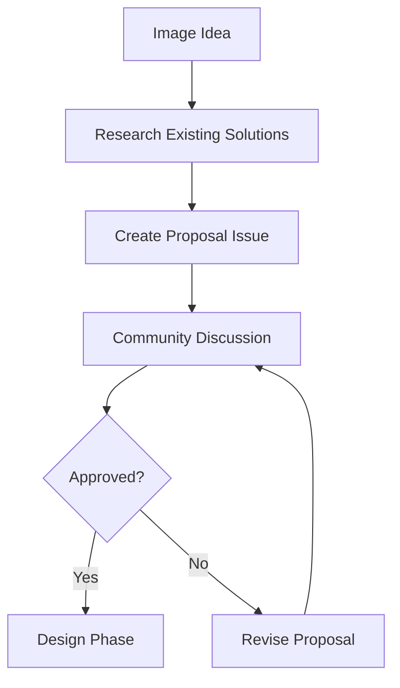
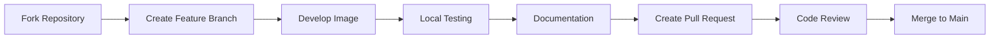

# Contributing Images

Guide for contributing new Docker images or improving existing ones in the WebGrip infrastructure repository.

## Overview

Contributing to our infrastructure helps:

- ✅ **Expand capabilities** with new development tools and environments
- ✅ **Improve existing images** with performance optimizations and feature additions
- ✅ **Share knowledge** through documentation and best practices
- ✅ **Maintain quality** through consistent standards and review processes
- ✅ **Support the community** by solving common development challenges

## Contribution Process

### 1. Planning Phase



**Before starting development:**

1. **Check existing images**: Review current images to avoid duplication
2. **Create an issue**: Use our [issue template](https://github.com/webgrip/infrastructure/issues/new)
3. **Discuss approach**: Engage with the team on implementation strategy
4. **Get approval**: Wait for maintainer approval before significant work

### 2. Development Phase



## Creating a New Image

### Directory Structure

```bash
# Create new image directory
mkdir -p ops/docker/my-new-image

# Standard structure
ops/docker/my-new-image/
├── Dockerfile              # Main build file
├── README.md              # Image-specific documentation
├── .dockerignore          # Build context exclusions
├── entrypoint.sh          # Custom entry point (if needed)
├── config/                # Configuration files
│   ├── tool.conf
│   └── env.sh
└── scripts/               # Helper scripts
    ├── setup.sh
    └── healthcheck.sh
```

### Dockerfile Best Practices

#### Base Image Selection

```dockerfile
# Prefer official, minimal base images
FROM node:20-alpine3.18        # Good: official + minimal
FROM alpine:3.22.1             # Good: minimal
FROM ubuntu:22.04              # OK: official but larger
FROM my-custom-base:latest     # Avoid: non-standard base
```

#### Multi-stage Build Pattern

```dockerfile
# Build stage - install build dependencies
FROM node:20-alpine3.18 AS build

WORKDIR /build

# Copy package files first (for layer caching)
COPY package*.json ./
RUN npm ci --only=production

# Copy source code
COPY . .
RUN npm run build

# Runtime stage - minimal runtime dependencies
FROM node:20-alpine3.18 AS runtime

# Create non-root user
RUN addgroup -g 1001 -S appgroup && \
    adduser -S appuser -u 1001 -G appgroup

# Install runtime dependencies only
RUN apk add --no-cache \
    ca-certificates \
    curl

# Copy artifacts from build stage
COPY --from=build /build/dist /app
COPY --from=build /build/node_modules /app/node_modules

# Set ownership and switch to non-root user
RUN chown -R appuser:appgroup /app
USER appuser

WORKDIR /app
EXPOSE 3000

# Health check
HEALTHCHECK --interval=30s --timeout=3s --start-period=5s --retries=3 \
  CMD curl -f http://localhost:3000/health || exit 1

ENTRYPOINT ["node", "server.js"]
```

#### Layer Optimization

```dockerfile
# ❌ BAD: Creates many layers
RUN apt-get update
RUN apt-get install -y curl
RUN apt-get install -y git
RUN apt-get install -y build-essential
RUN rm -rf /var/lib/apt/lists/*

# ✅ GOOD: Single layer with cleanup
RUN apt-get update && \
    apt-get install -y --no-install-recommends \
      curl \
      git \
      build-essential && \
    rm -rf /var/lib/apt/lists/*
```

#### Build Arguments and Environment

```dockerfile
# Build-time configuration
ARG NODE_VERSION=20
ARG BUILD_DATE
ARG VERSION

# Runtime environment
ENV NODE_ENV=production \
    PORT=3000 \
    LOG_LEVEL=info

# Labels for metadata
LABEL maintainer="WebGrip Ops Team <ops@webgrip.nl>" \
      org.opencontainers.image.title="My Tool" \
      org.opencontainers.image.description="Description of the tool" \
      org.opencontainers.image.version="${VERSION}" \
      org.opencontainers.image.created="${BUILD_DATE}" \
      org.opencontainers.image.source="https://github.com/webgrip/infrastructure"
```

### Example: Creating a Python Tools Image

```dockerfile
# ops/docker/python-tools/Dockerfile
ARG PYTHON_VERSION=3.11

# Build stage
FROM python:${PYTHON_VERSION}-slim-bookworm AS build

# System build dependencies
RUN apt-get update && \
    apt-get install -y --no-install-recommends \
      build-essential \
      curl \
      ca-certificates && \
    rm -rf /var/lib/apt/lists/*

# Python tools installation
RUN pip install --no-cache-dir \
    poetry \
    black \
    flake8 \
    mypy \
    pytest \
    jupyter

# Runtime stage
FROM python:${PYTHON_VERSION}-slim-bookworm AS runtime

# Runtime dependencies
RUN apt-get update && \
    apt-get install -y --no-install-recommends \
      git \
      curl \
      ca-certificates && \
    rm -rf /var/lib/apt/lists/*

# Copy Python tools from build stage
COPY --from=build /usr/local/lib/python3.11/site-packages /usr/local/lib/python3.11/site-packages
COPY --from=build /usr/local/bin /usr/local/bin

# Create non-root user
RUN groupadd -r python && useradd -r -g python python

# Set working directory
WORKDIR /workspace

# Switch to non-root user
USER python

# Verify installation
RUN python --version && \
    poetry --version && \
    black --version

ENTRYPOINT ["bash"]
```

### Configuration Files

#### .dockerignore

```bash
# ops/docker/my-new-image/.dockerignore
**/.git
**/.gitignore
**/README.md
**/Dockerfile
**/docker-compose*.yml
**/.dockerignore
**/.vscode
**/.idea
**/node_modules
**/target
**/*.log
**/tmp
**/temp
.DS_Store
Thumbs.db
```

#### Health Check Script

```bash
#!/bin/bash
# ops/docker/my-new-image/scripts/healthcheck.sh

set -e

# Check if main service is running
if pgrep -f "my-service" > /dev/null; then
    echo "Service is running"
    exit 0
else
    echo "Service is not running"
    exit 1
fi
```

#### Entry Point Script

```bash
#!/bin/bash
# ops/docker/my-new-image/entrypoint.sh

set -e

# Setup function
setup_environment() {
    echo "Setting up environment..."
    
    # Create necessary directories
    mkdir -p /workspace/.cache
    
    # Set permissions
    chown -R $(id -u):$(id -g) /workspace
    
    echo "Environment setup complete"
}

# Main execution
main() {
    setup_environment
    
    # Execute the main command
    exec "$@"
}

# Run main function
main "$@"
```

## Testing New Images

### Local Testing Checklist

```bash
# 1. Build image
docker build -t webgrip/my-new-image:test ops/docker/my-new-image/

# 2. Basic functionality test
docker run --rm webgrip/my-new-image:test --version

# 3. Interactive test
docker run -it --rm webgrip/my-new-image:test bash

# 4. Volume mounting test
docker run --rm -v $(pwd):/workspace -w /workspace \
  webgrip/my-new-image:test ls -la

# 5. Environment variable test
docker run --rm -e TEST_VAR=hello \
  webgrip/my-new-image:test env | grep TEST_VAR

# 6. Health check test (if implemented)
docker run -d --name test-container webgrip/my-new-image:test
sleep 10
docker exec test-container /scripts/healthcheck.sh
docker rm -f test-container
```

### Automated Testing

```bash
#!/bin/bash
# ops/docker/my-new-image/test.sh

set -e

IMAGE_NAME="webgrip/my-new-image:test"
CONTAINER_NAME="test-my-new-image"

echo "🧪 Testing $IMAGE_NAME"

# Build image
echo "Building image..."
docker build -t "$IMAGE_NAME" .

# Test 1: Basic execution
echo "Test 1: Basic execution"
docker run --rm "$IMAGE_NAME" --version

# Test 2: Tool availability
echo "Test 2: Tool availability"
docker run --rm "$IMAGE_NAME" which python3
docker run --rm "$IMAGE_NAME" python3 -c "import sys; print(sys.version)"

# Test 3: Workspace functionality
echo "Test 3: Workspace functionality"
docker run --rm -v "$(pwd):/workspace" -w /workspace \
  "$IMAGE_NAME" ls -la

# Test 4: Non-root user
echo "Test 4: Non-root user"
USER_ID=$(docker run --rm "$IMAGE_NAME" id -u)
if [ "$USER_ID" = "0" ]; then
    echo "❌ Container running as root"
    exit 1
else
    echo "✅ Container running as non-root user ($USER_ID)"
fi

# Test 5: Security scan
echo "Test 5: Security scan"
if command -v trivy >/dev/null 2>&1; then
    trivy image "$IMAGE_NAME"
else
    echo "⚠️  Trivy not available, skipping security scan"
fi

echo "✅ All tests passed!"
```

### Integration Testing

```yaml
# .github/workflows/test-new-image.yml
name: Test New Image
on:
  pull_request:
    paths:
      - 'ops/docker/my-new-image/**'

jobs:
  test:
    runs-on: ubuntu-latest
    steps:
      - uses: actions/checkout@v4
      
      - name: Build image
        run: |
          docker build -t test-image ops/docker/my-new-image/
          
      - name: Run tests
        run: |
          cd ops/docker/my-new-image
          chmod +x test.sh
          ./test.sh
          
      - name: Security scan
        uses: aquasecurity/trivy-action@master
        with:
          image-ref: test-image
          format: sarif
          output: trivy-results.sarif
          
      - name: Upload scan results
        uses: github/codeql-action/upload-sarif@v2
        with:
          sarif_file: trivy-results.sarif
```

## Documentation Requirements

### Image Documentation Template

```markdown
# My New Image

Brief description of what this image provides and its purpose.

## Purpose

This image serves as...

## Image Details

| Property | Value |
|----------|-------|
| **Base Image** | `python:3.11-slim-bookworm` |
| **Size** | ~200MB |
| **Architecture** | AMD64 |
| **Registry** | `webgrip/my-new-image` |
| **Dockerfile** | [`ops/docker/my-new-image/Dockerfile`](../../../ops/docker/my-new-image/Dockerfile) |

## Installed Tools

| Tool | Version | Purpose |
|------|---------|---------|
| **Python** | 3.11 | Runtime environment |
| **Poetry** | Latest | Dependency management |

## Usage Examples

### Basic Usage

```bash
# Run interactive session
docker run -it --rm webgrip/my-new-image:latest
```

### Project Development

```bash
# Mount project directory
docker run --rm -v $(pwd):/workspace -w /workspace \
  webgrip/my-new-image:latest \
  python main.py
```

## Configuration

### Environment Variables

| Variable | Default | Purpose |
|----------|---------|---------|
| `PYTHON_ENV` | `production` | Python environment |

## Troubleshooting

### Common Issues

**Tool not found**
```bash
# Verify installation
docker run --rm webgrip/my-new-image:latest which python3
```

## Related Documentation

- [Building Locally](../operations/building-locally.md)
- [Architecture Overview](../overview/architecture.md)
```

### Integration with Main Documentation

Update the main index page to include your new image:

```markdown
# Add to docs/techdocs/docs/index.md

| [My New Image](docker-images/my-new-image.md) | Python development tools | Complete Python toolchain for development |
```

Update the navigation in `mkdocs.yml`:

```yaml
# Add to docs/techdocs/mkdocs.yml
nav:
  - Docker Images:
    - My New Image: docker-images/my-new-image.md
```

## Code Review Process

### Pre-Review Checklist

Before submitting a pull request:

- [ ] **Dockerfile follows best practices** (multi-stage, layer optimization, security)
- [ ] **Image builds successfully** locally
- [ ] **Basic functionality tested** with manual verification
- [ ] **Documentation created** following template
- [ ] **Tests implemented** (automated testing script)
- [ ] **Security considerations** addressed (non-root user, minimal packages)
- [ ] **.dockerignore configured** to exclude unnecessary files
- [ ] **Build arguments documented** and sensible defaults provided

### Pull Request Template

```markdown
## Description
Brief description of the new image or changes.

## Type of Change
- [ ] New Docker image
- [ ] Enhancement to existing image
- [ ] Bug fix
- [ ] Documentation update

## Testing
- [ ] Local build successful
- [ ] Manual functionality testing complete
- [ ] Automated tests pass
- [ ] Security scan results reviewed

## Documentation
- [ ] Image documentation created/updated
- [ ] Navigation updated in mkdocs.yml
- [ ] Usage examples provided
- [ ] Troubleshooting section included

## Checklist
- [ ] Dockerfile follows best practices
- [ ] Image uses non-root user
- [ ] Minimal package installation
- [ ] Health check implemented (if applicable)
- [ ] Entry point script provided (if needed)
- [ ] .dockerignore configured

## Additional Notes
Any additional information about the implementation.
```

### Review Criteria

Reviewers will evaluate:

1. **Technical Quality**
   - Dockerfile best practices
   - Security considerations
   - Performance optimization
   - Error handling

2. **Documentation Quality**
   - Completeness and accuracy
   - Usage examples
   - Troubleshooting guidance
   - Integration with existing docs

3. **Testing Coverage**
   - Automated test coverage
   - Manual testing verification
   - Error condition handling

4. **Maintainability**
   - Code clarity and organization
   - Update procedures
   - Dependency management

## Common Patterns

### Development Tool Images

For images containing development tools:

```dockerfile
# Pattern: Development environment
FROM base-runtime AS development

# Install development tools
RUN package-manager install dev-tools

# Configure development environment
ENV DEVELOPMENT_MODE=true
COPY dev-config/ /etc/dev-config/

# Keep runtime optimized
FROM base-runtime AS production
COPY --from=development /usr/local/bin /usr/local/bin
```

### CI/CD Tool Images

For CI/CD pipeline tools:

```dockerfile
# Pattern: CI/CD tool
FROM minimal-base

# Install CI tools
RUN install-ci-tools

# Add pipeline scripts
COPY scripts/ /usr/local/bin/
RUN chmod +x /usr/local/bin/*

# Configure for automation
ENV AUTOMATION_MODE=true
ENTRYPOINT ["/usr/local/bin/entrypoint.sh"]
```

### Language Runtime Images

For language-specific runtimes:

```dockerfile
# Pattern: Language runtime
FROM official-language-image

# Add common tools
RUN install-language-tools

# Configure language environment
ENV LANGUAGE_ENV=production

# Add helpful utilities
COPY utilities/ /usr/local/bin/
```

## Maintenance Responsibilities

### After Contribution

Once your image is accepted:

1. **Monitor issues** related to your image
2. **Respond to bug reports** in a timely manner
3. **Propose updates** for security patches and new features
4. **Maintain documentation** accuracy
5. **Participate in reviews** of related changes

### Long-term Ownership

Consider the long-term maintenance:

- **Dependency updates**: Regular updates for security and features
- **Base image updates**: Following upstream base image changes
- **Documentation maintenance**: Keeping docs current with changes
- **Community support**: Helping other users with issues

## Related Documentation

- [Building Locally](building-locally.md) - Local development and testing
- [Maintenance](maintenance.md) - Ongoing maintenance procedures
- [Architecture Overview](../overview/architecture.md) - How images fit into infrastructure
- [CI/CD Pipeline](../cicd/automated-building.md) - Automated building process

---

> **Assumption**: Contributors have basic Docker knowledge and can follow standard GitHub contribution workflows. Complex images may require additional review time and documentation. Validation needed: Confirm contribution workflow and review capacity with maintainer team.

**Maintainer**: [WebGrip Ops Team](https://github.com/orgs/webgrip/teams/ops)  
**Issues**: [GitHub Issues](https://github.com/webgrip/infrastructure/issues)  
**Discussions**: [GitHub Discussions](https://github.com/webgrip/infrastructure/discussions)