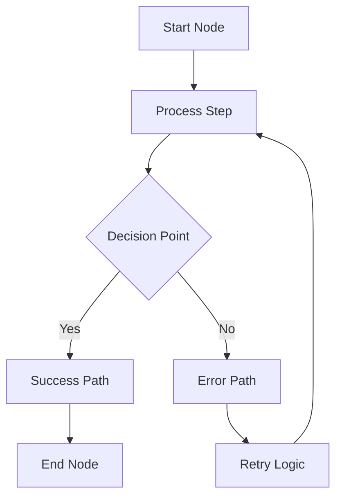

# Maintaining TechDocs

Guide for maintaining and updating the WebGrip Infrastructure TechDocs documentation.

## Overview

This guide helps contributors and maintainers keep the TechDocs documentation accurate, current, and valuable for all users of the WebGrip infrastructure.

## Documentation Architecture

### Information Architecture Mapping

The TechDocs structure directly maps to the repository organization:

```
Repository Structure          →    Documentation Structure
├── ops/docker/              →    ├── docker-images/
│   ├── rust-ci-runner/      →    │   ├── rust-ci-runner.md
│   ├── github-runner/       →    │   ├── github-runner.md
│   └── ...                  →    │   └── ...
├── .github/workflows/       →    ├── cicd/
├── tests/playwright-runner/ →    ├── testing/
├── docs/adrs/              →    ├── adrs/
└── docs/techdocs/          →    └── (this documentation)
```

### Content Organization Principles

1. **Service-First Structure**: Documentation organized around Docker images as primary services
2. **Audience-Specific Sections**: Content tailored for developers, DevOps engineers, and QA teams
3. **Cross-Linking**: Extensive internal links for discoverability
4. **Source Citations**: All claims link back to source code or configuration
5. **Assumption Tracking**: Clear marking of inferences with validation suggestions

## Adding New Content

### New Docker Image Documentation

When adding a new Docker image:

1. **Create image documentation file**:
   ```bash
   # Create new file following naming convention
   touch docs/techdocs/docs/docker-images/my-new-image.md
   ```

2. **Update navigation**:
   ```yaml
   # Add to docs/techdocs/mkdocs.yml
   nav:
     - Docker Images:
       - My New Image: docker-images/my-new-image.md
   ```

3. **Follow documentation template**:
   - Purpose and scope
   - Image details table
   - Installed tools and versions
   - Usage examples
   - Configuration options
   - Troubleshooting section
   - Related documentation links

4. **Update overview pages**:
   - Add to main index page table
   - Update architecture diagrams if needed
   - Add cross-references from related pages

### New Feature Documentation

For new features or significant changes:

1. **Identify affected sections**: Determine which existing pages need updates
2. **Create new pages if needed**: For substantial new functionality
3. **Update cross-references**: Ensure new content is discoverable
4. **Add to quick start**: Include in relevant quick start workflows
5. **Update troubleshooting**: Add common issues and solutions

## Updating Existing Content

### Regular Content Maintenance

**Version Information**:
- Update tool versions in image documentation
- Sync version matrices and compatibility tables
- Update "latest" version references

**Links and References**:
- Validate internal links quarterly
- Update external links when they change
- Fix broken references to source code

**Examples and Code Snippets**:
- Test code examples for accuracy
- Update deprecated command syntax
- Refresh environment variables and configuration

### Systematic Updates

**Quarterly Review Process**:

1. **Link Validation**:
   ```bash
   # Run link checker on all documentation
   cd docs/techdocs/docs
   find . -name "*.md" -exec markdown-link-check {} \;
   ```

2. **Content Audit**:
   ```bash
   # Find outdated content markers
   grep -r "TODO\|FIXME\|XXX" docs/techdocs/docs --include="*.md"
   
   # Find assumption blocks for validation
   grep -r "> Assumption:" docs/techdocs/docs --include="*.md"
   ```

3. **Version Synchronization**:
   ```bash
   # Update version information across all pages
   # This should be automated as part of maintenance scripts
   ```

## Content Standards

### Writing Guidelines

**Voice and Tone**:
- Use active voice and clear, direct language
- Write for multiple skill levels with appropriate context
- Include practical examples and real-world usage patterns

**Structure**:
- Use consistent heading hierarchy (H1 → H2 → H3)
- Include purpose statement at the beginning of each page
- Provide table of contents for long pages via MkDocs

**Technical Content**:
- Include complete, runnable examples
- Provide troubleshooting for common issues
- Link to source code and configuration files
- Mark assumptions and inferences clearly

### Documentation Patterns

**Image Documentation Pattern**:
```markdown
# Image Name

Brief description and purpose.

## Image Details
[Standard table with base image, size, registry, etc.]

## Installed Tools
[Table of tools, versions, and purposes]

## Usage Examples
[Practical, copy-paste examples]

## Configuration
[Environment variables, build args, etc.]

## Troubleshooting
[Common issues and solutions]

## Related Documentation
[Cross-links to related content]
```

**Process Documentation Pattern**:
```markdown
# Process Name

Overview and purpose.

## Architecture
[Mermaid diagram showing process flow]

## Implementation
[Detailed steps and configuration]

## Examples
[Real-world usage scenarios]

## Troubleshooting
[Common issues and debugging]
```

### Mermaid Diagram Standards

Use consistent Mermaid diagram patterns:



**Diagram Guidelines**:
- Use descriptive node labels
- Include decision points and error paths
- Group related components in subgraphs
- Use consistent color coding for different types of nodes
- Keep diagrams focused and not overly complex

## Building and Testing

### Local Development

```bash
# Install MkDocs and dependencies
pip install mkdocs mkdocs-material

# Navigate to TechDocs directory
cd docs/techdocs

# Serve locally for development
mkdocs serve

# Build static site
mkdocs build
```

### Content Validation

```bash
# Validate Markdown syntax
markdownlint docs/techdocs/docs/**/*.md

# Check for broken links
markdown-link-check docs/techdocs/docs/**/*.md

# Validate MkDocs configuration
mkdocs build --strict
```

### Integration Testing

The documentation builds automatically when:
- Changes are pushed to the main branch
- Pull requests modify documentation files
- Backstage TechDocs refreshes content

## PR Review Guidelines

### Documentation Review Checklist

**Content Quality**:
- [ ] Information is accurate and up-to-date
- [ ] Examples are complete and runnable
- [ ] Assumptions are clearly marked
- [ ] Cross-references are appropriate and working

**Structure and Navigation**:
- [ ] Content follows established patterns
- [ ] Navigation updates are included
- [ ] New content is discoverable
- [ ] Headings use proper hierarchy

**Technical Accuracy**:
- [ ] Code examples have been tested
- [ ] Version information is current
- [ ] Links to source code are correct
- [ ] Configuration examples are valid

**Style and Consistency**:
- [ ] Writing follows voice and tone guidelines
- [ ] Formatting is consistent with existing content
- [ ] Mermaid diagrams follow established patterns
- [ ] Table formatting is consistent

### Review Process

1. **Automated Checks**: GitHub Actions validate links and build documentation
2. **Content Review**: Reviewers check accuracy and completeness
3. **Style Review**: Ensure consistency with existing documentation
4. **Technical Review**: Validate examples and technical accuracy
5. **Integration Test**: Verify documentation builds and deploys correctly

## Troubleshooting

### Common Issues

**MkDocs Build Failures**:
```bash
# Check configuration syntax
mkdocs build --strict

# Validate nav structure
python -c "import yaml; yaml.safe_load(open('mkdocs.yml'))"
```

**Link Validation Failures**:
```bash
# Check specific file
markdown-link-check docs/docker-images/rust-ci-runner.md

# Fix common patterns
sed -i 's/\.\.\/\.\.\/\.\.\//..\/..\//' docs/**/*.md
```

**Mermaid Diagram Issues**:
- Verify syntax using [Mermaid Live Editor](https://mermaid-js.github.io/mermaid-live-editor/)
- Check for proper escaping in YAML configuration
- Ensure diagram complexity doesn't exceed rendering limits

### Getting Help

**Documentation Issues**:
- Create GitHub issue with `documentation` label
- Include specific pages and sections affected
- Provide suggestions for improvement when possible

**Technical Questions**:
- Use GitHub Discussions for questions about content
- Tag relevant maintainers for urgent issues
- Check existing issues before creating new ones

## Automation and Tools

### Maintenance Scripts

The repository includes several scripts for documentation maintenance:

```bash
# Validate all documentation
scripts/validate-documentation.sh

# Update version information
scripts/sync-versions.sh

# Check for broken links
scripts/check-documentation-links.sh
```

### GitHub Actions

Automated workflows handle:
- Link validation on PRs
- Documentation building and deployment
- Content validation and formatting checks

## Related Documentation

- [Contributing Images](contributing-images.md) - How to document new images
- [Maintenance](maintenance.md) - Overall repository maintenance procedures
- [ADRs](../adrs/index.md) - Architectural decisions affecting documentation

---

> **Maintenance Schedule**: Documentation should be reviewed quarterly and updated whenever infrastructure changes. Use this guide to ensure consistency and quality across all TechDocs content.

**Maintainer**: [WebGrip Ops Team](https://github.com/orgs/webgrip/teams/ops)  
**Source**: [`docs/techdocs/`](../../../techdocs/)  
**Support**: [GitHub Issues](https://github.com/webgrip/infrastructure/issues) with `documentation` label