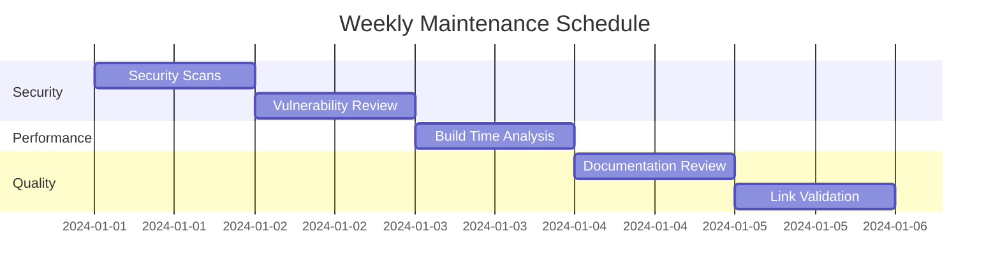
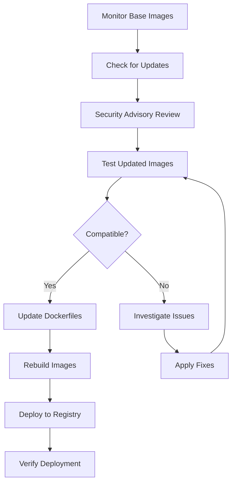

# Maintenance

Comprehensive guide for maintaining and updating the WebGrip infrastructure Docker images and documentation.

## Overview

Maintenance encompasses:

- ✅ **Regular updates** to base images and dependencies
- ✅ **Security patch management** and vulnerability remediation
- ✅ **Performance monitoring** and optimization
- ✅ **Documentation maintenance** to ensure accuracy and relevance
- ✅ **Quality assurance** through automated testing and validation

## Maintenance Schedule

### Weekly Tasks



**Every Monday**: Security and vulnerability scanning
```bash
# Automated security scan script
#!/bin/bash
for image in rust-ci-runner github-runner helm-deploy playwright-runner act-runner rust-releaser; do
    echo "Scanning webgrip/$image:latest"
    trivy image "webgrip/$image:latest" --severity HIGH,CRITICAL
done
```

**Every Wednesday**: Performance and build time monitoring
```bash
# Performance monitoring script
#!/bin/bash
for image in rust-ci-runner github-runner helm-deploy playwright-runner act-runner rust-releaser; do
    echo "Testing $image performance..."
    time docker pull "webgrip/$image:latest"
    time docker run --rm "webgrip/$image:latest" echo "Performance test"
done
```

**Every Friday**: Documentation review and link validation
```bash
# Documentation validation
cd docs/techdocs/docs
find . -name "*.md" -exec markdown-link-check {} \;
```

### Monthly Tasks

**First Monday of Month**: Base image updates
- Review base image security advisories
- Test updated base images
- Update Dockerfiles with new base image versions
- Rebuild and test all images

**Second Monday**: Dependency updates
- Update language runtimes (Rust, Node.js, PHP, Python)
- Update CLI tools and utilities
- Test compatibility with existing workflows

**Third Monday**: Performance optimization
- Analyze image sizes and build times
- Optimize Dockerfile layer caching
- Review and update build arguments

**Fourth Monday**: Documentation review
- Review and update all image documentation
- Validate links and references
- Update version information and compatibility matrices

### Quarterly Tasks

**Security Review**:
- Comprehensive security audit of all images
- Review and update security practices
- Update base images to latest stable versions
- Implement new security features

**Architecture Review**:
- Evaluate image architecture and dependencies
- Consider consolidation or splitting of images
- Review integration patterns and usage
- Plan for new image requirements

**Community Feedback**:
- Review GitHub issues and discussions
- Analyze usage patterns from logs
- Gather feedback from development teams
- Plan improvements based on feedback

## Image Maintenance

### Base Image Updates



#### Monitoring Base Images

```bash
#!/bin/bash
# scripts/monitor-base-images.sh

declare -A BASE_IMAGES=(
    ["rust-ci-runner"]="rust:1.87.0-slim-bookworm"
    ["github-runner"]="ghcr.io/actions/actions-runner:2.328.0"
    ["helm-deploy"]="alpine:3.21.3"
    ["playwright-runner"]="mcr.microsoft.com/playwright:v1.51.0-noble"
    ["act-runner"]="alpine:3.22.1"
    ["rust-releaser"]="node:22-bookworm-slim"
)

echo "Checking base image updates..."

for image in "${!BASE_IMAGES[@]}"; do
    base="${BASE_IMAGES[$image]}"
    echo "Checking $image (base: $base)"
    
    # Check for newer versions
    if docker pull "$base"; then
        echo "✅ $base is current"
    else
        echo "❌ Failed to pull $base"
    fi
    
    # Check for security vulnerabilities
    trivy image "$base" --severity HIGH,CRITICAL --quiet
done
```

#### Update Process

```bash
#!/bin/bash
# scripts/update-base-image.sh

IMAGE_NAME=$1
NEW_BASE_VERSION=$2

if [[ -z "$IMAGE_NAME" || -z "$NEW_BASE_VERSION" ]]; then
    echo "Usage: $0 <image-name> <new-base-version>"
    exit 1
fi

echo "Updating $IMAGE_NAME to use base image $NEW_BASE_VERSION"

# Update Dockerfile
sed -i "s/FROM .*/FROM $NEW_BASE_VERSION/" "ops/docker/$IMAGE_NAME/Dockerfile"

# Build and test
docker build -t "webgrip/$IMAGE_NAME:test-update" "ops/docker/$IMAGE_NAME/"

# Run basic tests
echo "Running basic tests..."
case $IMAGE_NAME in
    "rust-ci-runner")
        docker run --rm "webgrip/$IMAGE_NAME:test-update" rustc --version
        ;;
    "github-runner")
        docker run --rm "webgrip/$IMAGE_NAME:test-update" php --version
        ;;
    "helm-deploy")
        docker run --rm "webgrip/$IMAGE_NAME:test-update" helm version
        ;;
    "playwright-runner")
        docker run --rm "webgrip/$IMAGE_NAME:test-update" npx playwright --version
        ;;
    "act-runner")
        docker run --rm "webgrip/$IMAGE_NAME:test-update" act --version
        ;;
    "rust-releaser")
        docker run --rm "webgrip/$IMAGE_NAME:test-update" node --version
        ;;
esac

if [[ $? -eq 0 ]]; then
    echo "✅ Update successful for $IMAGE_NAME"
    echo "Ready to commit and push changes"
else
    echo "❌ Update failed for $IMAGE_NAME"
    exit 1
fi
```

### Dependency Management

#### Language Runtime Updates

```bash
#!/bin/bash
# scripts/update-runtimes.sh

# Rust updates
echo "Checking Rust versions..."
LATEST_RUST=$(curl -s https://forge.rust-lang.org/infra/channel-releases.html | grep -o "1\.[0-9]\+\.[0-9]\+" | head -1)
echo "Latest Rust: $LATEST_RUST"

# Node.js updates
echo "Checking Node.js versions..."
LATEST_NODE=$(curl -s https://nodejs.org/dist/index.json | jq -r '.[0].version' | sed 's/v//')
echo "Latest Node.js: $LATEST_NODE"

# PHP updates
echo "Checking PHP versions..."
LATEST_PHP=$(curl -s https://www.php.net/releases/index.php | grep -o "8\.[0-9]\+\.[0-9]\+" | head -1)
echo "Latest PHP: $LATEST_PHP"

# Update Dockerfiles with new versions
# This would typically involve careful testing and validation
```

#### Tool Updates

```bash
#!/bin/bash
# scripts/update-tools.sh

declare -A TOOLS=(
    ["helm"]="https://api.github.com/repos/helm/helm/releases/latest"
    ["kubectl"]="https://storage.googleapis.com/kubernetes-release/release/stable.txt"
    ["act"]="https://api.github.com/repos/nektos/act/releases/latest"
    ["sops"]="https://api.github.com/repos/mozilla/sops/releases/latest"
)

for tool in "${!TOOLS[@]}"; do
    echo "Checking $tool updates..."
    
    case $tool in
        "kubectl")
            latest=$(curl -s "${TOOLS[$tool]}")
            ;;
        *)
            latest=$(curl -s "${TOOLS[$tool]}" | jq -r '.tag_name')
            ;;
    esac
    
    echo "$tool latest version: $latest"
done
```

### Security Maintenance

#### Vulnerability Scanning

```bash
#!/bin/bash
# scripts/security-scan.sh

IMAGES=(
    "webgrip/rust-ci-runner:latest"
    "webgrip/github-runner:latest"
    "webgrip/helm-deploy:latest"
    "webgrip/playwright-runner:latest"
    "webgrip/act-runner:latest"
    "webgrip/rust-releaser:latest"
)

REPORT_DIR="security-reports/$(date +%Y-%m-%d)"
mkdir -p "$REPORT_DIR"

for image in "${IMAGES[@]}"; do
    echo "Scanning $image..."
    
    # Trivy scan
    trivy image "$image" \
        --format json \
        --output "$REPORT_DIR/$(basename $image)-trivy.json"
    
    # Summary report
    trivy image "$image" \
        --severity HIGH,CRITICAL \
        --format table \
        > "$REPORT_DIR/$(basename $image)-summary.txt"
done

# Generate overall report
echo "# Security Scan Report - $(date)" > "$REPORT_DIR/README.md"
echo "" >> "$REPORT_DIR/README.md"

for image in "${IMAGES[@]}"; do
    echo "## $(basename $image)" >> "$REPORT_DIR/README.md"
    echo '```' >> "$REPORT_DIR/README.md"
    cat "$REPORT_DIR/$(basename $image)-summary.txt" >> "$REPORT_DIR/README.md"
    echo '```' >> "$REPORT_DIR/README.md"
    echo "" >> "$REPORT_DIR/README.md"
done

echo "Security scan complete. Report saved to $REPORT_DIR/"
```

#### Security Patch Process

```bash
#!/bin/bash
# scripts/apply-security-patches.sh

IMAGE_NAME=$1
CVE_ID=$2

if [[ -z "$IMAGE_NAME" || -z "$CVE_ID" ]]; then
    echo "Usage: $0 <image-name> <cve-id>"
    exit 1
fi

echo "Applying security patch for $CVE_ID in $IMAGE_NAME"

# Create branch for security fix
git checkout -b "security-fix-$CVE_ID-$IMAGE_NAME"

# Update image with security fixes
case $IMAGE_NAME in
    "rust-ci-runner"|"rust-releaser")
        # Update Rust packages
        echo "Updating Rust packages..."
        # Add specific package updates to Dockerfile
        ;;
    "github-runner"|"playwright-runner")
        # Update system packages
        echo "Updating system packages..."
        # Update package versions in Dockerfile
        ;;
    "helm-deploy"|"act-runner")
        # Update Alpine packages
        echo "Updating Alpine packages..."
        # Update apk packages in Dockerfile
        ;;
esac

# Build and test
docker build -t "webgrip/$IMAGE_NAME:security-fix" "ops/docker/$IMAGE_NAME/"

# Run security scan to verify fix
trivy image "webgrip/$IMAGE_NAME:security-fix" --severity HIGH,CRITICAL

echo "Security patch applied. Please review and test before merging."
```

### Performance Maintenance

#### Build Time Optimization

```bash
#!/bin/bash
# scripts/optimize-build-times.sh

IMAGES=(rust-ci-runner github-runner helm-deploy playwright-runner act-runner rust-releaser)

echo "Analyzing build performance..."

for image in "${IMAGES[@]}"; do
    echo "Testing $image build time..."
    
    # Clean build
    start_time=$(date +%s)
    docker build --no-cache -t "webgrip/$image:perf-test" "ops/docker/$image/" > /dev/null 2>&1
    end_time=$(date +%s)
    clean_build_time=$((end_time - start_time))
    
    # Cached build
    start_time=$(date +%s)
    docker build -t "webgrip/$image:perf-test-cached" "ops/docker/$image/" > /dev/null 2>&1
    end_time=$(date +%s)
    cached_build_time=$((end_time - start_time))
    
    # Image size
    size=$(docker images "webgrip/$image:perf-test" --format "table {{.Size}}" | tail -1)
    
    echo "$image: Clean=${clean_build_time}s, Cached=${cached_build_time}s, Size=$size"
    
    # Cleanup
    docker rmi "webgrip/$image:perf-test" "webgrip/$image:perf-test-cached" > /dev/null 2>&1
done
```

#### Image Size Monitoring

```bash
#!/bin/bash
# scripts/monitor-image-sizes.sh

echo "Image Size Report - $(date)" > image-sizes.md
echo "==========================" >> image-sizes.md
echo "" >> image-sizes.md

docker images webgrip/* --format "table {{.Repository}}:{{.Tag}}\t{{.Size}}\t{{.CreatedAt}}" | \
    grep -v "REPOSITORY" | \
    sort -k1 >> image-sizes.md

# Check for images over size threshold
echo "" >> image-sizes.md
echo "Large Images (>1GB):" >> image-sizes.md
docker images webgrip/* --format "table {{.Repository}}:{{.Tag}}\t{{.Size}}" | \
    grep -E "[0-9\.]+GB" >> image-sizes.md || echo "None" >> image-sizes.md

echo "Image size report generated: image-sizes.md"
```

## Documentation Maintenance

### Automated Link Checking

```bash
#!/bin/bash
# scripts/check-documentation-links.sh

echo "Checking documentation links..."

cd docs/techdocs/docs

# Install markdown-link-check if not present
if ! command -v markdown-link-check &> /dev/null; then
    npm install -g markdown-link-check
fi

# Create config file for link checking
cat > /tmp/link-check-config.json << EOF
{
  "ignorePatterns": [
    {
      "pattern": "^http://localhost"
    },
    {
      "pattern": "^https://localhost"
    }
  ],
  "timeout": "20s",
  "retryOn429": true,
  "retryCount": 3,
  "fallbackRetryDelay": "30s"
}
EOF

# Check all markdown files
find . -name "*.md" -print0 | xargs -0 -I {} markdown-link-check {} -c /tmp/link-check-config.json

# Cleanup
rm /tmp/link-check-config.json

echo "Link checking complete"
```

### Content Validation

```bash
#!/bin/bash
# scripts/validate-documentation.sh

echo "Validating documentation content..."

# Check for broken internal references
echo "Checking internal references..."
find docs/techdocs/docs -name "*.md" -exec grep -H "\(\.\./\|docs/\)" {} \; | \
    while read -r line; do
        file=$(echo "$line" | cut -d: -f1)
        ref=$(echo "$line" | cut -d: -f2- | grep -o '\(docs/[^)]*\|\.\./[^)]*\)' | head -1)
        
        if [[ -n "$ref" ]]; then
            # Convert relative path to absolute
            abs_path=$(realpath --relative-to="$(pwd)" "$(dirname "$file")/$ref" 2>/dev/null)
            
            if [[ ! -f "$abs_path" ]]; then
                echo "❌ Broken reference in $file: $ref"
            fi
        fi
    done

# Check for outdated version references
echo "Checking for outdated version references..."
grep -r "v1\.[0-9]\+\.[0-9]\+" docs/techdocs/docs --include="*.md" | \
    grep -v "example\|placeholder" | \
    while read -r line; do
        echo "⚠️  Version reference found: $line"
    done

# Check for TODO/FIXME comments
echo "Checking for TODO/FIXME items..."
grep -r "TODO\|FIXME\|XXX" docs/techdocs/docs --include="*.md" | \
    while read -r line; do
        echo "📝 Action item: $line"
    done

echo "Documentation validation complete"
```

### Version Synchronization

```bash
#!/bin/bash
# scripts/sync-versions.sh

echo "Synchronizing version information..."

# Get current image versions from registry
declare -A CURRENT_VERSIONS

IMAGES=(rust-ci-runner github-runner helm-deploy playwright-runner act-runner rust-releaser)

for image in "${IMAGES[@]}"; do
    # Get image creation date and size
    info=$(docker inspect "webgrip/$image:latest" --format "{{.Created}} {{.Size}}" 2>/dev/null)
    
    if [[ $? -eq 0 ]]; then
        CURRENT_VERSIONS[$image]=$info
        echo "Found $image: $info"
    else
        echo "⚠️  Could not fetch info for $image"
    fi
done

# Update documentation with current versions
for image in "${IMAGES[@]}"; do
    doc_file="docs/techdocs/docs/docker-images/$image.md"
    
    if [[ -f "$doc_file" ]]; then
        echo "Updating version info in $doc_file"
        # This would involve updating the version tables in documentation
        # Implementation depends on specific format used
    fi
done

echo "Version synchronization complete"
```

## Quality Assurance

### Automated Testing

```bash
#!/bin/bash
# scripts/qa-check.sh

echo "Running quality assurance checks..."

# 1. Docker image builds
echo "Testing image builds..."
for image in rust-ci-runner github-runner helm-deploy playwright-runner act-runner rust-releaser; do
    echo "Building $image..."
    if docker build -q -t "qa-test-$image" "ops/docker/$image/" > /dev/null; then
        echo "✅ $image builds successfully"
        docker rmi "qa-test-$image" > /dev/null
    else
        echo "❌ $image build failed"
    fi
done

# 2. Documentation build
echo "Testing documentation build..."
cd docs/techdocs
if mkdocs build > /dev/null 2>&1; then
    echo "✅ Documentation builds successfully"
    rm -rf site/
else
    echo "❌ Documentation build failed"
fi
cd ../..

# 3. Link validation
echo "Validating links..."
./scripts/check-documentation-links.sh > /dev/null 2>&1
if [[ $? -eq 0 ]]; then
    echo "✅ All links are valid"
else
    echo "❌ Some links are broken"
fi

# 4. Security scan
echo "Running security scans..."
./scripts/security-scan.sh > /dev/null 2>&1
echo "✅ Security scans completed"

echo "Quality assurance checks complete"
```

### Continuous Monitoring

```yaml
# .github/workflows/maintenance.yml
name: Maintenance Tasks
on:
  schedule:
    # Weekly security scans (Mondays at 2 AM UTC)
    - cron: '0 2 * * 1'
    # Monthly full maintenance (First Monday of month at 4 AM UTC)
    - cron: '0 4 1-7 * 1'

jobs:
  security-scan:
    if: github.event.schedule == '0 2 * * 1'
    runs-on: ubuntu-latest
    steps:
      - uses: actions/checkout@v4
      
      - name: Run security scans
        run: ./scripts/security-scan.sh
        
      - name: Upload security reports
        uses: actions/upload-artifact@v3
        with:
          name: security-reports
          path: security-reports/
          
  full-maintenance:
    if: github.event.schedule == '0 4 1-7 * 1'
    runs-on: ubuntu-latest
    steps:
      - uses: actions/checkout@v4
      
      - name: Check base image updates
        run: ./scripts/monitor-base-images.sh
        
      - name: Validate documentation
        run: ./scripts/validate-documentation.sh
        
      - name: Performance analysis
        run: ./scripts/optimize-build-times.sh
        
      - name: Create maintenance report
        run: |
          echo "# Monthly Maintenance Report - $(date)" > maintenance-report.md
          echo "Generated on $(date)" >> maintenance-report.md
          # Add report sections
          
      - name: Upload maintenance report
        uses: actions/upload-artifact@v3
        with:
          name: maintenance-report
          path: maintenance-report.md
```

## Incident Response

### Image Failure Response

```bash
#!/bin/bash
# scripts/incident-response.sh

INCIDENT_TYPE=$1
AFFECTED_IMAGE=$2

case $INCIDENT_TYPE in
    "build-failure")
        echo "Responding to build failure for $AFFECTED_IMAGE"
        
        # Check recent changes
        git log --oneline -10 "ops/docker/$AFFECTED_IMAGE/"
        
        # Attempt to build with previous version
        previous_commit=$(git log --format="%H" -n 2 "ops/docker/$AFFECTED_IMAGE/" | tail -1)
        git checkout "$previous_commit" -- "ops/docker/$AFFECTED_IMAGE/"
        
        if docker build -t "webgrip/$AFFECTED_IMAGE:rollback" "ops/docker/$AFFECTED_IMAGE/"; then
            echo "✅ Previous version builds successfully"
            echo "Consider rolling back recent changes"
        else
            echo "❌ Previous version also fails to build"
            echo "Deeper investigation required"
        fi
        ;;
        
    "security-vulnerability")
        echo "Responding to security vulnerability in $AFFECTED_IMAGE"
        
        # Pull latest base image
        base_image=$(grep "FROM" "ops/docker/$AFFECTED_IMAGE/Dockerfile" | head -1 | awk '{print $2}')
        docker pull "$base_image"
        
        # Rebuild with latest base
        docker build --no-cache -t "webgrip/$AFFECTED_IMAGE:security-fix" "ops/docker/$AFFECTED_IMAGE/"
        
        # Run security scan
        trivy image "webgrip/$AFFECTED_IMAGE:security-fix" --severity HIGH,CRITICAL
        ;;
        
    "performance-degradation")
        echo "Responding to performance issues in $AFFECTED_IMAGE"
        
        # Analyze recent build times
        echo "Recent build performance analysis needed"
        ./scripts/optimize-build-times.sh
        ;;
esac
```

### Emergency Rollback

```bash
#!/bin/bash
# scripts/emergency-rollback.sh

IMAGE_NAME=$1
TARGET_SHA=${2:-HEAD~1}

if [[ -z "$IMAGE_NAME" ]]; then
    echo "Usage: $0 <image-name> [target-sha]"
    exit 1
fi

echo "Emergency rollback for $IMAGE_NAME to $TARGET_SHA"

# Create emergency branch
git checkout -b "emergency-rollback-$IMAGE_NAME-$(date +%s)"

# Rollback to target commit
git checkout "$TARGET_SHA" -- "ops/docker/$IMAGE_NAME/"

# Build and test
docker build -t "webgrip/$IMAGE_NAME:emergency-rollback" "ops/docker/$IMAGE_NAME/"

# Basic smoke test
case $IMAGE_NAME in
    "rust-ci-runner")
        docker run --rm "webgrip/$IMAGE_NAME:emergency-rollback" rustc --version
        ;;
    # Add other image tests as needed
esac

if [[ $? -eq 0 ]]; then
    echo "✅ Emergency rollback successful"
    echo "Create PR to merge emergency rollback"
else
    echo "❌ Emergency rollback failed"
    exit 1
fi
```

## Documentation Lifecycle

### Quarterly Review Process

1. **Content Audit**: Review all documentation for accuracy and completeness
2. **Link Validation**: Verify all internal and external links
3. **Version Updates**: Synchronize version information across all docs
4. **Usage Analytics**: Review most-accessed content and optimize accordingly
5. **Community Feedback**: Incorporate feedback from GitHub issues and discussions

### Continuous Improvement

```bash
#!/bin/bash
# scripts/doc-improvement.sh

echo "Analyzing documentation for improvement opportunities..."

# Find pages with outdated information
find docs/techdocs/docs -name "*.md" -exec grep -l "TODO\|FIXME\|XXX" {} \;

# Find pages that haven't been updated recently
find docs/techdocs/docs -name "*.md" -not -newer /tmp/30-days-ago

# Analyze link density (pages with few links might need more cross-references)
find docs/techdocs/docs -name "*.md" -exec sh -c 'echo "$(grep -o "\[.*\](.*)" "$1" | wc -l) links in $1"' _ {} \; | \
    sort -n | head -10

echo "Documentation improvement analysis complete"
```

## Related Documentation

- [Building Locally](building-locally.md) - Local development and testing procedures
- [Contributing Images](contributing-images.md) - Guidelines for contributing new images
- [CI/CD Pipeline](../cicd/automated-building.md) - Automated building and deployment
- [Architecture Overview](../overview/architecture.md) - Overall system architecture

---

> **Assumption**: Maintenance tasks can be automated through scripts and CI/CD pipelines. Manual intervention may be required for complex issues or major version updates. Validation needed: Confirm automation capabilities and manual oversight requirements with operations team.

**Maintainer**: [WebGrip Ops Team](https://github.com/orgs/webgrip/teams/ops)  
**Scripts**: Available in repository `scripts/` directory  
**Monitoring**: GitHub Actions workflows for automated maintenance tasks