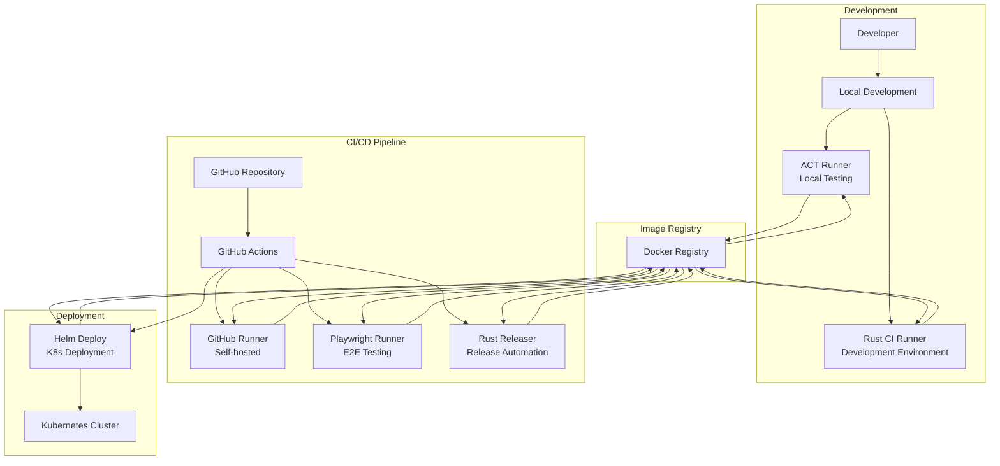
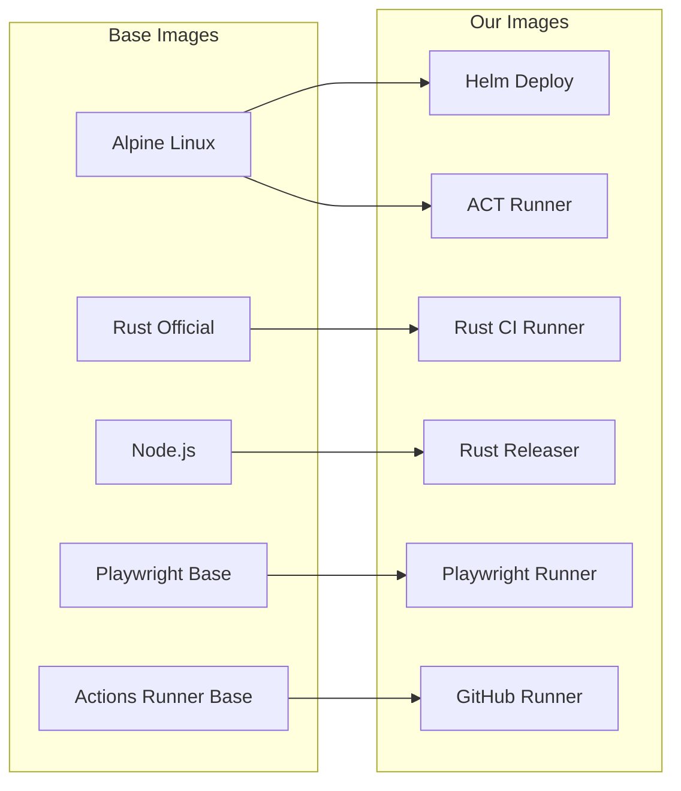
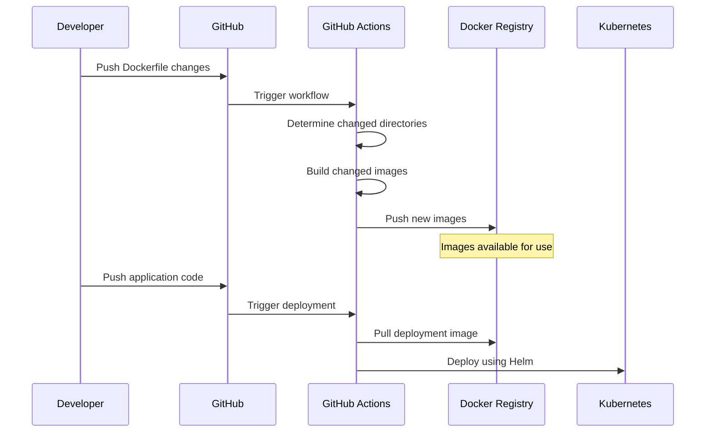
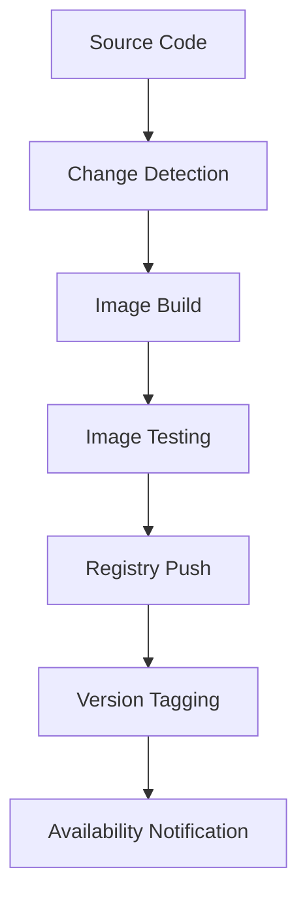
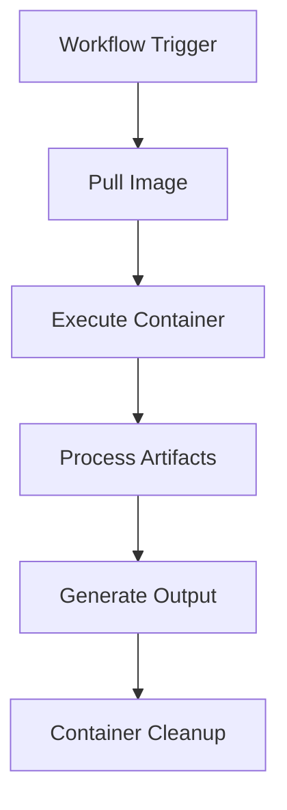
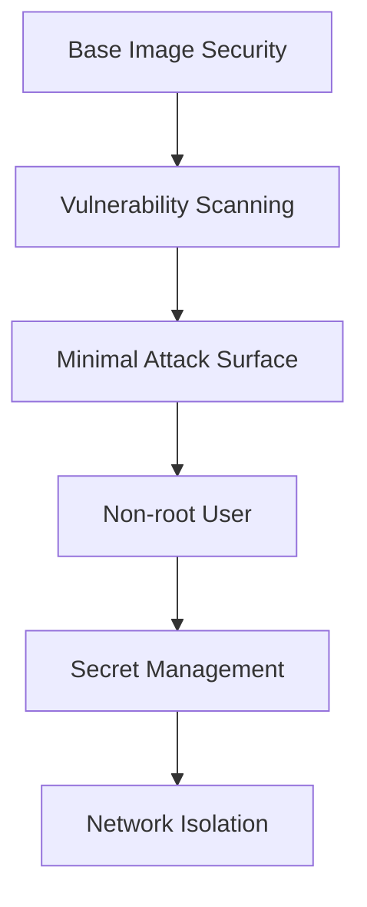
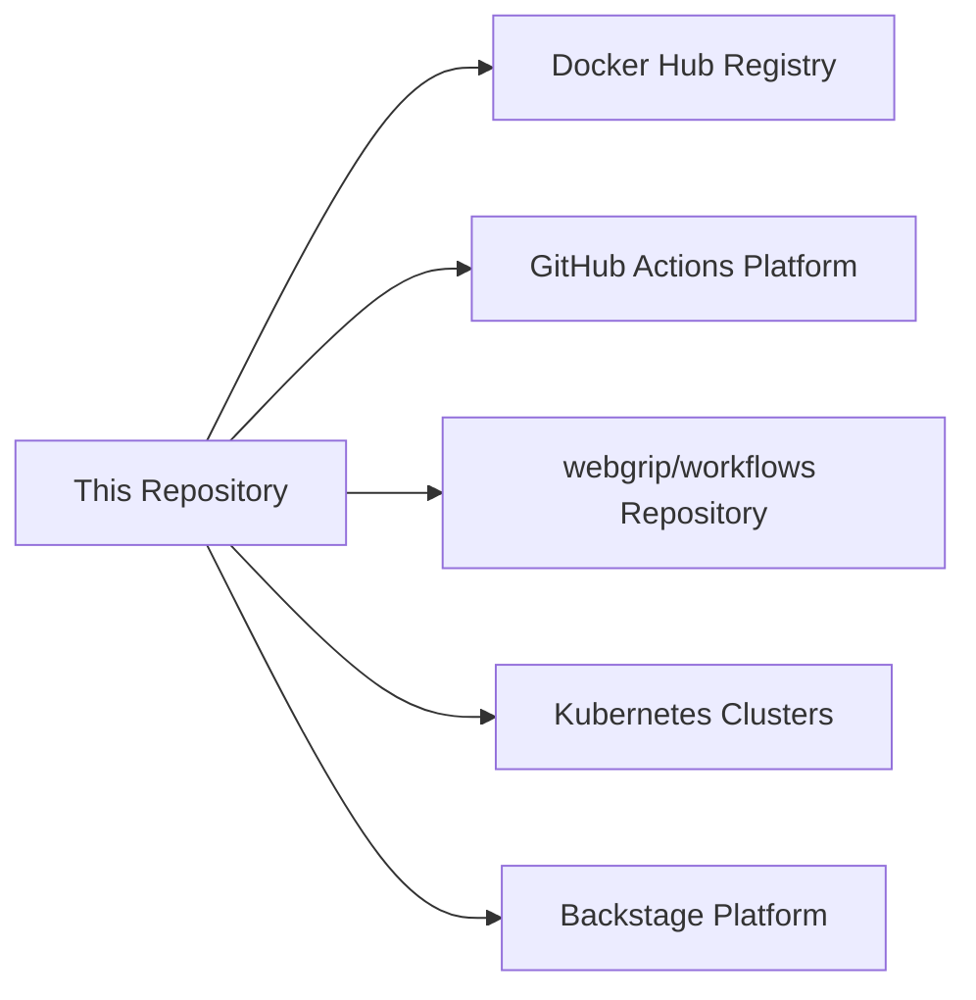

# Architecture Overview

## System Architecture

The WebGrip Infrastructure follows a **service-oriented architecture** where each Docker image serves as a specialized microservice for different aspects of our CI/CD pipeline.

## Component Architecture

### Docker Image Services

Each Docker image is designed as a self-contained service with specific responsibilities:

### Automation Architecture

Our automation follows an **event-driven pattern** triggered by repository changes:

## Design Principles

### 🎯 **Single Responsibility**
Each Docker image has one primary purpose and contains only the tools necessary for that specific function.

**Example**: The Helm Deploy image contains only Alpine Linux + Helm + kubectl, not development tools or testing frameworks.

### 🔧 **Composability**
Images can be used independently or combined in workflows to create more complex automation pipelines.

**Example**: A typical deployment workflow uses:
1. `rust-ci-runner` for building
2. `playwright-runner` for testing  
3. `helm-deploy` for deployment

### 📦 **Immutability**
Images are versioned and immutable. Changes result in new image versions rather than modifying existing ones.

**Implementation**: Each image is tagged with both `:latest` and `:${{ github.sha }}` for different use cases.

### 🚀 **Performance**
Images are optimized for fast startup and minimal resource usage in CI/CD environments.

**Techniques**:
- Multi-stage builds to reduce final image size
- Layer caching optimization
- Minimal base images where possible

## Data Flow

### Build Pipeline Data Flow

### Usage Data Flow

## Technology Stack

### Core Technologies

| Layer | Technology | Purpose |
|-------|------------|---------|
| **Container Runtime** | Docker | Container orchestration and execution |
| **CI/CD Platform** | GitHub Actions | Automation workflows and triggering |
| **Image Registry** | Docker Hub | Image storage and distribution |
| **Documentation** | MkDocs + Backstage | Technical documentation platform |
| **Orchestration** | Kubernetes + Helm | Production deployment platform |

### Per-Image Technology Stack

| Image | Base | Primary Tools | Purpose |
|-------|------|---------------|---------|
| **Rust CI Runner** | `rust:slim-bookworm` | Rust toolchain, cargo-audit, cargo-tarpaulin | Rust development and CI |
| **GitHub Runner** | `actions/actions-runner` | GitHub Actions runner, Helm | Self-hosted Actions execution |
| **Helm Deploy** | `alpine:3.21.3` | Helm, kubectl, git | Kubernetes deployment |
| **Playwright Runner** | `mcr.microsoft.com/playwright` | Playwright, Node.js | End-to-end browser testing |
| **ACT Runner** | `alpine:3.22.1` | ACT, Docker, git | Local GitHub Actions testing |
| **Rust Releaser** | `node:22-bookworm-slim` | Node.js, Rust, cross-compilation tools | Release automation |

## Security Architecture

### Container Security

**Security Measures**:
- Regular base image updates
- Minimal package installation
- Non-root user execution where possible
- No secrets baked into images
- Security scanning in CI pipeline

### Access Control

- **Registry Access**: Controlled via Docker Hub credentials
- **GitHub Actions**: Uses repository-level secrets and permissions
- **Kubernetes**: RBAC-controlled deployment permissions

## Scalability Considerations

### Horizontal Scaling
- Multiple runner instances can use the same images
- Registry caching reduces download times
- Parallel workflow execution supported

### Vertical Scaling  
- Images designed for various resource profiles
- Configurable resource limits in Kubernetes
- Efficient memory and CPU usage patterns

## Integration Points

### External Dependencies

### Internal Dependencies

- **Base Images**: Official Docker images (Alpine, Rust, Node.js, etc.)
- **Shared Workflows**: Reusable workflows from [`webgrip/workflows`](https://github.com/webgrip/workflows)
- **Configuration**: Settings from [`catalog-info.yml`](../../../catalog-info.yml)

## Operational Architecture

### Monitoring & Observability

Currently implemented:
- ✅ Build success/failure notifications via GitHub Actions
- ✅ Image vulnerability scanning
- ✅ Workflow execution logs

> **Assumption**: Detailed runtime monitoring (container metrics, resource usage) is handled by the Kubernetes platform and not part of this repository's scope. Validation needed: Confirm monitoring strategy with ops team.

### Backup & Recovery

- **Source Code**: Backed up via GitHub
- **Images**: Stored in Docker Hub with version history
- **Configuration**: Version controlled in this repository

### Disaster Recovery

In case of image unavailability:
1. Images can be rebuilt from source using local Docker
2. Alternative registries can be configured
3. Local development possible using `docker-compose.yml`

---

## Related Documentation

- [Purpose & Scope](purpose.md) - Why this architecture was chosen
- [Quick Start Guide](quick-start.md) - How to use this architecture
- [Docker Images](../docker-images/) - Detailed documentation for each component
- [Operations](../operations/) - Maintenance and operational procedures