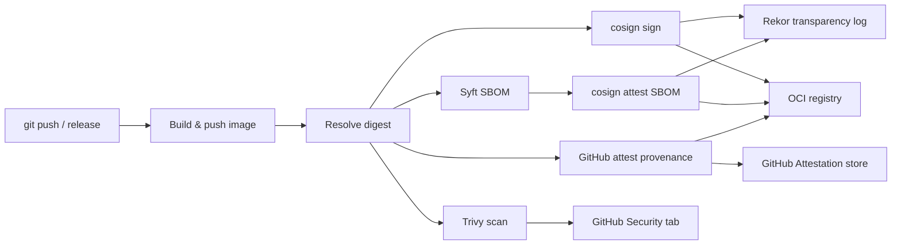

# Security Overview

This section documents the supply chain security measures applied to all container images built and published from this repository.

## What we protect against

| Threat | Mitigation |
|--------|------------|
| Tag mutation (image replaced after signing) | Kyverno pins tags to digests at admission time |
| Compromised registry | cosign signatures are independently verifiable via Rekor transparency log |
| Unsigned image deployed to cluster | Kyverno ClusterPolicy blocks unsigned webgrip images |
| Unknown software components | CycloneDX SBOM generated and attested for every release |
| Unpatched CVEs in base images | Trivy scans on every release, results in GitHub Security tab |
| Workflow impersonation | OIDC certificate is bound to the exact workflow file path and Git ref |

## Security pipeline overview

## Standards coverage

| Standard | Coverage |
|----------|----------|
| [SLSA Build Level 2](https://slsa.dev/spec/v1.0/levels) | Build provenance attestation, hermetic builds |
| [NIST SSDF PW.4](https://csrc.nist.gov/publications/detail/sp/800-218/final) | Verify third-party software components via SBOM |
| [NTIA Minimum SBOM Elements](https://www.ntia.gov/report/2021/minimum-elements-software-bill-materials-sbom) | Author, timestamp, component name/version/supplier, unique ID, dependency relationships |
| [CIS Software Supply Chain Guide](https://www.cisecurity.org/insights/white-papers/cis-software-supply-chain-security-guide) | Signed releases, provenance, artefact integrity |
| EU Cyber Resilience Act (CRA) — in progress | SBOM generation, vulnerability disclosure |

## Quick links

- [Supply Chain Security](supply-chain-security.md) — conceptual overview, SLSA framework
- [Image Signing](image-signing.md) — cosign keyless signing, how to verify
- [SBOM & Attestations](sbom-attestations.md) — what SBOMs contain, how to inspect them
- [Vulnerability Scanning](vulnerability-scanning.md) — Trivy, GitHub Security tab, triage
- [Kyverno Enforcement](kyverno-enforcement.md) — cluster-side policy enforcement
- [ADR-0002](../../adrs/0002-supply-chain-security.md) — decision record for this approach
