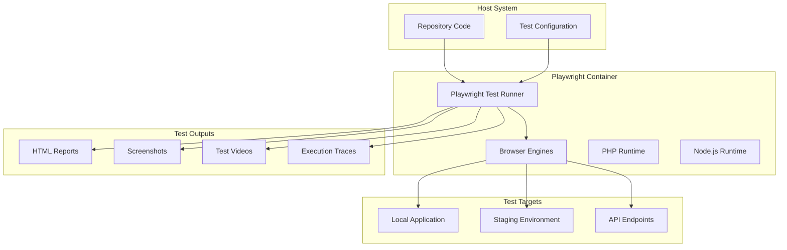
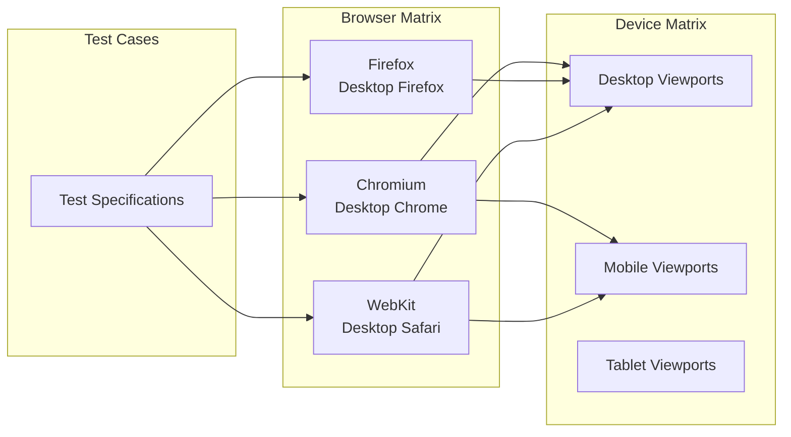

# Playwright Setup

Comprehensive guide to setting up and using Playwright for end-to-end testing in WebGrip's infrastructure.

## Overview

Our Playwright testing infrastructure provides:

- ✅ **Multi-browser testing** across Chromium, Firefox, and WebKit
- ✅ **Containerized execution** with consistent environments
- ✅ **PHP application support** for full-stack testing
- ✅ **CI/CD integration** with automated test execution
- ✅ **Visual regression testing** capabilities
- ✅ **Parallel test execution** for faster feedback

## Architecture

### Testing Environment Stack



### Browser Testing Matrix



## Configuration

### Current Configuration

Our Playwright setup is located in [`tests/playwright-runner/`](../../../tests/playwright-runner/) with the following structure:

```
tests/playwright-runner/
├── package.json              # Dependencies and scripts
├── playwright.config.ts      # Main configuration
└── tests/
    └── google.spec.ts        # Example test
```

### Playwright Configuration File

Current configuration ([`playwright.config.ts`](../../../tests/playwright-runner/playwright.config.ts)):

```typescript
export default defineConfig({
  testDir: './tests',
  fullyParallel: true,
  forbidOnly: !!process.env.CI,
  retries: process.env.CI ? 2 : 0,
  workers: process.env.CI ? 1 : undefined,
  reporter: 'line',
  
  use: {
    trace: 'on-first-retry',
  },
  
  projects: [
    {
      name: 'chromium',
      use: { ...devices['Desktop Chrome'] },
    },
    // Additional browsers commented out for now
  ],
});
```

### Recommended Production Configuration

```typescript
// playwright.config.ts - Enhanced configuration
import { defineConfig, devices } from '@playwright/test';

export default defineConfig({
  testDir: './tests',
  
  // Execution settings
  fullyParallel: true,
  forbidOnly: !!process.env.CI,
  retries: process.env.CI ? 2 : 0,
  workers: process.env.CI ? 2 : undefined,
  timeout: 30000,
  
  // Reporting
  reporter: [
    ['html', { outputFolder: 'playwright-report' }],
    ['json', { outputFile: 'test-results.json' }],
    ['junit', { outputFile: 'test-results.xml' }],
    ['line']
  ],
  
  // Global test settings
  use: {
    baseURL: process.env.BASE_URL || 'http://localhost:8000',
    trace: 'on-first-retry',
    screenshot: 'only-on-failure',
    video: 'retain-on-failure',
    actionTimeout: 10000,
    navigationTimeout: 15000,
  },
  
  // Browser projects
  projects: [
    {
      name: 'chromium',
      use: { ...devices['Desktop Chrome'] },
    },
    {
      name: 'firefox',
      use: { ...devices['Desktop Firefox'] },
    },
    {
      name: 'webkit',
      use: { ...devices['Desktop Safari'] },
    },
    {
      name: 'mobile-chrome',
      use: { ...devices['Pixel 5'] },
    },
    {
      name: 'mobile-safari',
      use: { ...devices['iPhone 12'] },
    },
  ],
  
  // Web server for testing
  webServer: {
    command: 'php artisan serve',
    url: 'http://localhost:8000',
    reuseExistingServer: !process.env.CI,
    timeout: 120000,
  },
});
```

## Installation and Setup

### Local Development Setup

```bash
# Navigate to test directory
cd tests/playwright-runner

# Install dependencies
npm install

# Install browser binaries
npx playwright install

# Install system dependencies (if needed)
npx playwright install-deps
```

### Docker-based Setup (Recommended)

```bash
# Use our Playwright Runner image
docker run -it --rm \
  -v $(pwd):/app \
  -w /app \
  webgrip/playwright-runner:latest \
  bash

# Inside container - dependencies already installed
cd tests/playwright-runner
npm install  # Install project-specific dependencies
npx playwright test
```

### Project Integration

```bash
# Add Playwright to existing project
cd your-project
npm init -y
npm install -D @playwright/test
npx playwright install

# Generate initial configuration
npx playwright init
```

## Writing Tests

### Basic Test Structure

```typescript
// tests/example.spec.ts
import { test, expect } from '@playwright/test';

test.describe('Application Tests', () => {
  test.beforeEach(async ({ page }) => {
    // Setup before each test
    await page.goto('/');
  });

  test('should load homepage', async ({ page }) => {
    await expect(page).toHaveTitle(/My Application/);
    await expect(page.locator('h1')).toContainText('Welcome');
  });

  test('should navigate to about page', async ({ page }) => {
    await page.click('a[href="/about"]');
    await expect(page).toHaveURL(/.*about/);
    await expect(page.locator('h1')).toContainText('About');
  });
});
```

### API Testing

```typescript
// tests/api.spec.ts
import { test, expect } from '@playwright/test';

test.describe('API Tests', () => {
  test('should fetch user data', async ({ request }) => {
    const response = await request.get('/api/users');
    expect(response.status()).toBe(200);
    
    const users = await response.json();
    expect(users).toHaveLength(3);
    expect(users[0]).toHaveProperty('name');
    expect(users[0]).toHaveProperty('email');
  });

  test('should create new user', async ({ request }) => {
    const response = await request.post('/api/users', {
      data: {
        name: 'Test User',
        email: 'test@example.com'
      }
    });
    
    expect(response.status()).toBe(201);
    const user = await response.json();
    expect(user.name).toBe('Test User');
  });
});
```

### Visual Regression Testing

```typescript
// tests/visual.spec.ts
import { test, expect } from '@playwright/test';

test.describe('Visual Regression', () => {
  test('should match homepage screenshot', async ({ page }) => {
    await page.goto('/');
    
    // Wait for content to load
    await page.waitForLoadState('networkidle');
    
    // Take screenshot and compare
    await expect(page).toHaveScreenshot('homepage.png');
  });

  test('should match mobile view', async ({ page }) => {
    await page.setViewportSize({ width: 375, height: 667 });
    await page.goto('/');
    
    await expect(page).toHaveScreenshot('homepage-mobile.png');
  });
});
```

### PHP Application Testing

```typescript
// tests/php-app.spec.ts
import { test, expect } from '@playwright/test';
import { execSync } from 'child_process';

test.describe('PHP Application', () => {
  test.beforeEach(async () => {
    // Reset database state
    execSync('php artisan migrate:fresh --seed', { stdio: 'inherit' });
  });

  test('should register new user', async ({ page }) => {
    await page.goto('/register');
    
    await page.fill('[name="name"]', 'John Doe');
    await page.fill('[name="email"]', 'john@example.com');
    await page.fill('[name="password"]', 'password123');
    await page.fill('[name="password_confirmation"]', 'password123');
    
    await page.click('button[type="submit"]');
    
    await expect(page).toHaveURL('/dashboard');
    await expect(page.locator('.welcome')).toContainText('Welcome, John Doe');
  });

  test('should handle authentication', async ({ page }) => {
    // Seed user first
    execSync('php artisan tinker --execute="User::create([\'name\' => \'Test\', \'email\' => \'test@test.com\', \'password\' => bcrypt(\'password\')])"');
    
    await page.goto('/login');
    await page.fill('[name="email"]', 'test@test.com');
    await page.fill('[name="password"]', 'password');
    await page.click('button[type="submit"]');
    
    await expect(page).toHaveURL('/dashboard');
  });
});
```

## Running Tests

### Basic Execution

```bash
# Run all tests
npx playwright test

# Run specific test file
npx playwright test tests/example.spec.ts

# Run tests in specific browser
npx playwright test --project=chromium

# Run tests in headed mode (visible browser)
npx playwright test --headed

# Run tests with UI mode
npx playwright test --ui
```

### Docker Execution

```bash
# Run tests in Playwright container
docker run --rm \
  -v $(pwd):/app \
  -w /app/tests/playwright-runner \
  webgrip/playwright-runner:latest \
  npx playwright test

# Run with custom configuration
docker run --rm \
  -v $(pwd):/app \
  -w /app \
  -e BASE_URL=http://staging.example.com \
  webgrip/playwright-runner:latest \
  npx playwright test --config=tests/playwright-runner/playwright.config.ts
```

### CI/CD Integration

```yaml
# .github/workflows/e2e-tests.yml
name: E2E Tests
on: [push, pull_request]

jobs:
  test:
    runs-on: ubuntu-latest
    container: webgrip/playwright-runner:latest
    
    services:
      database:
        image: postgres:15
        env:
          POSTGRES_PASSWORD: postgres
        options: >-
          --health-cmd pg_isready
          --health-interval 10s
          --health-timeout 5s
          --health-retries 5
    
    steps:
      - uses: actions/checkout@v4
      
      - name: Setup application
        run: |
          composer install
          php artisan key:generate
          php artisan migrate --force
          
      - name: Start web server
        run: php artisan serve &
        
      - name: Wait for server
        run: npx wait-on http://localhost:8000
        
      - name: Run Playwright tests
        run: |
          cd tests/playwright-runner
          npm install
          npx playwright test
          
      - name: Upload test reports
        uses: actions/upload-artifact@v3
        if: always()
        with:
          name: playwright-report
          path: tests/playwright-runner/playwright-report/
```

## Test Organization

### Recommended Directory Structure

```
tests/playwright-runner/
├── package.json
├── playwright.config.ts
├── fixtures/              # Test data and utilities
│   ├── auth.ts            # Authentication helpers
│   ├── database.ts        # Database utilities
│   └── api.ts             # API helpers
├── tests/
│   ├── auth/              # Authentication tests
│   │   ├── login.spec.ts
│   │   └── registration.spec.ts
│   ├── api/               # API tests
│   │   ├── users.spec.ts
│   │   └── orders.spec.ts
│   ├── e2e/               # End-to-end workflows
│   │   ├── checkout.spec.ts
│   │   └── user-journey.spec.ts
│   └── visual/            # Visual regression tests
│       ├── homepage.spec.ts
│       └── components.spec.ts
├── test-results/          # Generated test results
├── playwright-report/     # HTML reports
└── screenshots/           # Visual regression baselines
```

### Test Categorization

```typescript
// Use test tags for organization
test.describe('User Management @smoke', () => {
  // Smoke tests - critical functionality
});

test.describe('Advanced Features @integration', () => {
  // Integration tests - complex workflows
});

test.describe('Visual Regression @visual', () => {
  // Visual tests - UI consistency
});
```

### Running Categorized Tests

```bash
# Run smoke tests only
npx playwright test --grep "@smoke"

# Run all except visual tests
npx playwright test --grep-invert "@visual"

# Run specific category
npx playwright test tests/auth/
```

## Debugging and Development

### Debug Mode

```bash
# Debug specific test
npx playwright test --debug tests/example.spec.ts

# Debug with headed browser
npx playwright test --headed --slowMo=1000

# Debug in specific browser
npx playwright test --project=chromium --debug
```

### Test Inspector

```typescript
// Add breakpoint in test
test('debug example', async ({ page }) => {
  await page.goto('/');
  await page.pause(); // Opens Playwright Inspector
  await page.click('button');
});
```

### Trace Viewer

```bash
# Generate traces
npx playwright test --trace=on

# View traces
npx playwright show-trace test-results/trace.zip
```

### Console and Network Monitoring

```typescript
test('monitor network', async ({ page }) => {
  // Listen to console logs
  page.on('console', msg => console.log('PAGE LOG:', msg.text()));
  
  // Monitor network requests
  page.on('request', request => {
    console.log('REQUEST:', request.url());
  });
  
  page.on('response', response => {
    console.log('RESPONSE:', response.url(), response.status());
  });
  
  await page.goto('/');
});
```

## Advanced Features

### Custom Fixtures

```typescript
// fixtures/auth.ts
import { test as base } from '@playwright/test';

type AuthFixtures = {
  authenticatedPage: Page;
};

export const test = base.extend<AuthFixtures>({
  authenticatedPage: async ({ page }, use) => {
    // Login before each test
    await page.goto('/login');
    await page.fill('[name="email"]', 'test@example.com');
    await page.fill('[name="password"]', 'password');
    await page.click('button[type="submit"]');
    await page.waitForURL('/dashboard');
    
    await use(page);
  },
});

// Usage in tests
test('authenticated user can access profile', async ({ authenticatedPage }) => {
  await authenticatedPage.goto('/profile');
  await expect(authenticatedPage).toHaveURL('/profile');
});
```

### Page Object Model

```typescript
// pages/LoginPage.ts
export class LoginPage {
  constructor(private page: Page) {}

  async goto() {
    await this.page.goto('/login');
  }

  async login(email: string, password: string) {
    await this.page.fill('[name="email"]', email);
    await this.page.fill('[name="password"]', password);
    await this.page.click('button[type="submit"]');
  }

  async getErrorMessage() {
    return await this.page.locator('.error-message').textContent();
  }
}

// Usage in tests
test('login flow', async ({ page }) => {
  const loginPage = new LoginPage(page);
  await loginPage.goto();
  await loginPage.login('invalid@email.com', 'wrongpassword');
  
  const error = await loginPage.getErrorMessage();
  expect(error).toContain('Invalid credentials');
});
```

### Performance Testing

```typescript
test('performance metrics', async ({ page }) => {
  await page.goto('/');
  
  // Wait for page to load completely
  await page.waitForLoadState('networkidle');
  
  // Get performance metrics
  const performanceEntries = await page.evaluate(() => {
    return JSON.stringify(performance.getEntriesByType('navigation'));
  });
  
  const navigation = JSON.parse(performanceEntries)[0];
  const loadTime = navigation.loadEventEnd - navigation.fetchStart;
  
  expect(loadTime).toBeLessThan(3000); // 3 second load time
});
```

## Troubleshooting

### Common Issues

**Browser launch failures**
```bash
# Check browser installation
npx playwright install --with-deps

# Debug browser launch
DEBUG=pw:browser npx playwright test
```

**Element not found errors**
```typescript
// Use proper waiting strategies
await page.waitForSelector('[data-testid="submit-button"]');
await page.waitForLoadState('networkidle');

// Use more resilient selectors
await page.click('[data-testid="submit"]'); // Better
await page.click('button:has-text("Submit")'); // Good
await page.click('button'); // Fragile
```

**Flaky tests**
```typescript
// Add proper waits
await page.waitForURL('/dashboard');
await page.waitForSelector('.loading', { state: 'detached' });

// Use assertions with auto-waiting
await expect(page.locator('.message')).toBeVisible();
await expect(page).toHaveURL(/dashboard/);
```

**Performance issues**
```bash
# Run tests in parallel with limited workers
npx playwright test --workers=2

# Run specific browser only
npx playwright test --project=chromium
```

## Related Documentation

- [Playwright Runner Image](../docker-images/playwright-runner.md) - Container environment details
- [Test Execution](test-execution.md) - Advanced execution strategies
- [Architecture Overview](../overview/architecture.md) - Testing in our infrastructure
- [CI/CD Pipeline](../cicd/automated-building.md) - Automated test execution

---

> **Assumption**: Tests primarily target web applications built with standard technologies (HTML, CSS, JavaScript, PHP). Complex SPA frameworks may require additional configuration and custom waiting strategies. Validation needed: Confirm application architecture and testing requirements with development teams.

**Maintainer**: [WebGrip Ops Team](https://github.com/orgs/webgrip/teams/ops)  
**Configuration**: [`tests/playwright-runner/playwright.config.ts`](../../../tests/playwright-runner/playwright.config.ts)  
**Container**: [webgrip/playwright-runner](../docker-images/playwright-runner.md)