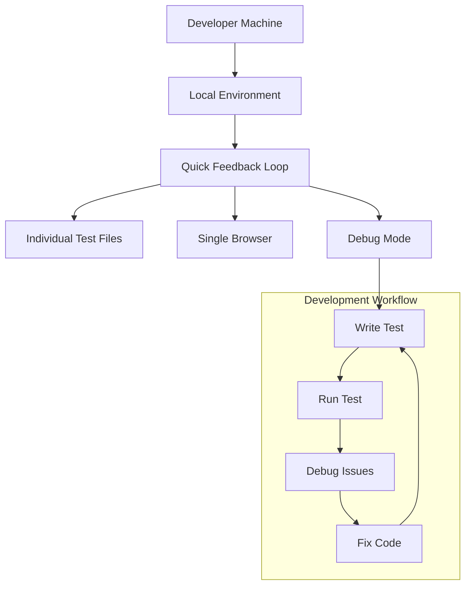
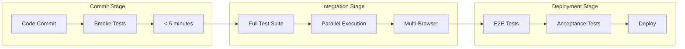
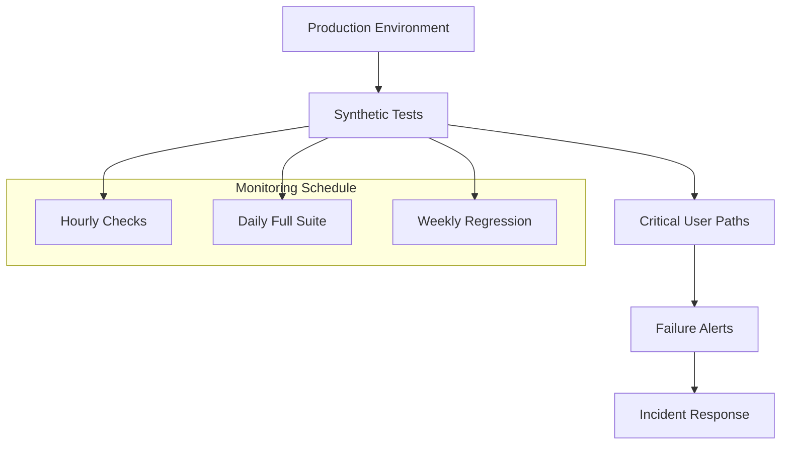

# Test Execution

Advanced strategies and patterns for executing Playwright tests across different environments and scenarios.

## Overview

Test execution encompasses:

- ✅ **Environment-specific execution** across development, staging, and production
- ✅ **Parallel and distributed testing** for optimal performance
- ✅ **Cross-browser and cross-device testing** for comprehensive coverage
- ✅ **CI/CD integration patterns** for automated testing workflows
- ✅ **Test result management** and reporting strategies

## Execution Strategies

### Local Development Execution



### CI/CD Execution Pipeline



### Production Monitoring



## Execution Environments

### Local Development

```bash
# Quick development cycle
cd tests/playwright-runner

# Run single test file
npx playwright test tests/auth/login.spec.ts

# Run with headed browser for debugging
npx playwright test tests/auth/login.spec.ts --headed

# Run with debug mode
npx playwright test tests/auth/login.spec.ts --debug

# Watch mode for continuous testing
npx playwright test --watch
```

### Docker-based Execution

```bash
# Standard container execution
docker run --rm \
  -v $(pwd):/app \
  -w /app/tests/playwright-runner \
  webgrip/playwright-runner:latest \
  npx playwright test

# With environment variables
docker run --rm \
  -v $(pwd):/app \
  -w /app/tests/playwright-runner \
  -e BASE_URL=http://staging.example.com \
  -e TEST_USER_EMAIL=test@example.com \
  -e TEST_USER_PASSWORD=password123 \
  webgrip/playwright-runner:latest \
  npx playwright test --project=chromium

# With volume for reports
docker run --rm \
  -v $(pwd):/app \
  -v playwright-reports:/app/tests/playwright-runner/playwright-report \
  -w /app/tests/playwright-runner \
  webgrip/playwright-runner:latest \
  npx playwright test --reporter=html
```

### GitHub Actions Integration

```yaml
# .github/workflows/playwright-tests.yml
name: Playwright Tests
on:
  push:
    branches: [main, develop]
  pull_request:
    branches: [main]

jobs:
  test:
    runs-on: ubuntu-latest
    container: webgrip/playwright-runner:latest
    
    strategy:
      fail-fast: false
      matrix:
        browser: [chromium, firefox, webkit]
        shard: [1, 2, 3, 4]
    
    steps:
      - uses: actions/checkout@v4
      
      - name: Setup application
        run: |
          composer install --no-dev --optimize-autoloader
          php artisan config:cache
          php artisan route:cache
          
      - name: Setup database
        env:
          DB_CONNECTION: sqlite
          DB_DATABASE: ":memory:"
        run: |
          php artisan migrate --force
          php artisan db:seed --force
          
      - name: Start application server
        run: |
          php artisan serve --port=8000 &
          sleep 10
          curl http://localhost:8000/health || exit 1
          
      - name: Run Playwright tests
        env:
          BASE_URL: http://localhost:8000
        run: |
          cd tests/playwright-runner
          npm ci
          npx playwright test \
            --project=${{ matrix.browser }} \
            --shard=${{ matrix.shard }}/4 \
            --reporter=blob
            
      - name: Upload test results
        uses: actions/upload-artifact@v3
        if: always()
        with:
          name: playwright-results-${{ matrix.browser }}-${{ matrix.shard }}
          path: tests/playwright-runner/test-results/
          
  merge-reports:
    if: always()
    needs: test
    runs-on: ubuntu-latest
    container: webgrip/playwright-runner:latest
    steps:
      - uses: actions/checkout@v4
      
      - name: Download all test results
        uses: actions/download-artifact@v3
        with:
          pattern: playwright-results-*
          merge-multiple: true
          path: test-results/
          
      - name: Merge test reports
        run: |
          cd tests/playwright-runner
          npx playwright merge-reports --reporter=html test-results/
          
      - name: Upload merged report
        uses: actions/upload-artifact@v3
        with:
          name: playwright-report
          path: tests/playwright-runner/playwright-report/
```

## Parallel Execution

### Browser Parallelization

```typescript
// playwright.config.ts - Browser parallelization
export default defineConfig({
  projects: [
    {
      name: 'chromium',
      use: { ...devices['Desktop Chrome'] },
    },
    {
      name: 'firefox',
      use: { ...devices['Desktop Firefox'] },
    },
    {
      name: 'webkit',
      use: { ...devices['Desktop Safari'] },
    },
  ],
});
```

```bash
# Run all browsers in parallel
npx playwright test

# Run specific browser
npx playwright test --project=chromium

# Run multiple specific browsers
npx playwright test --project=chromium --project=firefox
```

### Test Sharding

```bash
# Split tests across multiple runners
npx playwright test --shard=1/4  # Run 1st quarter
npx playwright test --shard=2/4  # Run 2nd quarter
npx playwright test --shard=3/4  # Run 3rd quarter
npx playwright test --shard=4/4  # Run 4th quarter

# In CI with matrix
strategy:
  matrix:
    shard: [1, 2, 3, 4]
steps:
  - name: Run tests (Shard ${{ matrix.shard }})
    run: npx playwright test --shard=${{ matrix.shard }}/4
```

### Worker Configuration

```typescript
// playwright.config.ts - Worker optimization
export default defineConfig({
  // Local development - use all cores
  workers: process.env.CI ? 2 : undefined,
  
  // Or specify exact number
  workers: 4,
  
  // Full parallelization
  fullyParallel: true,
  
  // Global timeout
  globalTimeout: 60 * 60 * 1000, // 1 hour
  
  // Per-test timeout
  timeout: 30 * 1000, // 30 seconds
});
```

## Test Selection and Filtering

### Tag-based Execution

```typescript
// tests/auth.spec.ts
test.describe('Authentication @smoke @auth', () => {
  test('should login successfully @critical', async ({ page }) => {
    // Test implementation
  });
  
  test('should handle invalid credentials @error-handling', async ({ page }) => {
    // Test implementation
  });
});

test.describe('User Management @integration @users', () => {
  test('should create new user @crud', async ({ page }) => {
    // Test implementation
  });
});
```

```bash
# Run tests by tags
npx playwright test --grep "@smoke"              # Smoke tests only
npx playwright test --grep "@critical"          # Critical tests only
npx playwright test --grep "@smoke|@critical"   # Smoke OR critical
npx playwright test --grep-invert "@slow"       # Everything except slow tests

# Run by test suite
npx playwright test --grep "@auth"              # All auth tests
npx playwright test tests/auth/                 # All files in auth directory
```

### Environment-specific Selection

```bash
# Development environment - fast feedback
npx playwright test --grep "@smoke" --project=chromium

# Staging environment - comprehensive testing
npx playwright test --grep "@smoke|@integration"

# Production monitoring - critical paths only
npx playwright test --grep "@critical|@monitoring"
```

### File-based Selection

```bash
# Run specific test files
npx playwright test tests/auth/login.spec.ts
npx playwright test tests/auth/

# Run multiple specific files
npx playwright test tests/auth/login.spec.ts tests/users/profile.spec.ts

# Run tests matching pattern
npx playwright test "**/*auth*.spec.ts"
```

## Cross-Environment Testing

### Environment Configuration

```typescript
// config/environments.ts
export const environments = {
  development: {
    baseURL: 'http://localhost:8000',
    timeout: 10000,
    retries: 0,
  },
  staging: {
    baseURL: 'https://staging.webgrip.nl',
    timeout: 30000,
    retries: 2,
  },
  production: {
    baseURL: 'https://app.webgrip.nl',
    timeout: 15000,
    retries: 1,
  },
};

// playwright.config.ts
const env = process.env.TEST_ENV || 'development';
const config = environments[env];

export default defineConfig({
  use: {
    baseURL: config.baseURL,
    actionTimeout: config.timeout,
  },
  retries: config.retries,
});
```

### Environment-specific Execution

```bash
# Test against different environments
TEST_ENV=development npx playwright test
TEST_ENV=staging npx playwright test --grep "@smoke"
TEST_ENV=production npx playwright test --grep "@monitoring"

# With Docker
docker run --rm \
  -v $(pwd):/app \
  -w /app/tests/playwright-runner \
  -e TEST_ENV=staging \
  -e BASE_URL=https://staging.webgrip.nl \
  webgrip/playwright-runner:latest \
  npx playwright test --grep "@smoke"
```

### Cross-browser Testing Matrix

```yaml
# Complete cross-browser testing
strategy:
  matrix:
    browser: [chromium, firefox, webkit]
    environment: [staging, production]
    
steps:
  - name: Test ${{ matrix.browser }} on ${{ matrix.environment }}
    env:
      TEST_ENV: ${{ matrix.environment }}
    run: npx playwright test --project=${{ matrix.browser }}
```

## Performance Optimization

### Test Execution Performance

```typescript
// playwright.config.ts - Performance optimizations
export default defineConfig({
  // Faster test execution
  fullyParallel: true,
  workers: process.env.CI ? 4 : undefined,
  
  // Reasonable timeouts
  timeout: 30000,
  actionTimeout: 10000,
  navigationTimeout: 15000,
  
  // Optimize for CI
  use: {
    // Disable animations for faster execution
    reducedMotion: 'reduce',
    
    // Optimize screenshots
    screenshot: 'only-on-failure',
    
    // Minimal trace collection
    trace: 'retain-on-failure',
    
    // Disable video in CI
    video: process.env.CI ? 'off' : 'retain-on-failure',
  },
  
  // Global setup for shared state
  globalSetup: require.resolve('./global-setup'),
  globalTeardown: require.resolve('./global-teardown'),
});
```

### Resource Management

```typescript
// global-setup.ts - Shared setup
import { chromium, FullConfig } from '@playwright/test';

async function globalSetup(config: FullConfig) {
  // Setup shared database state
  await setupTestDatabase();
  
  // Warm up application
  const browser = await chromium.launch();
  const page = await browser.newPage();
  await page.goto(config.projects[0].use.baseURL);
  await browser.close();
  
  // Cache authentication state
  await setupAuthenticationState();
}

export default globalSetup;
```

### Caching Strategies

```typescript
// fixtures/auth-cache.ts
import { test as base } from '@playwright/test';

const STORAGE_STATE = 'auth-state.json';

export const test = base.extend({
  // Reuse authentication state
  storageState: STORAGE_STATE,
  
  authenticatedPage: async ({ page }, use) => {
    // Use cached authentication if available
    await use(page);
  },
});
```

## Test Result Management

### Report Generation

```typescript
// playwright.config.ts - Multiple reporters
export default defineConfig({
  reporter: [
    // HTML report for local development
    ['html', { 
      outputFolder: 'playwright-report',
      open: process.env.CI ? 'never' : 'on-failure'
    }],
    
    // JSON for CI integration
    ['json', { outputFile: 'test-results.json' }],
    
    // JUnit for test management systems
    ['junit', { outputFile: 'test-results.xml' }],
    
    // Line reporter for CI logs
    ['line'],
    
    // Custom reporter for notifications
    ['./reporters/slack-reporter.js'],
  ],
});
```

### Artifact Management

```bash
# Generate and collect artifacts
npx playwright test \
  --reporter=html \
  --output-dir=test-results \
  --screenshot=on \
  --video=on \
  --trace=on

# Archive results
tar -czf "test-results-$(date +%Y%m%d-%H%M%S).tar.gz" \
  test-results/ \
  playwright-report/ \
  test-results.json
```

### CI/CD Integration

```yaml
# Complete artifact handling
- name: Run Playwright tests
  run: npx playwright test --reporter=blob
  
- name: Generate HTML report
  if: always()
  run: npx playwright merge-reports --reporter=html blob-report/
  
- name: Upload test report
  uses: actions/upload-artifact@v3
  if: always()
  with:
    name: playwright-report-${{ github.run_id }}
    path: |
      playwright-report/
      test-results/
    retention-days: 30
    
- name: Upload to test management
  if: always()
  run: |
    curl -X POST \
      -H "Content-Type: application/json" \
      -d @test-results.json \
      https://test-management.webgrip.nl/api/results
```

## Monitoring and Alerting

### Synthetic Monitoring

```typescript
// tests/monitoring/critical-paths.spec.ts
import { test, expect } from '@playwright/test';

test.describe('Critical Path Monitoring @monitoring @critical', () => {
  test('user login flow', async ({ page }) => {
    const startTime = Date.now();
    
    await page.goto('/login');
    await page.fill('[name="email"]', process.env.MONITOR_USER_EMAIL!);
    await page.fill('[name="password"]', process.env.MONITOR_USER_PASSWORD!);
    await page.click('button[type="submit"]');
    
    await expect(page).toHaveURL('/dashboard');
    
    const loadTime = Date.now() - startTime;
    expect(loadTime).toBeLessThan(5000); // 5 second SLA
  });
  
  test('checkout process', async ({ page }) => {
    // Simulate critical business process
    await page.goto('/products/1');
    await page.click('button:has-text("Add to Cart")');
    await page.goto('/checkout');
    
    // Verify checkout loads within SLA
    await expect(page.locator('h1')).toContainText('Checkout');
  });
});
```

### Alert Configuration

```bash
#!/bin/bash
# monitoring/run-synthetic-tests.sh

# Run critical path tests
npx playwright test --grep "@monitoring" --reporter=json > monitoring-results.json

# Check for failures
FAILURES=$(jq '.stats.failed' monitoring-results.json)

if [ "$FAILURES" -gt 0 ]; then
  # Send alert to Slack
  curl -X POST -H 'Content-type: application/json' \
    --data '{"text":"🚨 Synthetic monitoring tests failed: '"$FAILURES"' failures detected"}' \
    $SLACK_WEBHOOK_URL
    
  # Page on-call team
  curl -X POST \
    -H "Authorization: Token $PAGERDUTY_TOKEN" \
    -H "Content-Type: application/json" \
    -d '{
      "incident": {
        "type": "incident",
        "title": "Synthetic Test Failures",
        "service": {"id": "'"$PAGERDUTY_SERVICE_ID"'", "type": "service_reference"}
      }
    }' \
    https://api.pagerduty.com/incidents
fi
```

### Performance Monitoring

```typescript
// tests/performance/load-times.spec.ts
test('performance metrics', async ({ page }) => {
  await page.goto('/');
  
  const metrics = await page.evaluate(() => {
    const perfData = performance.getEntriesByType('navigation')[0];
    return {
      domContentLoaded: perfData.domContentLoadedEventEnd - perfData.fetchStart,
      loadComplete: perfData.loadEventEnd - perfData.fetchStart,
      firstPaint: performance.getEntriesByType('paint')[0]?.startTime || 0,
    };
  });
  
  // Assert performance SLAs
  expect(metrics.domContentLoaded).toBeLessThan(2000);
  expect(metrics.loadComplete).toBeLessThan(5000);
  expect(metrics.firstPaint).toBeLessThan(1500);
  
  // Log metrics for monitoring
  console.log('Performance Metrics:', JSON.stringify(metrics));
});
```

## Troubleshooting Test Execution

### Common Execution Issues

**Tests timing out**
```typescript
// Increase timeouts for specific tests
test('slow operation', async ({ page }) => {
  test.setTimeout(60000); // 60 seconds for this test
  
  await page.goto('/slow-page');
  await page.waitForSelector('.slow-component', { timeout: 30000 });
});
```

**Flaky tests**
```typescript
// Add proper waits and retries
test('potentially flaky test', async ({ page }) => {
  // Retry this test up to 3 times
  test.fixme(({ browserName }) => browserName === 'webkit', 'Flaky on WebKit');
  
  await page.goto('/');
  
  // Wait for network to be idle
  await page.waitForLoadState('networkidle');
  
  // Use auto-waiting assertions
  await expect(page.locator('.dynamic-content')).toBeVisible();
});
```

**Resource exhaustion**
```bash
# Reduce parallel workers
npx playwright test --workers=1

# Run tests sequentially
npx playwright test --workers=1 --fullyParallel=false

# Increase system resources
docker run --rm \
  --memory=4g \
  --cpus=2 \
  -v $(pwd):/app \
  webgrip/playwright-runner:latest \
  npx playwright test
```

### Debug Execution

```bash
# Debug with verbose output
DEBUG=pw:* npx playwright test

# Debug specific test
npx playwright test --debug tests/auth/login.spec.ts

# Debug in headed mode
npx playwright test --headed --slowMo=1000

# Generate trace for debugging
npx playwright test --trace=on
npx playwright show-trace test-results/example-test/trace.zip
```

## Related Documentation

- [Playwright Setup](playwright-setup.md) - Initial configuration and test writing
- [Playwright Runner Image](../docker-images/playwright-runner.md) - Container environment
- [CI/CD Pipeline](../cicd/automated-building.md) - Automated test execution
- [Architecture Overview](../overview/architecture.md) - Testing architecture

---

> **Assumption**: Test execution primarily occurs in containerized environments with reliable network connectivity. High-latency or unreliable network conditions may require additional timeout and retry configuration. Validation needed: Confirm network and infrastructure requirements for test execution environments.

**Maintainer**: [WebGrip Ops Team](https://github.com/orgs/webgrip/teams/ops)  
**Configuration**: [`tests/playwright-runner/playwright.config.ts`](../../../tests/playwright-runner/playwright.config.ts)  
**Container**: [webgrip/playwright-runner](../docker-images/playwright-runner.md)